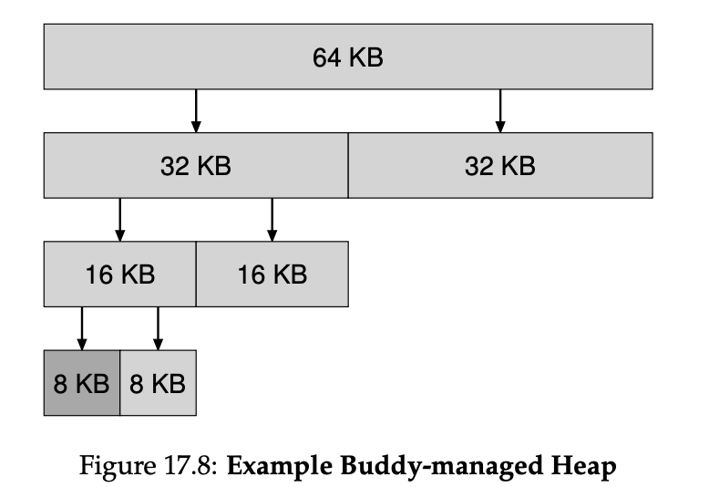

:::note[INFO]
[「Operating Systems: Three Easy Pieces」](https://pages.cs.wisc.edu/~remzi/OSTEP/)第一部分 Virtualization 学习笔记.
同时也参考了 [ouuan 大佬的笔记](https://ouuan.moe/post/2024/01/ostep-virtualization).
:::

---

## The Abstraction: The Process

*process* 指的就是 *running program*.

一个 process 的 *machine state* 包括: memory(它的 address space 内的内容)、registers (包括 program counter、stack pointer 等)、I/O information (能被读/写的 open files).

创建一个 process 时, OS 需要 load program code & static data into memory, 初始化 *run-time stack* (*stack*) 填入 `argv` 和 `argc`; 初始化 *heap*; 初始化 I/O 相关信息, 例如 `stdin`、`stdout`、`stderr` 三个 *file descriptor*.

process 有 3 种 state: running、ready、blocked.

OS 的 scheduler 需要通过调度来优化性能.

OS 还会维护 *process list* 来记录所有 ready processes 已经一些附加信息以便跟踪 running processes. 另外 OS 也会通过某些方式跟踪 blocked processes.

## Interlude: Process API

- `pid_t fork(void)`: 复制当前状态创建子进程, 新的进程拥有和原进程相同的代码、数据、文件, 但 PID 不同, 并且后续对数据的修改是独立的.
	- 调用一次 `fork()` 会返回两次, 一次在父进程返回子进程的 PID, 一次在子进程返回 0, error 则返回 -1
	- 一般通过判断 `fork()` 的返回值来判断当前进程是父进程还是子进程
	- 由于 OS scheduler 的存在, `fork()` 会导致一些 undeterministic 的行为产生
- `pid_t waitpid(pid_t pid, int *statusp, int options)`: 等待子进程结束
	- `pid_t wait(int *statusp)`: `waitpid(-1, statusp, 0)`
- `int execve(const char *filename, char *const argv[], char *const envp[])`
	- 希望子进程干一些与父进程不同任务时很有用
	- 工作原理是加载你想要执行的 executable 的代码并直接 overwrite 到当前的 code segment 中; 当前程序的 memory space (包括 heap、stack 等) 会 re-initialize; 成功调用 `exec()` 则永远不会返回原程序之后的指令
- `kill()`: 给进程发送 *signals*
	- Ctrl + C: `SIGINT`, 一般会直接停止 (terminate) 该进程
	- Ctrl + Z: `SIGTSTP` 中途暂停该进程, 可以通过 `fg` 等 command 复原
- `signal()`: 进程通过 `signal()` 来捕捉不同的 signals

一般将 `fork()` 和 `exec()` 配合使用, 可以通过在它们之间插入其他代码来修改子进程的执行环境. shell 程序就是通过 `fork()` 创建子程序然后 `wait()` 直到子程序通过 call `exec()` 执行完键入的 command, 接着回到父进程再次弹出 prompt 等待用户输入新的 command. 另一个例子是 redirect output, 即在 `fork()` 与 `exec()` 之间插入 `open()` 和 `close()`.

UNIX 还通过用一个 *pipe* (`pipe()` system call) 将一个进程的 output 连接到另一个进程的 input 来达到重定向的目的.

## Mechanism: Limited Direct Execution

CPU 通过 *time sharing* 来达到 virtualization, 达到 high *performance* 的同时维持 *control* 是主要挑战.

"direct execution" 就是直接在 CPU 上运行程序, 但是这样无法限制程序的不可控行为, 所以 OS 需要采用 *limited direct execution* 来对程序加以限制.

### Problem \#1: Restricted Operations

为了限制 user program, CPU 将 processor mode 分为 *user mode* 和 *kernel mode* 两种. 其中 kernel mode 由 OS (或 kernel) 来运行, 可以执行更高权限的 operations, 例如 I/O 读写请求和访问 memory.

user program 通过 *system call* 交给 OS 来执行权限更高的 operation. system call 是一种特殊的 *trap* (exception), 它通过 trap instruction 进入 kernel 内对应的 *trap handler*, 这个过程由 hardware 将 program 的 register 信息存储进这个 program 的 *kernel stack* 中并根据 *trap table* 来决定应该跳转到 kernel 的位置, 然后转变为 kernel mode 执行相应操作后, 通过 return-from-trap 回到 user program, 同样也由 hardware 来恢复 registers 的状态.

trap table 由 OS 在系统启动时设置给 hardware, 即各种 trap 对应的 handler address, 为了防止 user program 能随意进入 kernel 的任意位置, trap table 只能由 OS 进行设置. 进行 system call 需要指定 *system-call number*, 由 user code 负责将其放在特定 register/stack 中.

limited direct execution (*LDE*) protocol 可以分为两个阶段:

1. kernel 在系统启动时初始化 trap table, CPU 记住它的位置
2. kernel 在执行 return-from-trap instruction 前分配好 process list 和 memory 等信息, 然后将 CPU 切换到 user mode 开始 run process. 当 process 发出 system call 时 trap 进入 OS, 由 OS 执行完相应操作后通过 return-from-trap 返回 process. process 完成所有工作后, 通过返回一些 stub code 来退出 (例如会 trap 进 OS 的 `exit()` )

### Problem \#2: Switching Between Processes

当一个 process 占用着 CPU 时, OS 不在运行状态, 自然无法实现 control, 因此需要 user program 将 control 交给 OS. OS 重新获取 control 有两种方式:

1. cooperative approach: 等待 system calls.
2. non-cooperative approach: 用一个 timer 定时进行 timer interrupt 强制收回 control.
	- 这里也需要 interrupt handler, 与 system-call handler 同属于 trap handler, 会在系统启动时由 OS 设置
	- 同样也会将 register 存储到当前 program 的 kernel stack 中
	- OS 的 scheduler 会决定切换哪一个 process, 若确定切换则会进行 *context switch*: 从 process A 的 registers 和 kernel stack 切换到 process B 的 registers 和 kernel stack, 之后 return-from-trap 就会回到 process B 中断的地方

## Scheduling: Introduction

OS scheduler 使用一系列的 *scheduling policies* 来决定 schedule 哪个 job.

### Workload Assumptions

先对 *workload* 即要运行的 processes (也即 *jobs*) 作一些 assumptions 以简化问题, 后面再逐步抛弃这些 assumptions 得到一个 *fully-operational scheduling discipline*.

1. 每个 job 运行时间相同
2. 所有 jobs 同时到来
3. 每个 job 一旦开始就会一直运行到结束, 终途不被打断
4. 所有 jobs 只使用到 CPU
5. 每个 job 的 run-time 是已知的

### Turnaround Time

我们使用 *scheduling metric* 来比较不同的 scheduling policies. *turnaround time* 定义为 $T_{\text{turnaround}}=T_{\text{completion}}-T_{\text{arrival}}$, 用来衡量总体性能.

*First In, First Out* (*FIFO*) / *First Come, First Served* (*FCFS*) 是最简单的一种 scheduling policy. 在 5 个 assumption 下, FIFO 表现很好.

当丢弃第 1 个 assumption 时, FIFO 就会发生 *convoy effect*, 即 large job 排在前面堵住后面的 small job 从而使 turnaround time 变得很大. 此时采用 *Shortest Job First* (*SJF*) 可以达到最优.

进一步丢弃第 2 个 assumption, 若 large job 先来, small job 后来, 那么 SJF 就会失效. 此时我们丢弃第 3 个 assumption, 允许 scheduler *preempt* 一个 job 然后运行另一个 job (不进行 preempt 的 scheduler 被称为 *non-preemptive* scheduler) 便可以使用 *Shortest Time-to-Completion First* (*STCF*) / *Preemptive Shortest Job First* (*PSJF*) 来达到最优: 若新到来的 job 的总用时比当前运行 job 需要的剩余运行时间还短, 则切换运行新 job.

### Response Time

*response time* 定义为 $T_{\text{response}}=T_{\text{firstrun}}-T_{\text{arrival}}$, 用来衡量 fairness, 让用户在交互式环境下有一个更好的体验.

上述的几种 policy 在这个 metric 下表现都很差, 被排到后面的 job 会需要等待很久.

*Round-Robin* (*RR*) 让每个 job 运行一个 *time slice* (也称为 *scheduling quantum*) 然后切换到下一个 job, 因此 RR 也被称为 *time-slicing*. time slice 越小, response time 也就越小, 且 time slice 必须是 timer-interrupt period 的整数倍. 当 time slice 过小时, context switching (包括存储/恢复 registers, cache miss penalty 等) 就占用过多时间, 继而显著影响整体性能, 所以需要一个合适大小的 time slice 来 *amortize* 掉 switching cost. 另外, RR 虽然 response time 很小, 但是 turnaround time 很大, 甚至比 FIFO 还大.

### Incorporating I/O

丢弃第 4 个 assumption, 运行 job 进行 I/O, 就需要处理 *blocked* 的情况: 当前运行的 job 在 I/O 时不会使用 CPU, 而是会被 blocked 等待 I/O 完成, scheduler 需要在此时 schedule 另一个 job, 另外还需要决定 I/O 完成时 schedule 哪一个 job.

可以将一个 job 看作用 I/O 分割成的一些 sub-jobs, 然后继续用之前的 policy. 例如, 使用 STCF 时, 会优先运行需要 I/O 密集的 job 使得有大量 I/O 期间能运行其它 job, 这可以达成 *overlap*, 让 CPU 和 I/O 同时工作, 更充分利用系统资源.

## Scheduling: The Multi-Level Feedback Queue

前面的 scheduling policy 往往不能兼顾 turnaround time 和  response time 两者的优化, 并且 SJF/STCF 依赖于对 job 不切实际的预知.

*Multi-level Feedback Queue (MLFQ)* 是目前被广泛使用的一种 scheduling policy, 它同时解决了上述两个问题.

### Basic Rules

MLFQ 的思想是通过观测 job 的行为将其动态地分为两类: short-running interactive jobs (被 I/O 切分为小块) 和 long-running CPU intensive jobs. short-running interactive jobs 需要更高的优先级, 这既符合 SJF/STCF 的思想, 也满足这类 job 需要更小的 response time 的要求.

MLFQ 动态地将 jobs 放进不同 priority 的 job queues 中, 每次选择优先级高的 queue, queue 内部使用 RR.

### Change Priority

MLFQ 首先默认新到来的 job 是 interactive job, 将其放在 priority 最高的 queue, 若运行太久就放到下一级 queue. 具体而言, 在每一级 queue 给 job 一个 *time allotment*, job 在这个 queue 中运行时间超过 allotment 就会降级, 如果在 allotment 用完之前 job 放弃使用 CPU 就留在当前 queue 并重置 allotment.

这种方式存在三个问题:

- 如果 short-running jobs 太多占满了 CPU, 那么在 low priority queues 中的 long-running jobs 就会一点 CPU 都拿不到 (称为 *starvation*)
- jobs 可能会在之后 change behavior 成为 interactive, 而降级之后无法升级
- jobs 可以每次在 allotment 快用完的时候放弃 CPU 从而一直留在当前 queue 来获取更高的 CPU 使用率 (称为 *game the scheduler*)

#### The Priority Boost

前两个问题的解决方案是每隔一个 time period $S$ 就进行 *priority boost*, 将所有 jobs 都放回 priority 最高的 queue 中.

系统中类似 $S$ 这样看上去需要用一些黑魔法才能正确设置的值被 John Ousterhout 称为 *voo-doo constants*: $S$ 设置的太高会出现 starvation, 太低则影响 response time.

#### Better Accounting

第三个问题可以通过 *better accounting* 来解决: 相比于在 I/O 之后就抛弃此次使用的 allotment, 而改成累计 allotment, 即不进行重置而是在下一次除了这个 job 时继续使用之前的 allotment, 当 allotment 累积用完时则降级.

### Tuning MLFQ

MLFQ 有很多可以设置的参数: queue 的数量、每个 queue 中 RR 的 time slice 和 allotment、boost 的 time period $S$. 一般来说, priority 越高, time slice 和 allotment 越小.

MLFQ 也可以不实现多个 queue, 而是统计每个 job 的 CPU usage, 根据 usage 计算 priority, 让 usage 随时间 *decay* 来代替 priority boost, 这种方法称为 *decay-usage* scheduling.

priority 不一定完全依赖 feedback, 也可以由 user 给出 *advice*, 例如使用 `nice` 命令设置 *niceness* 来调整 priority.

:::note[MLFQ rules]
- Rule 1: If Priority(A) > Priority(B), A runs (B doesn't).
- Rule 2: If Priority(A) = Priority(B), A & B run in round-robin fashion using the time slice (quantum length) of the given queue.
- Rule 3: When a job enters the system, it is placed at the highest priority (the topmost queue).
- Rule 4: Once a job uses up its time allotment at a given level (regardless of how many times it has given up the CPU), its priority is reduced (i.e., it moves down one queue).
- Rule 5: After some time period $S$, move all the jobs in the system to the topmost queue.
:::

## Scheduling: Proportional Share

本章讨论 *proportional-share* (或 *fair-share*) scheduler, 它的主要目标是确保每个 job 能得到确定比例的 CPU time.

### Lottery Scheduling

lottery scheduling 给每个 job 分配一些 *tickets*, 经过一个 time slice 就随机选择一个 winning ticket, 然后 schedule 到相应的 job, 最后 CPU time 会按照分配的 tickets 数量的比例分给 jobs.

lottery scheduling 还提供了一系列 ticket mechanisms 来分配 tickets:

- *ticket concurrency*: user 自行分配 tickets 给他的 jobs, 最后 scheduler 将其转化一个 global value
- *ticket transfer*: process 可以将它的 tickets 转交给另一个 process
- *ticket inflation*: 在一组互相信任的 processes 中, process 可以不通知其他 processes 按需多na拿一些 tickets

### Stride Scheduling

stride scheduling 使用确定性算法进行 schedule.

它给每个 job 定一个 *stride*, stride 与 ticket value 成反比 (bushi), 例如定为 jobs 的 ticket value 的最小公倍数除以该 job 的 ticket value 的值. 然后为每个 job 维护一个 *pass*, 每次 schedule 到 pass 值最小的 job, 单次运行完这个 job 后给它的 pass 加上 stride. 这样最终 job 获得的 CPU time 的比例等于 ticket value 的比例.

### The Linux Completely Fair Scheduler (CFS)

CFS 可以高效且 scalable 地实现 fair share scheduling, 是目前 Linux 使用的 scheduler.

CFS 维护每个 job 的 *virtual runtime* (`vruntime`), 每次 schedule 到 `vruntime` 最小的 job, 运行完就加上这次的 runtime. 单次运行的 time slice 由 `sched_latency` 除以 job 数量动态决定, 为了防止 time slice 过小导致 context switching 过多影响性能, time slice 设有一个最小值 `min_granularity`. scheduler 会使用一个 timer 来决定下一个 schedule 的对象, 若 time slice 不是 timer interrupt 的整数倍也没有关系, 因为 `vruntime` 会精确记录 job 实际的 runtime.

CFS 还拥有以下 features:

- weighting (niceness): user 可以用 `nice` command 来调整 job 权重, 默认为 0, 取值范围在 $[-20, +19]$, niceness 越低, weight 越高, 且呈指数式变化, 最后 time slice 由 `sched_latency` 按照 weight 占比分配
- red-black trees: 利用 red-black trees 维护 `vruntime`, 保证每次查询与修改操作复杂度. 为了避免 job 被 block 后 wake up 时 `vruntime` 明显小于其他 jobs 从而独占 CPU 造成 starvation, 重新插入 job 时会将 `vruntime` 设为此时树上的最小值, 但是这个操作会导致 I/O 频繁或长期 sleep 的 job 无法得到 fair share.
- other: CFS 还有很多其他的 features, 例如优化 cache performance 的特殊手段、高效处理多个 CPU 的情况、可以将多个 process 视为一个 group 进行 schedule 而不是对单个 process

## Multiprocessor Scheduling (Advanced)

> As this topic is relatively advanced, it may be best to cover it after you have studied the topic of concurrency in some detail (i.e., the second major "easy piece" of the book).

## The Abstraction: Address Space

为了支持 time sharing 和 interactivity, 同时保证切换 process 时能提高 memory 部分的切换性能，因此要给不同 process 分配 memory 并在 switching 时保留。为了方便，OS 需要将 virtual memory virtualize，提供名为 *address space* 的 abstraction.

一个 process 的 address space 包括 code、stack、heap、data 等部分，各部分的 layout 一般固定，例如 code 一般位于最低地址处，code 上方为向上增长的 heap，最高地址处为向下增长的 stack, 但是它们实际的 physical memory address 是不固定的。

virtual memory (VM) 需要达到以下目标：
- transparency: process 感受不到 VM 的存在，以为独占了整个 physical memory.
- efficiency: time 和 space 的 overhead 不能太大，因此需要 hardware 的帮助。
- protection: 每个 process 只能访问自己的 address space, 不能访问其他 process 或 OS 的，以此达到 *isolation*.

user-level program 使用的所有 address 都是 virtual address, 只有 OS 和 hardware 才能接触到 physical address.

## Interlude: Memory API

C program 使用两种 memory: stack memory 和 heap memory.

stack memory 是由 compiler 隐式管理的，也被称为 *automatic* memory.

heap memory 则需要手动使用 `malloc()` allocate、`free()` deallocate, 例如：
- `double *d = (double *) malloc(sizeof(double));`
- `iny *x = malloc(10 * sizeof(int));`
- `char *s = malloc(strlen(buf) + 1);`（字符串需要多分配一个 byte 作为 `\0`，因此一般不使用 `sizeof(char)`）
- `free(x);`

heap memory 的使用很容易出错，例如：
- null pointer dereference: 使用前没有 allocate
- uninitialized read: 未初始化就读取
- buffer overflow: allocate 的 memory 不够大
- memory leak: long-running program 的 memory 使用后没有 free
- use after free: free 后继续使用 *dangling pointer*
- double free: free 之后再次 free

`malloc()` 和 `free()` 并不是 system call 而是 library call. memory-allocation library 使用 system call `brk()`/`sbrk()` 设置 program 的 *break* 即 heap 末尾的地址来获取 memory 并分配给用户。

`mmap()` 可以进行 memory mapping, 例如 map 到 *anonymous* memory region（与 *swap space* 有关的 region）来获取 memory.

另外可以用 `calloc()` 来初始化 `malloc()` 得到的 memory, `realloc()` 调整一块已分配的的 memory 的大小。

## Mechanism: Address Translation

OS 通过 *(hardware-based) address translation* 将 memory access 从 virtual address 高效、灵活地翻译为 physical address. OS 需要配置 hardware, 通过 track location 是 free 还是 in use 来 manage memory, 通过 intervening 来维持 control.

对于 address translation, 先做出下列假设：
- 每个 process 的 address space 都被映射到了 physical memory 中连续[^1]的一段；
- physical memory 足够大，可以装下所有 process 的 address space;
- 每个 process 的 address space 的 size 相同。

[^1]: "contiguous" 与 "continuous" 是有区别的，书上说的是 "contiguous".

### Dynamic (Hardware-based) Relocation

1950's 时使用了 *base and bounds* 技术实现 time-sharing: CPU 中使用两个特殊的 register: *base* 和 *bounds*.

base 即 virtual address `0` 对应的 physical address, 当 access memory 时，使用下列公式进行 address translation:
$$\text{physical address = virtual address + base}$$

而 bounds 则是 address space 的大小，memory access 时会首先检查 memory reference 在 bounds 范围以内来确保 protection.

由于 address translation 是在 runtime 进行的，在 process 运行时也能移动 address spaces（即进行 relocate），因此 base and bounds 也被称为 *dynamic relocation*.

### Hardware Support

dynamic relocation 的实现需要 hardware 提供下列 support:
- 支持 kernel mode 和 user mode;
- 给 CPU 提供 base register 和 bounds register 作为 *memory management unit* (MMU) 的一部分；
- 为 base register 和 bounds register 提供 privileged instruction 以供修改。只有 OS 可以修改它们，否则 user process 可以 wreak havoc;
- 在 memory access 不合法时（例如超出 bounds）生成 exceptions, 调用 exception handler.

### Operating System Issues

OS 需要做的工作有：
- 在一个 process 被创建时为其分配 memory;
	- 在前面的假设下，可以使用一个简单的 *free list* 作为维护空闲的 memory slots 的 data structure.
- 在一个 process 被 terminate 时，回收它的 memory;
- 在 context switch 时将 base 和 bounds register save 到一些 per-process structure (例如 *process structure*、*process control block* 即 PCB), 同时 restore 新 process 的 base 和 bounds register;
	- 此时可以进行 relocate: 将 base 修改为与上次 schedule 到当前 process 时的不同位置，将数据复制过去。
- 提供 exception handlers.

## Segmentation

Base and Bounds 中 heap 与 stack 中间的空位一般会有剩余，而这部分未被使用的空间也实际占用了 physical memory, 造成了浪费，即 internal fragmentation. 并且，Base and Bounds 不支持运行 address space 比当前 physical memory 所有 free slots 都大的 program，因此需要更灵活的机制。

*segmentation* 是一种 generalized base/bounds, 它将 memory space 分为多个 *segment* (address space 中有特定长度的一段连续[^1]区间), 例如 code、stack 和 heap，不同 segment 可以不连续，因此可以更灵活地分配减少 internal fragmentation.

### Hardware Support

segmentation 需要将整体的一对 base and bounds register 变为每个 segment 各一对。在 address translation 时，需要先识别 address 属于哪一个 segment, 再用它的 base and bounds register 使用 Base and Bounds 相同方法 translate.

explicit approach 通过将 address 的最高几位作为 segment 的标识，对于拥有非 2 的幂次个 segment 的 program 来说会造成 address 的浪费，同时它会将每个 segment 的大小限制在一个相同的范围内，不够灵活。

implicit approach 则由 hardware 根据地址的生成方式（是否来自 PC / stack pointer / base pointer）来判断 segment.

由于 stack 是 grow backwards 的，需要额外的 hardware support. 可以在 hardware 中添加表示 grow 方向的 flag bit, 对于 grow backwards 的 segment, base 是它的 address 的上界，取 negative offset 进行 address translation, 相应的 bounds check 也有所不同。

在不同 address space 之间 share memory (segments, 尤其是 code sharing) 需要额外添加 protection bits 来表示一个 segment 是否可以 read / write / execute.

只分为少量的 relative large segment 被称为 *coarse-grained* segmentation, 分为大量 smaller segment 则是 *fine-grained* segmentation, 这会需要 hardware 存储额外的 *segment table*.

### OS Support

为了支持 segmentation, OS 需要：
- 在 context switch 时 save and restore segment registers;
- 管理 physical memory 的 free space 以支持
	- 创建新的 address space;
	- segment grow 时分配空间（例如 `sbrk()`），并更新 segment registers;
- 当 process 违背 permission bits 时提供 exception 并进行处理.

由于 segment 的 size 不同定，physical memory 中各个 segment 之间可能出现很多空洞，这被称为 *external fragmentation*.

一种解决方案是通过 rearrange 已有的 segment 进行 *compact*, 但是这需要频繁移动大量数据，效率很低且会占用大量 processor time, 还会使 segment grow 变得更困难，所以一般不采用 compact.

## Free Space Management

将 memory 分成 fixed-sized units, 以 unit 为分配的基本单位会使 free-space management 更容易。如果使用 variable-sized units 则容易造成 external fragmentation, 需要使用一些机制来优化。

`malloc()` 和 `free()` 管理的是 heap segment, 它的 free space 通常采用一种 *free list* 的 data structure 来管理。

在学习 free space management 之前，先作以下假设：
- 为了简单，仅考虑 external fragmentation;
- 不允许 relocation, 因此 compaction 也是不允许的；
- allocator 管理的是一块连续的区域[^1]。

### Low-level Mechanisms

free list 会以链表的形式存储 heap 中 free space 的 `addr` 和 `len`.

当需要分配的空间小于 max node 的 `len` 时，allocator 会使用 *splitting* 将满足需求的 free node 一分为二，前者分配给 caller, 后者作为新的 free node 存储在 free list.

若一块空间被 `free()` 则会将其作为一个新的 free node 存储在 free list 中，如果它与某些 free node 的地址范围相接，allocator 则会将它们合并，这被称为 *coalescing*.

为了 track 被分配区域的 size, allocator 会在被分配区域的 *header* block 存储下它的 size 和一个用于 integrity check 的 magic number, 另外也可能存储 additional pointer 来加速 deallocation.

当 program call `malloc(size = N)` 时返回的是指向 header 的下一个地址的 pointer, 实际分配的 size 也比 $N$ 要大. `free()` 则会使用 `*hptr = (header_t *) ptr - 1` 得到指向 header 的 pointer.

当 heap 的 size 不够分配时，最简单的方法是直接 fail, 也可以在 program 运行时以一个 small-sized heap 开始，不够用时再向 OS 申请 grow the heap.

### Strategies

allocator 有两个目标：fast 和 minimize fragmentation. 多数情况下需要对二者进行 tradeoff.

一些简单的 allocation policy 有：
- best fit: 遍历 free list 后 split 最小的满足分配要求的 free node 以尽可能减少空间浪费，但是需要完整遍历 free list 导致 performance 较差。
- worst fit: 遍历 free list 后 split 最大的满足分配要求的 free node 以使留下的 free node 尽可能大，但是同样需要完整遍历 free list, 并且会存在 excess fragmentation 和 high overheads.
- first fit: split free list 中第一个满足要求的 free node, 不需要完整遍历 free list 提高了 performance, 但是可能会使 free list 前面的 node 大小较小，可以通过 *address-based ordering* 方便 coalescing 从而减少 external fragmentation.
- next fit: 维护一个 extra pointer 指向上次 split 的 node（留下的新 node），每次它为起点实行 first fit, 思想是使 first fit 在 list 上的 search 更均匀，避免了头部 nodes 的 fragmentation 同时也不需要完整遍历 free list.

对于一些特殊的 application, 它们会有一些 popular-sized request, 可以给每个这样的 size 单独维护一个 free list, 这样每个 node 的 size 都相同会使得 free space management 更简单，这种 list 被称为 *segregated list*.

*binary buddy allocator* 则通过简化 coalescing 来优化 free space management. 在 buddy system 中，free memory 被看作大小为 2 的幂次的 blocks, split 时会分配一块 $N$ 最小的 size 为 $2^N$ 的 block, 这样会是搜索和合并都比较块，但是由于分配 block size 只能是 2 的幂次，可能会出现较为严重的 internal fragmentation.

另外也可以通过一些 advanced data structure 来维护 free blocks 以使搜索更加高效，例如平衡树、splay 树等。

## Paging: Introduction

将 memory 分成 variable-sized pieces（例如 VM 内的 segmentation）会使 allocation 变得更困难，因此一般会将 memory 分成 fixed-sized pieces, address space 中的每个 unit 被称为 *page*, 对应的 physical memory unit 则是 *page frame*, 这个方法被称为 *paging*.

paging 可以避免 external fragmentation, 并且更加 flexible, 可以支持 sparse address space, 不需要关心 process 使用 address space 的方式（例如对 stack 的 grow 方向特殊处理）。

*page table* 是用来记录 virtual page 到 physical frame 的映射关系的 per-process data structure, 用于 address translation, 在 context switch 需要切换 page table.

在进行 address translation 时会将 address 分为 *virtual page number* (VPN) 和 *offset* 两个部分，其中 offset 位于低位，位数对应一个 page 的大小；VPN 位于高位，作为 page table 的索引访问对应的 *page table entry* (PTE), 进而得到 *physical frame / page number* (PFN / PPN), 最后用 PFN 替换 VPN 拼接 offset 得到 physical address.

由于 page table 可以很大，因此不能放在专门的 hardware 中而是存在 physical memory 中。

page table 可以用各种 data structure 存储，最简单的一种是 *linear page table*, 它是一个以 VPN 为下标的一维数组。

page table 的基本数据单位是 PTE, 它需要存储 PFN、valid bit、protection bits 以及一些其他信息（例如 present bit、dirty bit、用于 swapping 的 reference bit）。其中，valid bit 表示该条 translation 是否是 valid 的（invalid 表示实际未分配 physical frame，可以节约 memory），protection bits 则表示该 page 能否被 read、write、execute.

在这个简单的 page table 的设计下，每次 memory access 需要访问 2 次 physical memory, 一次访问 page table, 一次访问实际目标，并且 address space 很大时 page table 也会很大，导致 time 和 space overhead 都很大，需要优化。

## Paging: Faster Translations (TLBs)

可以用 *translation-lookaside buffer* (TLB) 来加速 page table access, 它位于 hardware MMU 中，是一种 hardware cache.

TLB 中存储少量的 PTE，在使用 TLB 进行 address translation 时的流程如下：

### Locality

TLB 利用了 program 的 *spatial locality*, 即访问完 memory address $x$ 后很快会访问 $x$ 临近的 memory, 很多 address 位于同一个 page 所以可以 TLB hit; 也利用了 *temporal locality*, 即访问过的 address 很快会再次访问，从而可以 TLB hit.

locality 是 program 的性质，若 program 短时间内访问的 page 数量超过了 TLB 的容量就会产生大量的 TLB miss, 这被称为 exceeding the *TLB coverage*. 对于需要随机大范围访问 memory 的特殊 application (例如 DBMS), 可以为其设置更大的 page size 来缓解这一问题。

### Who Handles The TLB Miss?

TLB miss 可以由 hardware 或 software 处理。

对于 hardware-managed TLB, page table 需要有固定的格式，也需要 OS 设置 page-table base register 告知 hardware 需要处理的 page table 在 memory 中的地址。

对于 software-managed TLB, TLB miss 会触发 trap，交由 OS 提供的 trap handler 进行处理，使用特殊的 privileged 修改 TLB, 这可以让 OS 灵活设计 page table, 不受 hardware 的限制。在配置 trap handler 时需要注意：
- hardware 需要 resume 回触发 trap 的 instruction 而不是像 system call 一样返回到下一条 instruction;
- trap handler 自身不能触发 TLB miss, 否则会变成 TLB miss 的死循环。解决方法是要么 trap handler 直接访问 physical memory 绕开 TLB, 要么在 TLB 中设置一些 *wired* translation, 永驻 TLB.

### TLB Contents: What's In There?

TLB entry 的内容一般会包括：
- PTE: PFN、protection bits、dirty bit 等;
- VPN: TLB 一般是 fully associative 的，需要存储 VPN 作为 cache tag;
- valid bit: 表示该 entry 的信息是否是 valid 的，与 page table 的 valid bit 不同；
- protection bits: 该 page 能否被 read / execute / write;
- ASID: 即 address-space identifier;
- wired: 表示该 entry 是否永远 valid，不被清除 / 替换。

### TLB Issue: Context Switches

由于每个 process 的 page table 不同，而 TLB 只包含当前的 running process 的 valid PTE, 因此在 context switch 时需要更新 TLB.

最简单的方法是直接将 TLB 的所有 entry 清空（将 valid bit 置 0），这样会导致每次 context switch 后都会 TLB miss, 性能较差。

另一种方法是在 TLB 中存储 *address space identifier* (ASID), 它可以被看作 bits 较少的 PID, 用来表示该 entry 属于哪个 address space. 查找 TLB 时需要同时比较 VPN 和 ASID.

### Issue: Replacement Policy

若 TLB 满了，添加新 entry 就需要替换一个旧 entry, 这需要根据 replacement policy 进行选择。

*least-recently-used* (LRU) 会替换最近被使用过的 entry, 而 *random* policy 则是随机选择一个 entry 进行替换。

## Paging: Smaller Tables

page table 本身也会占用大量的 memory, 因此还需要优化 page table 的 space overhead.

假定一个 32-bit address space 在 page size 为 4KB、PTE 占用 4B 时，page table 需要占用 4MB 的空间。

### Simple Solution: Bigger Pages

增大 page size 可以让 PTE 数量减少，从而减少 page table 占用的空间。但是更大的 page size 会可能会导致严重的 internal fragmentation.

有些 OS 支持更大的 page size 是为了减小 TLB 的占用，提升 TLB hit rate 而不是减小 page table size.

### Hybrid Approach: Paging and Segments

要减少 internal fragmentation 可以将 paging 和 segmentation 结合：整体使用 segmentation, 每个 segment 内部使用 paging, 各安排一个 page table, 将 segment 的 base 和 bounds register 指向 page table. 这样 address space 中不属于 segment 的部分无需占用 page table 的空间，节省了大量的 memory.

这样的做法依然存在一些问题：
- 需要 segmentation, 损失了一些 flexibility;
- segment 内部如果太 sparse, 它的 page table 依然很大；
- 不同 segment 的 page table size 可能不同，使得给 page table 分配空间变得更困难，因此依然会产生 external fragmentation.

### Multi-level Page Tables

modern system 一般采用 *multi-level page table*: 将 page table 分为多级形成的树状结构，parent PDE 在 valid 时指向下一级 page table / page directory.

在 multi-level page table 中，一个 virtual address 会被拆分为如下形式：

这个方法有以下优点：
- 分配的 page-table space 与实际使用的 address space 成正比，节省了大量 invalid PTE 占用的空间并且支持 sparse address space;
- page table 本身的分配以 page 为单位，添加了 a *level of indirection*, 可以将 page-table page 放在 physical memory 中的任意地方。

它也有一些缺点：
- 在 TLB miss 时，每个 level 的 page table / page directory 都需要访问，多次 memory access 开销更大；
- 实现更复杂。

### Inverted Page Tables

不同于普通的 page table 为每个 VPN 分配一个 entry 存储 PFN, inverted page table 为每个 PFN 分配一个 entry 存储 VPN, 让所有 process 共用一张 inverted page table, 每个 entry 记录对应的 process.

由于 inverted page table size 非常大，要支持快速查询就需要一些数据结构来维护，例如 hash table.

### Swapping the Page Tables to Disk

page table 不一定要放在 physical memory 中，或者可能它自身也使用 virtual memory, 可以将这样的 page table 放在 *kernel virtual memory* 中，当 memory 存不下时就 *swap* 到 disk 中。