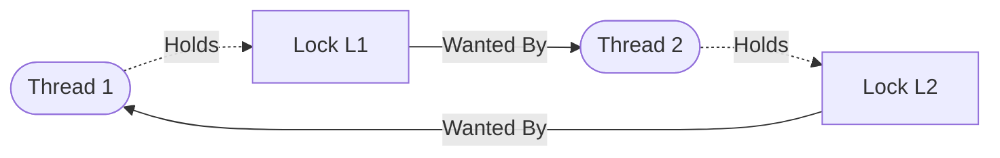

[「Operating Systems: Three Easy Pieces」](https://pages.cs.wisc.edu/~remzi/OSTEP/)第二部分 Concurrency 学习笔记.

## Concurrency: An Introduction

本章介绍 process 的一个新的 abstraction: *thread*. 一个 *multi-threaded* program 可以拥有多个执行点, 与多个 process 不同, 多个 thread 之间的 address space 是共享的.

在 thread 之间切换执行也需要 context switch, 将 process 的 state 存储到 *process control block (PCB)*, 单个 process 内的 threads 的 state 则分别存储到多个 *thread control blocks (TCBs)* 内.

*single-threaded* process 的 address space 中只有一个 stack, 而 *multi-threaded* process 则会有多个 stack, 称为 *thread-local* storage, 一个 heap 被多个 threads 共享.

*parallelism* 和避免因为 slow I/O 而导致 program 被 block 是使用 thread 的两大需求:

- 将 single-threaded program 转化为能在 multiple CPUs 上并行计算的过程称为 *parallelization*.
- threads 允许 single program 内 I/O 与其他活动的 overlap, 类似 *multiprogramming*.

thread 可以通过 `Pthread_create` 创建, `Pthread_join` 等待 thread 完成, thread 的运行先后也是有 scheduler 决定的, 因而无法确定某个时间是哪个 thread 在运行.

由于 uncontrolled scheduling, 同时 thread 之间共享 address space, 就会产生 *race condition* (也称为 *data race*), 即某个共享的 data 的结果会由代码的执行时间决定, 具体而言, 当一个 thread 利用某个 register 完成 `counter += 1` 还未将数据 `mov` 回 `counter` 变量的地址时切换到了另一个 thread 来执行这一段代码并完成了写入, 之后切换回旧的 thread 完成 `mov`, 本应 `+2` 的 counter 最终只 `+1`, 称这样无法确定结果的计算过程为 *indeterminate*, 可能导致多个 multiple threads 出现 race condition 的代码段称为 *critical section*.

为了避免这样的情况, 我们需要 *mutual exclusion* 来保证某个 thread 执行 critical section 中的代码时禁止其他 thread 执行这段代码.

一种方法是 *atomicity*, 即在硬件层面上实现单个 instruction 完成 critical section 需要完成的工作, 但是对于 critical section 描述的是复杂的操作时这种方法并不现实, 因此我们希望 hardware 能提供少量有用的 instructions 帮助将简单的操作 atomize, 这种 instruction 的集合被称为 *synchronization primitives*.

thread 还存在的一个问题出现在一个 thread 需要等待另一个 thread 完成某些操作后才能继续下一步时, 例如一个 process 进行了 disk I/O 然后进入 sleep, 当 I/O 完成后需要从 sleep 中唤醒, 这就需要提供一些 sleeping/waking interaction 的 mechanisms.

## Interlude: Thread API

thread 相关 API 如下:
- 创建 thread: `int pthread_create(pthread_t *thread, const pthread_attr_t *attr, void *(*start_routine)(void*), void *arg);`
	- `thread` 为传入的 `pthread_t` 类型变量指针
	- `attr` 指定 thread 的 attributes, 例如 stack 大小及 scheduling priority 的信息, attribute 指针通过 `pthread_attr_init();` 进行初始化
	- `start_routine` 为需要 thread 执行的函数指针, 前一个 `void *` 表示该函数返回值类型, 后一个 `void*` 表示该函数传入参数类型
	- `arg` 为 `start_routine` 的传入参数
- 等待 thread: `int pthread_join(pthread_t thread, void **value_ptr);`
	- `thread` 为创建 thread 时 `pthread_create()` 的返回值
	- `value_ptr` 为需要存储 `thread` 的返回值的指针

POSIX threads library 使用 *locks* 保护 critical section, 相关 API 如下:
- 给后面的代码上锁: `int pthread_mutex_lock(pthread_mutex_t *mutex);`
	- 若后面的代码当前没有被其他 thread 占用, 则之间由当前 thread 占用
	- 若当前被其他 thread 占用, 则等待其释放后再占用
- 释放锁: `int pthread_mutex_unlock(pthread_mutex_t *mutex);`

`pthread_mutex_t` 类型的变量需要正确初始化:
- 使用 default value: `pthread_mutex_t lock = PTHREAD_MUTEX_INITIALIZAER;`
- 使用 function call: `int rc = pthread_mutex_init(&lock, NULL);`
	- 其中 `NULL` 为 default value, 也可指定 `lock` 初始为其他值
	- always check success: `assert(rc == 0);`
	- 相应地, 需要使用 `pthread_mutex_destroy()` 进行销毁

上锁的方式也有更灵活的 API 提供:
- `int pthread_mutex_trylock(pthread_mutex_t *mutex);`
	- 若当前代码被其他 thread 占有, 则直接 return failure
	- 否则直接占有并 return success
- `int pthread_mutex_timedlock(pthread_mutex_t *mutex, struct timespec *abs_timeout);`
	- 若当前代码被其他 thread 占有, 则在等待指定时间内不断尝试占有, timeout 之后仍未成功则 return failure

*condition variable* 也是任何 threads library 的重要组成部分, 它负责 threads 之间的交互, 例如:
- `int pthread_cond_wait(pthread_cond_t *cond, pthread_mutex_t *mutex);`
	- 直到 `cond` 发生相应改变之前, caller thread 会进入 sleep, 此时会释放 `mutex` 对应的 lock
- `int pthread_cond_signal(pthread_cond_t *cond);`
	- 完成相关操作后利用 `cond` 向对应的 `pthread_cond_wait()` 的 caller thread 发送 signal 并唤醒它, 同时 caller thread 会 reaquire `mutex` 对应代码

类似地, `cond` 也需要正确的初始化, 例如 `pthread_cond_t cond = PTHREAD_CON_INITIALIZAER`.

由于一些 pthread implementations 可能会 spuriously wake up a waiting thread, 因此常用一个 `while` recheck 某个被两个需要交互的 threads 共用的 flag 来确保 threads 之间的行为符合预期.

compile 上述 code 需要用到头文件 `pthread.h` 同时需要在编译命令中加入 flag `-pthread`.

## Locks

lock 是一个变量, 它有 *available* (or *unlocked* or *free*) 和 *acquired* (or *locked* or *held*) 两种状态.

thread 通过 `lock()` 来获取 lock, 若此时 lock 处于 available 状态则获取成功, 这个 thread 也被称为该 lock 的 *owner*, 它可以通过 `unlock()` 来释放这个 lock.

POSIX library 使用 *mutex* 来命名 lock, Linux 则使用 *futex*.

相较于用一个大的 lock 来保护整个 critical section (称为 *coarse-grained* locking strategy), 使用不同的 lock 来保护不同的 data 从而允许多个 thread 能同时进入 locked code (称为 *fine-grained* locking strategy) 可以提高 concurrency.

一般用以下三个标准评估 lock:
- *mutual exclusion*: 阻止不同的 threads 进入 critical section
- *fairness*: 竞争 lock 的 threads 能否得到 fair shot, 或者是否存在 starvation
- *performance*: 使用 lock 而增加的 time overheads

### Interrupt-Based Locks

最早的提供 mutual exclusion 的方法是在 critical section 禁止 interrupts (interrupt-based technique), 这可能导致 thread 通过不停 call `lock()` 来独占 CPU, 而且这个方法在 multiprocessor 下并不 work, 另外也可能导致重要的 interrupt 丢失 (例如 CPU 可能无法得知 disk device 是否完成了读写操作).

### Spin Locks

另一种方法是使用 `flag` 来标示 lock 的状态, 在 `lock()` 中先 *test* `flag` 是否为 1, 若没有则令 `flag = 1` 来 *holds* the lock, 最后 call `unlock()` 并 clear `flag`; test 失败的 thread 会用一个 while loop 进行 *spin-wait* 等待 lock 被释放. 这种方法没有对 `flag` 的修改进行保护, 另外 spin-wait 的性能也很低.

通过 hardware support 可以用单个的 *test-and-set* (or *atomic exchange*) instruction 来完成 flag 的读写从而保证 correctness :

```c
int TestAndSet(int *old_ptr, int new) {
	int old = *old_ptr; // fetch old value at old_ptr
	*old_ptr = new;     // store ’new’ into old_ptr
	return old;         // return the old value
}
```

另一种 hardware primitive 是 *compare-and-swap* instruction (on SPARC) 或者叫 *compare-and-exchange* (on x86):

```c
int CompareAndSwap(int *ptr, int expected, int new) {
	int original = *ptr;
	if (original == expected)
		*ptr = new;
	return original;
}
```

也可以利用 conditional variable, 用一对指令来保证 correctness, 例如 MIPS 架构提供 *load-linked* 和 *store-conditional* 指令:

```c
int LoadLinked(int *ptr) {
	return *ptr;
}

int StoreConditional(int *ptr, int value) {
	if (no update to *ptr since LL to this addr) {
		*ptr = value;
		return 1; // success!
	} else {
		return 0; // failed to update
	}
}
```

使用 LL/SC 指令的例子如下:

```c
void lock(lock_t *lock) {
	while (LoadLinked(&lock->flag) ||
			!StoreConditional(&lock->flag, 1))
		; // spin
}
```

上述方法都不能保证 fairness,  而 *ticket lock* 使用 *fetch-and-add* instruction, 给 lock 增加一个 ticket value, 当有一个 thread 想要获取 lock 时就用 fetch-and-add 给 ticket value 增加 1, 此时的 value 被视为该 thread 的 "turn", 然后由 global shared `lock->turn` 来决定将 lock 给谁, `unlock()` 则是直接给 `lock->turn` 增加 1, 这种「轮流来」的方案保证了每个拥有 ticket 的 thread 都能获取 lock。

```c
int FetchAndAdd(int *ptr) {
	int old = *ptr;
	*ptr = old + 1;
	return old;
}
```

spin lock 需要 preemptive scheduler 才能在 single CPU 环境下 make sense, 而且尽管 spin locks 满足了 mutual exclusion, 也有 ticket lock 保证 fairness, 但是每个 spinning thread 都会浪费 time slice 等待 lock 被释放, 若有 $N$ 个 thread 则可能会浪费 $N-1$ 个 time slice, 而且会 context switch 的花费也会计入其中, 因此 spin lock 的 performance 较差.

### Locks With Yield, Queue

> "Just yield, baby!"

最简单的避免 spin 的方式是直接 give up the CPU, 即在 `while (TestAndSet(&flag, 1) == 1)` 中 call `yield()`, 这会将 caller thread 从 running state 移到 ready state, 并切换到另一个 thread, 本质上是 thread *deschedule* 自己.

这种方法当存在大量 thread 竞争同一个 lock 时, 依然会有大量的 context switch 的花费, 而且也没有解决 starvation, 例如其他 threads 不断重复获取 lock 时会有 thread 陷入无尽的 yield loop.

前面的方法都会由于 OS 错误的 schedule 而导致各种错误/性能问题, 因此我们需要从 OS 中获取一些关于 schedule threads 的 control, 例如用一个 queue 来决定下一个获取 lock 的 thread.

Solaris 提供 `park()` 来令 calling thread 进入 sleeping, 以及 `unpark(threadID)` 来唤醒由 `threadID` 指定的 thread. 我们可以借由这两者 routine, 来进行入队与出队时 thread 状态转变的处理.

实现上还需要用一个 guard lock (`lock->guard`) 来保护 `queue_add()` 操作, 具体而言, 在 `lock()` 中先通过 `TestAndSet()` 以及 spinning 获取 guard lock, 然后通过 `lock->flag` 变量来尝试获取 lock, 成功则置 `lock->flag = 1` 表示占用, 并释放 guard lock, 否则入队, 接着释放 guard lock, 然后 call `park()` 进入 sleeping (后两步顺序不能反); 在 `unlock()` 中, 同样先通过 `TestAndSet()` 和 spinning 获取 guard lock, 之后直接 call `unpark()` 唤醒 queue 中下一个 thread (相当于直接将 lock 交给它), 若 queue 为空则释放 lock, 最后释放 guard lock.

```c
typedef struct __lock_t {
	int flag;
	int guard;
	queue_t *q;
} lock_t;
```

### Two-Phase Locks

Linux 使用的是 two-phase lock: 当 lock 要被释放时, spinning 是有用的, 因此在 1st phase 为简单的 spin once, 若没能获取 lock 则进入 2nd phase, 即进入 sleeping, 只有当 lock 变为 free 时才被唤醒.

two-phase locks 属于 *hybrid* approach, 即将两个 good idea 结合起来可能得到一个更好的 idea.

## Lock-based Concurrent Data Structures

加上 locks 来使其可以被 threads 使用的 data structures 被称为是 *thread safe*.

### Concurrent Counters

最简单的实现方式是使用单个 `lock` variable 作为 global variable, 每个函数的 critical section 前后分别 call `lock()` 和 `unlock()`.这种做法导致 counter 只能被一个 thread 拥有, 并不 scale to multiple threads, performance 很差.

能让 multiple threads 在 multiple processors 上工作效率与 single thread 在 single processor 上的一样的能力称为 *perfect scaling*.

*approximate counter* 方法能做到 scalable counting. 它让每个 threads 维护一个 local counter, 仅对 local counter 执行操作, 使用 threshold $S$ 来控制 thread 获取 lock 的时间间隔, 每当获取到 lock 时就将 global counter 的值加上 local counter 的值, 然后将 local counter 清零.

accuracy/performance 之间的 tradeoff 由 $S$ 进行控制: $S$ 越小, performance 越差; $S$ 越大, performance 越好, 但是 global count lags 就会越大.

### Concurrent Linked Lists

最简单的方式依然是给 linked list 一个 lock, 然后在 `insert` 和 `lookup` 函数中先获取 lock, 再进行操作, 最后释放 lock. 这种单个 lock 的性能依旧很差, 另外还有一个问题就是对 failure 的处理:
- `insert` 操作中 `malloc` 失败就直接 `unlock()` 并 return 了
- `lookup` 操作中找到相应 node 后直接 `return 0` (success), 反之则遍历结束后再 `return -1` (failure)

这种对 failure case 进行额外处理的 exceptional control flow 是相当 error prone 的, 将 `unlock()` 引入这样的 control flow 就很容易产生奇怪的错误, 因此我们应该将 success 和 failure 两种情况的 control flow 汇合之后再 call `unlock()`.

一种 scaling linked lists 使用的技术是 *hand-over-hand locking* (a.k.a. *lock coupling*), 它通过给每个 node 一个 lock 而不是整个 linked list 来达到 concurrency, 但是 linked list 的遍历往往是对整个 list 的 node 进行访问, 因此这个方法在实际中并不比 single lock 方法好.

### Concurrent Queues

concurrent queue 使用 tail lock 与 head lock 来允许 `enqueue` 与 `dequeue` 操作的 concurrency, 为了在初始 queue 为空时建立两个 lock 还用到了 trick: 初始化两个 node 分别作为起始的 tail node 与 head node.

### Concurrent Hash Table

concurrent hash table 给每个 hash bucket 一个 concurrent list 来达到 concurrency.

## Condition Variables

简单地使用一个 global variable 来表示某个 condition 是否满足, 同时 thread spins 等待该 variable 取到期待值之后再继续 execution 是低效的方法, 因此需要允许 thread 进入 sleep 来避免浪费 CPU time.

这种方法需要引入专门的 *condition variable*, 它作为 `wait()` 和 `signal()` 参数, 在 POSIX 中, 这两个函数如下:
- `pthread_cond_wait(pthread_cond_t *c, pthread_mutex_t *m);`
	- 释放 mutex, 然后进入 sleep 等待 condition variable 改变
- `pthread_cond_signal(pthread_cond_t *c);`
	- wake up 使用 `c` 作为 `wait()` 参数的某个 thread

这两个函数需要配合 lock 和 state variable 使用, 即在 `thr_join()` 中先获取 lock `m` 再用 while 循环 check state variable, 循环内部 `wait(&c, &m)`; 在 `thr_exit()` 中同样先获取 lock 再修改 state variable, 接着 `signal(&c)` 最后释放 lock.

lock 与 state variable 缺一不可:
- No state variable: 若 child thread 在 parent thread call `thr_join()` 前已经运行完 `thr_exit()`, 那么 parent thread 会接着直接 call `thr_join()` 从而进入 sleep 而无法 wake up
- No lock: state variable 的读写是 critical section, 没有 lock 保护会存在 race condition

### The Producer/Consumer (Bounded Buffer) Problem

*producer/consumer* problem (*bounded buffer* problem) 描述的是一些 producer 生产 items 并将其放入一个公共的 bounded buffer 中 (用 `put()` 表示), 同时存在一些 consumers 从 buffer 中消费这些 items (用 `get()` 表示).

由于 buffer 是公共资源, 因此需要 synchronized access.

在 1 个 producer、2 个 consumer 的情景下, 使用前面提到的 single lock、single condition variable 与 single state variable 结合的方法会导致某个 consumer 将 buffer 消耗光时 `signal(&cond)` 有可能 wake up 的是另一个 consumer, 此时若使用的是 `if` 来 check state variable `done`, 则会出现被唤醒的 consumer 消耗已经为空的 buffer 的情况, 若使用的 `while`, 那么被唤醒的 consumer 会继续 call `wait()` 进入 sleep, 出现所有 threads 都在 sleep 无法被唤醒的情况.

解决方案是使用两个 condition variable: `empty` 和 `fill`. consumer 会 `wait(&fill)` 并 `signal(&empty)`, 而 producer 则会 `wait(&empty)` 并 `signal(&fill)`, 这样 consumer 只会 wake up producer, producer 只会 wake up consumer, 这也允许了存在多个 producer 的情况. 另外还需要对 `get()` 和 `put()` 进行修正, 引入 `counter` 来计算 buffer 中 item 的数量, `get()` 则减少, `put()` 则增加, 这样一来, producer 只会在 `counter == bufferSize` 时主动 sleep, 而 consumer 也只会在 `counter == 0` 时主动 sleep, 进而提高了 performance.

### Covering Conditions

在使用 single condition variable `c` 与 single lock `m` 的 memory allocation code 中可能出现当可分配的 memory 为 0 时, thread $T_{a}$ call `allocate(100)` 并进入 sleep, 然后 thread $T_{b}$ call `allocate(10)` 并进入 sleep, 接着 thread $T_{c}$ call `free(50)`, 此时若 wake up 的是 $T_{a}$ 则会出现三者均进入 sleep 的情况.

实现最简单的解决方式是将 `pthread_cond_signal()` 替换为 `pthread_cond_broadcast()` 唤醒所有 sleeping threads, 让每个 threads 自行 re-check condition 并决定是否再次进入 sleep, 代价是唤醒所有 threads 会降低 performance.

这种包含了所有 threads 可能被唤醒的条件的 condition 被称为 *covering condition*. 在 producer/consumer problem with a single condition variable 中使用的就是这种方法, 然而这时是不正确的方法, 在大部分情况下使用 covering condition 不是一个好的解决方案, 不过在类似 memory allocator 的情况下, broadcast 是最直接的有效方案.

## Semaphores

前面提到要解决很多 concurrency problems 需要结合使用 lock 和 condition variable, *semaphore* 则是将二者整合而成的单个的 synchronization primitive.

semaphore 是包含了一个 integer 的 object, 当 integer 为正的时候可以表示可用资源的数量, 为负的时候则表示正在等待的 thread 的数量, 它的初始值设置决定了它的 behavior.在 POSIX standard 中, 可以使用以下代码对 semaphore 进行初始化:
```c
#include <semaphore.h>
sem_t s;
sem_init(&s, 0, 1);
```

semaphore 常用的函数有:
- `int sem_init(sem_t *sem, int pshared, unsigned int value)`: 初始化 `sem`
	- `pshared`: `sem` 在相同 process 的 threads 之间的共享情况
	- `value`: `sem` 的 integer 初始值
- `int sem_wait(sem_t *s)`: 将 `s` 的值 -1, 若 `s` 值为负则进入 sleep, 否则直接 return
- `int sem_post(sem_t *s)`: 将 `s` 的值 +1, 若 `s` 值为正则唤醒某个等待中的 thread

### Binary Semaphores (Locks)

最简单的应用是将 semaphore 当成 lock 使用, 将 critical section 夹在 `sem_wait()` 和 `sem_post()` 中间, 此时 sempahore 的值表示 lock 是否是 available 的, 只有 2 个 state, 因此被称为 *binary semaphore*.

### Semaphore For Ordering

semaphore 也可以当作 *ordering* primitive 使用, 例如令 parent thread call `sem_wait()` 来等待 child thread 完成, child thread 则在 child function 中 call `sem_post()`, 这样无论哪个 thread 先执行 semaphore 相关函数都能按照期待的顺序进行下一步.

### The Producer/Consumer (Bounded Buffer) Problem

使用两个 semaphore `full` 和 `empty` 分别通知 consumer 与 producer 达到 concurrency, 若简单地用 `sem_wait()` 和 `sem_post()` 将 `get()`/`put()` 夹住的话会出现以下问题: 当 buffer 容量 > 1, 用 `sem_init(&empty, 0, MAX)` (其中 `MAX` 为 buffer size) 进行初始化, 并且有多个 consumer 和多个 producer 时会存在 race condition.

改进措施是添加 *mutual exclusion*, 即再使用一个 semaphore `mutex` 作为 lock 来保护 buffer, 这里如果将 `sem_wait(&mutex)` 与 `sem_post(&mutex)` 夹住 `sem_wait(&full / &empty)` 与 `sem_post(&full / &empty)` 则会出现 *dead lock*, 例如获取了 `mutex` 的 consumer 等待 producer signal `full`, producer 可以 signal `full` 却要等待 `mutex` 被释放, 形成一个 cycle.

要避免 dead lock, 就要缩小 lock 保护的范围, `sem_wait(&mutex)` 与 `sem_post(&mutex)` 放在 `sem_wait(&full / &empty)` 与 `sem_post(&full / &empty)` 内部, 仅用来保护 critical section `put()` 和 `get()`.

### Reader/Writer Locks

reader/writer problem 指的是要能允许多个 reader 对 data structure 同时进行读取, 另外还有多个 writer 需要单独占用 DS 对其进行修改的问题.

解决上述问题的 lock 被称为 *reader-writer lock* (rwlock). rwlock 使用两个 semaphore `lock` 和 `writelock`, 另外还用 integer `readers` 记录当前 readers 的数量, 其中 `lock` 作为 binary lock 保护 `readers` 的修改操作, `writelock` 限制只能有一个 writer 对 DS 进行修改.

```c
typedef struct _rwlock_t {
	sem_t lock;      // binary semaphore (basic lock)
	sem_t writelock; // allow ONE writer/MANY readers
	int readers;     // #readers in critical section
} rwlock_t;

void rwlock_init(rwlock_t *rw) {
	rw->readers = 0;
	sem_init(&rw->lock, 0, 1);
	sem_init(&rw->writelock, 0, 1);
}

void rwlock_acquire_readlock(rwlock_t *rw) {
	sem_wait(&rw->lock);
	rw->readers++;
	if (rw->readers == 1) // first reader gets writelock
		sem_wait(&rw->writelock);
	sem_post(&rw->lock);
}

void rwlock_release_readlock(rwlock_t *rw) {
	sem_wait(&rw->lock);
	rw->readers--;
	if (rw->readers == 0) // last reader lets it go
		sem_post(&rw->writelock);
	sem_post(&rw->lock);
}

void rwlock_acquire_writelock(rwlock_t *rw) {
	sem_wait(&rw->writelock);
}

void rwlock_release_writelock(rwlock_t *rw) {
	sem_post(&rw->writelock);
}
```

### The Dining Philosophers

*dining philosopher's problem* 指的是: 假定有 5 个 philosopher 共同坐在圆桌上, philosopher 两两之间有一个 fork, 每个 philosopher 会有思考时间也有进餐时间, 进餐就会需要拿到他左右两边的两个 fork, 怎样让他们有序地用餐是一个 concurrent problem.


如果让每个 philosopher 都先拿左边的 fork 再拿右边的 fork, 显然会出现 *deadlock*. 解决方案是让 (序号) 最后一个 philosopher 先拿右边的 fork 再拿左边的 fork.

### Thread Throttling

semaphores 还能用来限制并发执行某部分 code 的 thread 数量, 这种方法被称为 *throttling*, 它是 *admission control* 的一种形式.

一个具体的例子是, 假设我们创建了上百个 threads 来并行执行某一段代码, 其中代码的某一部分 (memory-intensive region) 会申请大量的 memory, 如果所有 threads 都同时申请则机器的 physical memory 会不够用, 如果我们在 memory-intensive region 的 semaphore 初始化时将值设为允许同时进入 memory-intensive region 的 thread 数量就可以做到 throttling.

### How to Implement Semaphores

下面的 implementation 与 Dijkstra 提出的 semaphore 有一点不同: 当 semaphore 值降为负数则表示等待中的 thread 数量, 而 Dijkstra 的 implementation 则是维护这个值的 invariant, 每个 invariant 永远不会 < 0. 与目前的 Linux implementation 更接近的是下面的 Zemaphore.

```c
typedef struct __Zem_t {
	int value;
	pthread_cond_t cond;
	pthread_mutex_t lock;
} Zem_t;

// only one thread can call this
void Zem_init(Zem_t *s, int value) {
	s->value = value;
	Cond_init(&s->cond);
	Mutex_init(&s->lock);
}

void Zem_wait(Zem_t *s) {
	Mutex_lock(&s->lock);
	while (s->value <= 0)
		Cond_wait(&s->cond, &s->lock);
	s->value--;
	Mutex_unlock(&s->lock);
}

void Zem_post(Zem_t *s) {
	Mutex_lock(&s->lock);
	s->value++;
	Cond_signal(&s->cond);
	Mutex_unlock(&s->lock);
}
```

## Common Concurrency Problems

本节主要介绍一些常见的 concurrency problems, 并给出一些相应的解决方案.

### Non-Deadlock Bugs

non-deadlock bugs 主要是 atomicity-violation bugs 和 order-violation bugs.

atomicity-violation bugs 其实就是没有使用 lock 等技术对非 atomic operations 进行保护而产生的 bug, 一个可行的解决方案就是给 critical section 上锁.

order-violation bugs 则是在多线程环境下对不同 thread 的执行顺序没有考虑周全而导致的 bug, 例如 thread 1 负责创建并初始化 `mthread`, 而 thread 2 则会调用 `mthread->value`, 若 thread 2 的任务先于 thread 1 执行就会出现 NULL-pointer dereference. 使用 condition variable 与 lock 共同作用限制 threads 的执行顺序可以解决上述问题.

### Deadlock Bugs

deadlock 通常以 *cycle* 的形式出现, 它很难被避免的原因主要有两个, 一个是大型 code bases 中不同 component 之间可能存在复杂的依赖关系, 另一个则是 the nature of *encapsulation*, 即 API 函数内部的实现细节被隐藏会导致调用时很难确定外部的并发策略.



具体而言, 要产生 deadlock 必须满足下列条件, 要解决 deadlock 可以分别从下列条件入手:

- *mutual exclusion*: thread 会获取某些 resource 的 exclusive control
	- 解决方法是借助 hardware instructions (例如 atomic instruction) 的力量尽可能地不使用 lock, 即 *lock-free* (相应地有 *wait-free*)
- *hold-and-wait*: thread 在获取到某些 resources (例如以及获取的 lock) 后等待获取 additional resources (例如还希望获取的 lock)
	- 让 thread 一次性获取所有的 lock, 可以借助添加另一个 lock 保护获取所有 lock 的部分. 这个方案要求提前知道可能需要获取的所有 lock, 可能降低 concurrency, 因此并不 practical
- *no preemption*: 被 thread 获取到的 resource 不会被强制收回
	- 结合使用 `pthread_mutex_trylock` 和 `goto` 语句:
	  ```c
      top:
        pthread_mutex_lock(L1);
        if (pthread_mutex_trylock(L2) != 0) {
            pthread_mutex_unlock(L1);
            goto top;
        }
	  ```
	- 这个方法可能会产生 *livelock*, 即两个 thread 都需要 lock 1 和 lock 2, 都在获取其中一个的情况下尝试获取另一个 lock
	- 由于 encapsulation, 若其中一个 lock 被藏在某个会被调用的 routine 中, 那么 `goto` 语句的实现会变得异常困难
	- 若 thread 在获取完 `L1` 到尝试获取 `L2` 的中间还获取了一些 resource (例如 memory), 那么它还需要在 jump back 之前释放这些 resource
	- 另外, 这个方法实际上并没有添加 preemption
- *circular wait*: threads 之间对于 resource 的依赖关系形成 circular chain
	- 提供获取 lock 的 *total/partial ordering*

另外, 在某些情形下可以借助 scheduling 来避免 deadlock: 一个 smart scheduler 会将可能冲突的 threads 分配给同一个 CPU 执行, 避免他们会被同时执行的情况. 例如, 给定 2 个 CPU 和下述需求表, scheduler 可以将 T3、T4 分到 CPU1, T1、T2 分到 CPU2, 避免 T1、T2 同时执行.

|     | T1  | T2  | T3  | T4  |
| :-: | :-: | :-: | :-: | :-: |
| L1  | yes | yes | no  | no  |
| L2  | yes | yes | yes | no  |

若 T3 也需要 L1, 则将 T3 也分到 CPU2. 尽管这个方法可以让 tasks 并发执行, 但是代价就是降低了 concurrency, 因此利用 scheduling 来避免 deadlock 并不是一个被广泛使用的方法.

最后的方法是 *detect and recover*, 即不避免 deadlock, 但是要能 detect deadlock 并且能 recover. 当 deadlock 出现较少时, 这样的 non-solution 是很有效的.