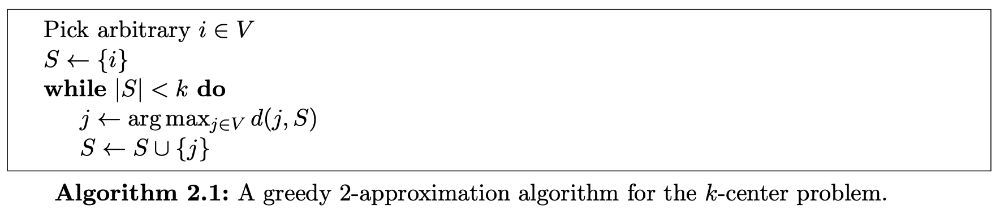
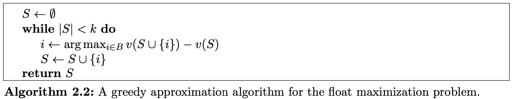
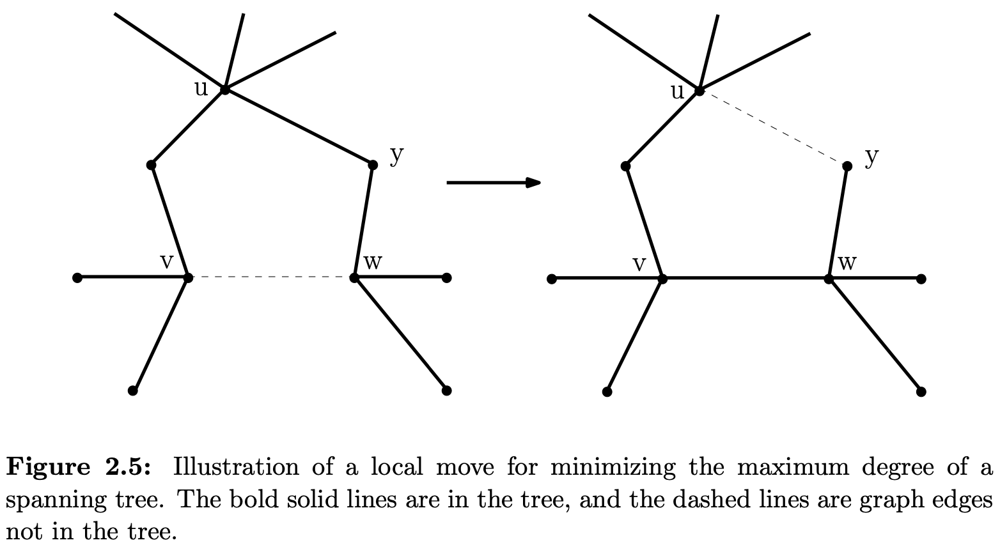
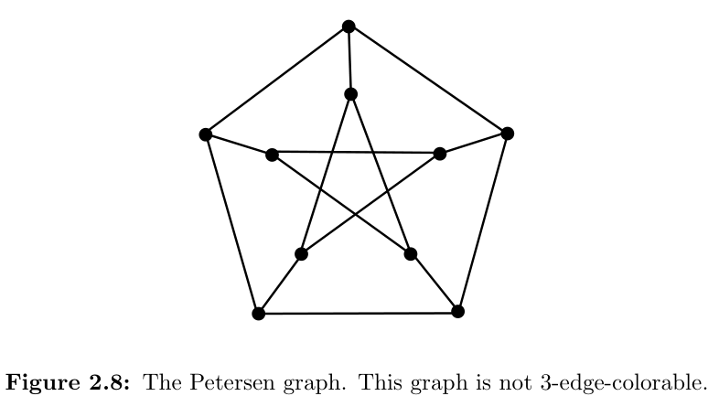
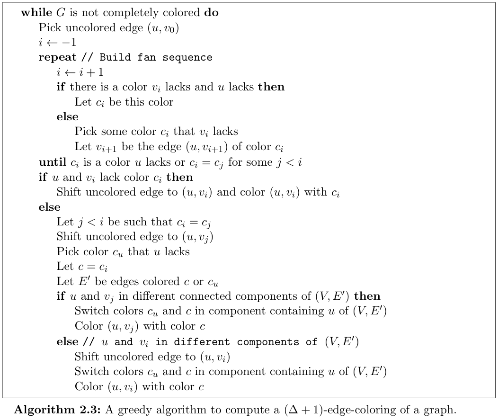

:::note[INFO]
[The Design of Approximation Algorithms](http://www.designofapproxalgs.com/) 第二章学习笔记。
:::

greedy algs 和 local search algs 都通过做一系列最优化某些 local choice 的决策进行工作:

- greedy algs 属于 *primal infeasible* algs: 过程中构造一个 feasible solution
- local search algs 属于 *primal feasible* algs: 维护一个 feasible solution, 过程中不断修改它

## Scheduling job with deadlines on a single machine

先考虑最简单的版本:

> $n$ 个 jobs 需要在一个机器上调度, 同一时间只能处理一个 job, 第 $i$ 个 job 的 *release date* 为 $r_{i}$, 需要的处理时间为 $p_{i}$, 假定每个 job 还有一个 *due date* $d_{i}$, 若我们在 $C_{i}$ 时完成这个 job, 那么它的 *lateness* $L_{i}=C_{i}-d_{i}$.
> 
> 目标是最小化 $L_{\max}=\max_{j=1,\dots,n}L_{j}$.

这个问题是 NP-hard 的, 决定是否存在一个 schedule 使得 $L_{\max}\leq 0$ 也是 strongly NP-hard 的, 很难得到 near-optimal solutions. 假设存在一个 $\rho$-approximation algorithm, 那么对于所有最优解为 0 的输入, 它的解不会超过 $0 \cdot \rho=0$, 这就会得出 $\mathrm{P}=\mathrm{NP}$ 的结论. 事先假定 $d_{i} < 0 ~ \forall i$ 是一个规避上述问题 easy workaround, 此时保证有 $L_{\max} > 0$, 利用优先处理 due date 最小的 job 的 greedy heuristic 便可得到一个 2-approximation algorithm.

令 $S$ 为 jobs 的某个子集, $r(S) = \min_{j \in S}r_{j}, p(S)=\sum_{j \in S}p_{j}, d(S)=\max_{j\in S}d_{j}$, $L_{\max}^{\ast}$ 为 optimal value.

:::note[Lemma 2.1]
For each subset $S$ of jobs,

$$L_{\max}^{\ast} \geq r(S)+p(S)-d(S).$$
:::

$\textit{Proof}.$ 考虑 $S$ 中 $C_{j}$ 最大的 job $j$, 显然有 $L_{\max}^{\ast} \geq L_{j} = C_{j} - d_{j}$. 根据定义有, $d(S) \geq d_{j}$, 当机器处理 $S$ 中的 jobs 没有任何闲置时有 $C_{j} = r(S)+p(S)$, 存在闲置时有 $C_{j} > r(S) + p(S)$, 因此有 $C_{j} \geq r(S)+p(S)$. 于是

$$L_{\max}^{\ast} \geq C_{j}-d_{j} \geq r(S)+p(S)-d(S).$$

lemma 2.1 是对最优解极端情况的一个分析, 可以用来比较最优解与算法解的大小关系.

若 job $j$ 的 release date $r_{j} \leq t$ 就称它在 time $j$ 是 *available* 的. *earliest due date (EDD) rule* 指的是每当机器处于闲置时, 就处理下一个 due date 最早的 available job.

:::note[Theorem 2.2]
The EDD rule is a 2-approximation algorithm for the problem of minimizing the maximum lateness on a single machine subject to release dates with negative due dates.
:::

$\textit{Proof}.$ 考虑算法得到的最大 lateness 对应的 job $j$, 即 $L_{\max}=C_{j} - d_{j}$. 找到 $C_{j}$ 之前的最小的 $t$ 满足 $[t, C_{j})$ 的时间段机器没有任何闲置, 令 $S$ 为这个时间段内 available jobs 的集合.

job $j$ 开始处理的时间为 $C_{j}-p_{j}$, 在 $[C_{j}-p_{j}, C_{j})$ 时间段内机器没有闲置, 所以 $C_{j}-p_{j} \geq t$, 所以 $j$ 在 $[t, C_{j}-p_{j}]$ 中至少有一段时间为 available job, 根据 $S$ 的定义有 $j \in S$.

显然我们有 $r(S)=t, p(S)=C_{j}-t, d(S) < 0$, 根据 lemma 2.1 有 $L_{\max}^{\ast} \geq C_{j}-d(S) \geq C_{j}$. 将 $S = \{j\}$ 代入 lemma 2.1 得到 $L_{\max}^{\ast}$ 与 $d_{j}$ 的关系式: $L_{\max}^{\ast} \geq r_{j}+p_{j}-d_{j} \geq d_{j}$. 最后将两个不等式相加有
$$L_{\max} = C_{j}-d_{j} \leq 2L_{\max}^{\ast}.$$

## The $k$-center problem

将大量 data 根据 similarities 和 dissimilarities 分类是现实世界中很普遍的需求, 这通常被称为 *clustering* data.

这里考虑 clustering 的一个变种, 即 $k$-center problem:

> 给定一个无向完全图 $G=(V, E)$, $V$ 中任意两点 $i,j$ 之间的 *distance* $d_{ij} \geq 0$ 并约定 $d_{ii}=0, d_{ij}=d_{ji}$, 且遵循 *triangle inequality*: 任给三元组 $i,j,k \in V$, 有 $d_{ij}+d_{jl} \geq d_{il}$. 在本题中, similarity 由 distance 决定: 越相近的点越相似. 给定 input $k$, 要求找到 $k$ clusters 使得最相似的 vertices 处于同一 cluster 中.
> 
> 问题等同于找出 $S \subseteq V, |S|=k$ 为 $k$ 个 *cluster centers* 的集合, 对每个点 $i$, 定义 $d(i, S) = \min_{j \in S} d_{ij}$, 将其放入距离最近的 center 所处的 cluster 中, 目标是最小化 $r^{\ast}=\max_{i \in V} d(i, S)$.

一个 simple & intuitive 的 greedy algorithm 是: 先随机将一个点加入 $S$, 然后迭代 $k-1$ 次, 每次在 $V - S$ 中选取 $d(i, S)$ 最大的点 $i$  将其加入 $S$.

:::note[Theorem 2.3]
Algorithm 2.1 is a 2-approximation algorithm for the $k$-center problem.
:::

这个 approximation 是可能的最优值, 考虑 NP-complete 问题 *dominating set problem*:

> 给定 graph $G=(V, E)$ 和整数 $k$, 需要 decide 是否存在大小为 $k$ 的集合 $S\subseteq V$ 使得每个结点要么在 $S$ 中要么与 $S$ 中的结点相邻.

给定一个 dominating set problem 的实例 $G,k$, 构造一个 $k$-center problem 实例 $G^{\prime},k$, 令 $V^{\prime}=V$, 若 $(i,j) \in E$, 则令 $d_{i^{\prime}j^{\prime}}=1$, 否则令 $d_{i^{\prime}j^{\prime}}=2$. 此时 $k$-center problem 所有可行解的值要么是 1 要么是 2, 若为 1, 则说明 dominating set problem 的答案为 true, 否则为 false. 假设我们有一个 $\rho$-approximation algorithm for $k$-center problem, 其中 $\rho < 2$, 那么只要最优解为 $1$, 那么它至多返回 $\rho < 2$, 于是可以由算法的返回值来 decide, 这表明了以下定理.

:::note[Theorem 2.4]
There is no $α$-approximation algorithm for the $k$-center problem for $α < 2$ unless $\mathrm{P=NP}$.
:::

## Scheduling jobs on identical parallel machines

> $m$ 个相同的 machine, $n$ 个 jobs 待处理, 每个 job $j$ 需要处理时间 $p_{j}$, 不存在 release date 和 due date, 都在 $t=0$ 时 release, 设完成时间为 $C_{j}$, 目标是最小化 $C_{\max} = \max_{j=1,\dots,n}C_{j}$, 也将 $C_{\max}$ 称为 schedule 的 *makespan* 或 *length*.

可以将这个问题看作等价的 load-balancing problem:

> $n$ 个物品, 每个有一个 weight $p_{j}$, 将其分配到 $m$ 个 machine 上, 目标是最小化单个 machine 的 total weight.

即便是最简单的算法也能在这个 scheduling problem 的模型上取得 reasonably good 的结果.

利用 local search 来解决的一个算法是: 从任意 schedule 开始, 将当前 schedule 下最晚完成的 job 记作 $\ell$, 检查是否存在一个 machine 使得将 $\ell$ 分配给它能减小 $C_{\ell}$ 即减小 makespan, 若存在则重新分配 $\ell$, 否则 terminate. 不断重复上述过程直到 terminate.

job $\ell$ 在 reassign 前的开始时间为 $C_{\ell}-p_{\ell}$, 若它能被 reassign 则表明存在 machine 的结束工作时间早于 $C_{\ell}-p_{\ell}$. 在分析这个算法前先对 optimal solution $C_{\max}^{\ast}$ 建立估计式. 由于每个 job 都要被处理, 肯定有

$$
C_{\max}^{\ast} \geq \max_{j=1,\dots,n}p_{j}
$$

另外, 若每个 job 可以被 fractionally processed, 那么最优解必然是 $\sum_{j=1}^{n}p_{j} / m$, 于是有

$$
C_{\max}^{\ast} \geq \sum_{j = 1}^{n}p_{j} / m
$$

考虑上述 local search algorithm 的解. 设 $\ell$ 为最终 schedule 中最晚完成的 job, 即得到的解 $C_{\max} = C_{\ell}$, 它开始处理的时间为 $S_{\ell} = C_{\ell}-p_{\ell}$, 由于 $\ell$ 不能被 reassign, 所以在 $[0, S_{\ell})$ 这段时间内所有 machine 都没有空闲且这段时间至少还有一个 job 没有结束处理, 可以得到不等式

$$
m\cdot S_{\ell} < \sum_{j=1}^{n} p_{j} \leftrightarrow S_{\ell} < \sum_{j=1}^{n} p_{j} / m \qquad (2.5)
$$

又有 $p_{\ell} \leq \max_{j=1,\dots,n}p_{j}$, 于是

$$
2C_{\max}^{\ast} \geq \max_{j=1,\dots,n}p_{j} + \sum_{j=1}^{n} p_{j} / m > p_{\ell} + S_{\ell} = C_{\ell} = C_{\max}
$$

:::note[Theorem 2.5]
The local search procedure for scheduling jobs on identical parallel machines is a 2-approximation algorithm.
:::

不难发现简单修改一下不等式 2.5 可以进一步精确上述 approximation ratio:

$$
S_{\ell} \leq \sum_{j \not= \ell}p_{j} / m
$$

继而

$$
\begin{aligned}
C_{\max} &= S_{\ell} + p_{\ell} \\
&\leq \sum_{j \not= \ell}p_{j} / m + p_{\ell} \\
&= \left( 1-\frac{1}{m} \right)p_{\ell} + \sum_{j=1}^{n}p_{j} / m \\
&\leq \left( 1-\frac{1}{m} \right)C_{\max}^{\ast} + C_{\max}^{\ast} \\
&= \left( 2 - \frac{1}{m} \right)C_{\max}^{\ast}
\end{aligned}
$$

另一个 natural algorithm 是遍历 job 每次将 job 分配给当前最早完工的 machine 的 greedy algorithm, 这个算法被称为 *list scheduling algorithm*, 即可以将其看作为先将 jobs 按顺序排列为一个 list, 然后下一个被处理的 job 就是 list 中最上方的 job.

要分析这个 greedy algorithm, 不妨将它得到的 schedule 作为 local search algorithm 的初始 schedule, 此时 $S_{\ell}$ 必然小于等于其他 machine 的结束时间, 于是 local search algorithm 会直接 terminate, 因此有以下定理.

:::note[Theorem 2.6]
The list scheduling algorithm for the problem of minimizing the makespan on $m$ identical parallel machines is a 2-approximation algorithm.
:::

显然 $p$ 较大的 job 分配错误的惩罚也较大, 那么不妨在刚开始每个 machine 工作量相差不大时将 $p$ 较大的 job 分配好, 后面 $p$ 较小的再进行分配容错率就会高一些. 利用这个 heuristic 优化 list scheduling algorithm 即先将 job 按 $p$ 从大到小排序之后再运行 list scheduling algorithm 便得到了一个新的算法, 它也被称为 *longest processing time rule (LPT)*.

:::note[Theorem 2.7]
The longest processing time rule is a $4/3$-approximation algorithm for scheduling jobs to minimize the makespan on identical parallel machines.
:::

$\textit{Proof}.$ 考虑反证法。假设 LPT 的 approximation $= 2-\alpha$, 尝试找出反例使得 $C_{\max} > (2-\alpha)C^{\ast}_{\max}$. 
 
令 $p_{1} \geq p_{2} \geq \cdots \geq p_{n}$ ，首先简化问题，不妨只考虑最晚完成的 job 是 $p$ 最小的 job, 我们需要证明这个情况是存在的。不妨设 job $\ell$ 是最晚完成的 job 并且 $\ell < n$，那么直接丢掉第 $\ell + 1 \sim n$ 个 job，算法的解不变，而最优解只会减小，于是我们可以得到一个满足要求的更小的反例，于是待证情况可以存在。

不妨记最晚完成的 job 为 $\ell$, 显然 $\ell = n$. 不难发现，在上述情况下，除非 $n=1$, 否则必然有 $S_{\ell} > 0$, 即 $\ell$ 前面一定有 job 和它在同一个机器上处理。类似于前面的证明，此处也有 $C_{\max}^{\ast} \geq S_{\ell}$, 不妨设 $\ell$ 前面有 $k$ 个 job 与它在同一机器上处理，那么有 $C_{\max}^{\ast} \geq kp_{\ell}$, 若 $p_{\ell} \leq (1-\alpha)C_{\max}^{\ast}$, 这显然会有 $C_{\ell} = S_{\ell}+p_{\ell} \leq C_{\max}^{\ast}+(1-\alpha)C_{\max}^{\ast}=(2-\alpha)C_{\max}^{\ast}$, 不是个反例，于是我们需要找到 $p_{\ell} > (1-\alpha)C_{\max}^{\ast}$ 的情况。

在满足前面所述条件下，$\ell$ 所在机器共处理 $k+1$ 个 job、其余机器每个都处理 $k$ 个 job 的情况是 $C_{\max}^{\ast}$ 最小且 $C_{\max}$ 不会变的情况，我们考虑这样的极端情况。此时有 $C_{\max}^{\ast} \geq kp_{\ell} \geq k(1-\alpha)C_{\max}^{\ast} \implies k(1-\alpha)\leq 1$. 当 $k=1$ 时，这个式子恒成立；当 $k=2$ 时，$\alpha \geq \frac{1}{2}$；当 $k \geq 3$ 时，这要求 $p_{\ell} \leq \frac{1}{3}C_{\max}^{\ast}$, 与前提条件矛盾，反例不存在。

最后，$k=1、2$ 的情况比较简单，此时 LPT 的解必然就是最优解，同样不存在反例。具体而言，当 $k=1$ 时，显然将 $\ell$ 给前面最早结束的机器处理时 makespan 最小；当 $k=2$ 时，不妨先丢掉 job $\ell$, 那么剩下的 job 按照前面所说的情况，每台机器都会处理其中两件，根据 LPT 流程，必然是第 $i$ 大的 job 与第 $i$ 的 job 在一台机器上处理，任意调换两个 job 都会使两台机器的 makespan 增大，因此此时必然是最优解，最后将 $\ell$ 给最早完工的机器处理必然仍然是最优解。得证。

由上述证明过程，可以直接得到以下 Lemma.

:::note[Lemma 2.8]
For any input to the problem of minimizing the makespan on identical parallel machines for which the processing requirement of each job is more than one-third the optimal makespan, the longest processing time rule computes an optimal schedule.
:::

## The traveling salesman problem

> 给定城市集合 $\{1,2,\dots,n\}$ 和 $n \times n$ 的对称矩阵 $C=(c_{ij})$ 表示从城市 $i$ 到城市 $j$ 的旅行花费. 我们约定没有自边, 且 cost 都 $\geq 0$. 要求找到一个包含所有结点且仅包含一次的环, 使得环的路径花费之和最小.

如果将输入看作一个带权无向完全图, 则 feasible solution (即 *tour*) 由图中的 Hamiltonian cycle 构成.

decide 给定的无向图是否存在 Hamiltonian cycle 是 NP-complete 的, 能解决上述 TSP 问题的 approx alg 也能用来解决 Hamiltonian cycle 问题: 给定无向图 $G$, 构造对应 TSP 的图, 对于每个二元组 $i,j$, 若 $(i,j) \in E$, 则令 $c_{ij}=1$, 否则令 $c_{ij}=n+2$. 如果 $G$ 存在 Hamiltonian cycle, 那么就会有一个 cost 为 $n$ 的 tour, 否则 tour 的 cost 至少为 $2n+1$. 若我们有一个 2-approximation alg for the TSP, 如果它计算的 tour 至多为 $2n$, 就说明 $G$ 中存在一条 Hamiltonian cycle, 否则不存在.

:::note[Theorem 2.9]
For any $α > 1$, there does not exist an $α$-approximation algorithm for the traveling salesman problem on $n$ cities, provided $\textrm{P}\not= \textrm{NP}$. In fact, the existence of an $O(2^{n})$-approximation algorithm for the TSP would similarly imply that $\textrm{P=NP}$.
:::

如果给边权加上 triangle inequality 的限制, 就可以避免上述转化, 从而可以对 TSP 进行求解, 此时的 TSP 被称为 *metric TSP*.

解决 metric TSP 的一个简单的 greedy heuristic 是: 先找到距离最近的两个城市 $i,j$, 令目前的 tour 为 $i\to j, j\to i$; 之后不断迭代, 记 $S$ 为当前 tour 包含的城市集合, 每轮找到一对城市 $i,j$ 其中 $i \in S, j \notin S$ 且 $c_{ij}$ 最小, 将 $j$ 加入 $S$, 设 $k$ 为 $i$ 在当前 tour 中下一个到达的城市, 将 tour 改为 $i \to j \to k$.

这个算法被称为 *nearest addition algorithm*, 它的过程与求解 MST 的 Prim 算法几乎一致, 我们借助 TSP 的最优解 $\geq$ MST 的边权和来分析 nearest addition algorithm.

:::note[Lemma 2.10]
For any input to the traveling salesman problem, the cost of the optimal tour is at least the cost of the minimum spanning tree on the same input.
:::

$\textit{Proof idea}.$ 这个证明很简单, 将 optimal tour 任意去掉一条边便会得到一个特殊的 spanning tree, 并且这个 spanning tree 的 cost $\leq$ optimal tour 的 cost, 又由于 MST 的 cost $\leq$ 任意 spanning tree 的 cost, 因此引理成立.

:::note[Theorem 2.11]
The nearest addition algorithm for the metric traveling salesman problem is a 2-approximation algorithm.
:::

事实上, 有了 MST 这个桥梁后我们可以从另一个角度看待上述算法, 在这个角度下可以进一步优化. 首先需要知道一点: **Eulerian graph 可以通过 shortcutting 得到一个 Hamiltonian cycle**. 具体到本题, 假设我们已经计算出 $G$ 的 MST, 然后将每条边 copy 一份, 此时每个点度数必然是偶数, 也就存在 Eulerian traversal, 并且新的 graph 的 cost $\leq 2\mathrm{OPT}$. 令一个 Eulerian traversal 为 $(i_{0}, i_{1}), (i_{1}, i_{2}), \dots, (i_{k-1}, i_{k}), (i_{k}, i_{0})$, 将对应的 path 罗列出来, 去除重复的结点仅保留它的第一次出现, 这样一来我们就得到了 $G$ 的一个 tour.

接着我们 bound 这个 tour 的长度: 设 $i_{l}, i_{m}$ 是 tour 中相邻的两个结点, 我们从 traversal 中去除了已经出现过了的结点 $i_{l+1},\dots,i_{m-1}$, 根据 triangle inequality, $c_{i_{l}i_{m}} \leq c_{i_{l}i_{l+1}}+\cdots+c_{i_{m-1}i_{m}}$, 因此 tour cost $\leq$ traversal cost $\leq 2\mathrm{OPT}$. 这个算法也被称为 *double-tree algorithm*.

:::note[Theorem 2.12]
The double-tree algorithm for the metric traveling salesman problem is a 2-approximation algorithm.
:::

"跳过"已经访问过的结点并利用未经"跳过"的原图的边权和来 bound 新得到的 tour 的 cost 的技术有时也被称为 *shortcutting*.

在 double-tree alg 将 MST 转化为 Eulerian 的过程可以进一步优化. 在 MST 中, 显然所有结点的度数之和为偶数, 对于度数本来就是偶数的结点可以不做修改, 考虑度数为奇数的结点集合 $O$. 为了不动偶度数结点的连边, 我们只对 $O$ 内部的连边作修改. 要保证图的连通性, 我们必然加边而不是减边, 要使加边的边权和尽可能小, 加的边数自然要尽可能小, 我们希望给每个结点仅加一条边, 此时问题转化为了求解 $O$ 的 *perfect matching*. 给定一个完全带权图, 我们能在 polynomial time 找到权值最小的 perfect matching. 因此我们新加的边即为 $O$ 的边权和最小的 perfect matching 的边, 这样 MST 便成为了 Eulerian graph, 接着我们按照 double-tree alg 后面的步骤走便可得到 $G$ 的一个 tour. 这个算法被称为 *Christofides' algorithm*.

:::note[Theorem 2.13]
Christofides' algorithm for the metric traveling salesman problem is a $3/2$- approximation algorithm.
:::

:::note
TODO
:::

目前还没有找到比这个更优的 metric TSP 算法, 不过根据下面的定理, 也许还有更优一点的算法有待发现.

:::note[Theorem 2.14]
Unless $\mathrm{P=NP}$, for any constant $α < \frac{220}{219} ≈ 1.0045$, no $α$-approximation algorithm for the metric TSP exists.
:::

## Maximizing float in bank accounts

*float* 指的是使用支票付款到银行将账户中这笔钱抽取出来的时间间距, maximizing float problem 指的是:

> 我们希望开不超过 $k$ 个银行账户来最大化 float, 记 $B$ 为可能开账户的银行集合, $P$ 为需要支付的 payees 的集合. 令 $v_{ij} \geq 0$ 表示用在银行 $i \in B$ 的账户付款给 $i\in P$ 的 float 值. 我们希望找到 $S \subseteq B, |S| \leq k$, 使得 $\sum_{j \in P}\max_{i \in S}v_{ij}$ 最大. 我们定义 $v(S)$ 为选择 $S \subseteq B$ 得到的这个 objective function 的值.

一个 natural greedy alg 是: 从 $S=\emptyset$ 开始, 每次选择能使 $v(S\cup \{i\})$ 的银行 $i \in B$ 将其加入 $S$ 直到 $|S| \geq k$.

这个贪心看上去好像很对, 可惜的是 objective function 是 convex function 而不是 linear function, 局部最优并不等同于全局最优, 因而它只能是近似算法. 不过它的性能很优秀, 接下来我们证明它是 $(1-\frac{1}{e})$-approximation 的.

在证明之前, 我们首先提出一个 Lemma, 约定 $O$ 为 $|O|$ 最小的 optimal solution, 它满足 $O \subseteq B, |O| \leq k$.

:::note[Lemma 2.15]
Let $S$ be the set of banks at the start of some iteration of Algorithm 2.2, and let $i \in B$ be the bank chosen in the iteration. Then
$$v(S \cup \{i\}) - v(S) \geq \frac{1}{k}(v(O) - v(S)).$$
:::

这个 Lemma 的 intuition 在于: $O$ 中每一个银行 $i \in O$, 都会在 $P$ 中至少对应一个 payee $j$ 使得 $v_{ij} = \max_{i' \in O}v_{i'j}$, 否则 $i$ 对 $v(O)$ 没有贡献, 没有必要将 $i$ 加入 $O$ 凑数, 由于 $|O| \leq k$, 因此必然存在 $i \in O$ 使得 $i$ 的贡献 $\geq \frac{v(O)}{k}$. 显然加入的第一个银行 $i$ 必然满足 $v(\{i\}) \geq \frac{v(O)}{k}$, 直觉上来说, 必然还会存在银行满足贡献 $\geq v(O)$ 中还为被分配出去的部分的 $\frac{1}{k}$, 同样地也可以得出 $\geq \frac{1}{k}(v(O)-v(S))$ 的结论.

:::note[Theorem 2.16]
Algorithm 2.2 gives a $\left( 1-\frac{1}{e} \right)$-approximation algorithm for the float maximization problem.
:::

$\textit{Proof}.$ 令 $S^t$ 表示第 $t$ 轮迭代后的结果, 于是 $S^0 = \emptyset, S^k = S$. 令 $v(S^0)=0$, 对任意 $t$, 代入 Lemma 2.15 有 $v(S^t) \geq \frac{1}{k}v(O)+\left( 1-\frac{1}{k} \right)v(S^{t-1})$, 不断对 $v(S^k)$ 应用这个不等式可以得到

$$
\begin{aligned}
v(S) &= v(S^k) \\
&\geq \frac{1}{k}v(O) + \left( 1-\frac{1}{k} \right)v(S^{t-1}) \\
&\geq \frac{1}{k}\left( 1 + \left( 1-\frac{1}{k} \right) + \left( 1-\frac{1}{k} \right)^2 + \cdots + \left( 1-\frac{1}{k} \right)^{k-1} \right)v(O) \\
&= \left( 1 - \left( 1-\frac{1}{k} \right)^k \right)v(O) \\
&\geq \left( 1-\frac{1}{e} \right)v(O)
&&\blacksquare
\end{aligned}
$$

接下来我们证明 Lemma 2.15. Lemma 2.15 的证明又依赖于下述 Lemma:

:::note[Lemma 2.17]
For the objective function $v$, for any $X \subseteq Y$ and any $\ell \not\in Y$,
$$v(Y \cup \{\ell\}) - v(Y) \leq v(X \cup \{\ell\}) - v(X).$$
:::

这个 Lemma 的正确性很显然, formal proof 也比较简单, 这里不再赘述.

:::note[Submodularity]
Lemma 2.17 反映的 value function $v$ 所具有的性质称为 *submodularity*, 它的主要含义是加入一个新元素能产生的 marginal value 会随着 set 的元素数量增加而减少, 这个性质在很多 algorithmic settings 中都起到了重要作用.
:::

$\textit{Proof of Lemma 2.15}.$ 设 $|O / S|=p$ 以及 $i_{1}, \dots, i_{p} \in O / S$, 由 $|O| \leq k$ 且 $|S| \leq k$, 显然 $p \leq k$, 于是我们有

$$
\begin{aligned}
v(O) - v(S) &= v(S \cup (O / S)) - v(S) \\
&= \left( v(O)-v(O / \{i_{1}\}) + v(O / \{i_{1}\}) - v(O / \{i_{1}, i_{2}\}) + \cdots + v(S \cup {i_{p}}) - v(S) \right) - v(S) \\
&\leq p\left(v(S \cup \{i_{p}\}) - v(S) \right) - v(S)
\end{aligned}
$$

根据算法流程, 必然有 $v(S \cup \{i\}) - v(S) \geq v(S \cup \{i_{p}\}) - v(S)$, 因此

$$
\begin{aligned}
v(O) - v(S) &\leq p\left( v(S \cup \{i\}) - v(S) \right) - v(S) \\
&\leq k(v(S \cup \{i\}) - v(S))
&&\blacksquare
\end{aligned}
$$

类似的拥有以集合 $S$ 来表示的 objective function $v(S)$, 同时满足 $v(S)$ 是 monotone 和 submodularity 的问题中都可以借鉴上述 greedy approx alg 以及它的分析.

## Finding minimum-degree spanning trees

> 给定图 $G=(V,E)$, 我们希望找到 $G$ 的一个最小生成树 $T$ 使得 $T$ 中度数最大的结点的度数最小.

对于 $|V| >2$ 的图 $G$, 它的答案最小只能是 $2$, 若确实是 $2$ 就说明 $G$ 存在一条 Hamiltonian path, 而决定图 $G$ 中是否存在一条 Hamiltonian path 的问题是 NP-hard 的, 可见 minimum spanning tree problem 也是 NP-hard.

:::note[Theorem 2.18]
It is NP-complete to decide whether or not a given graph has a minimum-degree spanning tree of maximum degree two.
:::

对于图 $G=(V, E)$, 设 $T^\ast$ 为最优解得到的 MST, $\mathrm{OPT}$ 为 $T^\ast$ 中的 maximum degree. 下面给出一个能在 polynomial time 找到 maximum degree 不超过 $2\mathrm{OPT}+\lceil \log_{2}n \rceil$ 的 local search algorithm.

该 local search algorithm 的基本设置如下: 从任意 MST $T$ 开始, 记 $\Delta(T)$ 为 $T$ 的 maximum degree, $d_{T}(u)$ 为 $u$ 在 $T$ 中的 degree, 为了方便, 记 $\ell = \lceil \log_{2}n \rceil$. local move 为选择一个结点 $u$, 然后尝试遍历 $E$ 添加一条不属于 $T$ 的边 $(v,w)$ 得到环 $C$ 使得 $u$ 位于 $C$ 上并且满足 $\max(d_{T}(v), d_{T}(w)) \leq d_{T}(u)-2$, 然后删除 $C$ 上与 $u$ 相连的一条边从而将 $d_{T}(u)$ 减少 1, $d_{T}(v)$ 和 $d_{T}(w)$ 增加 1.

local search algorithm 会用上述 local move 不断减少某些结点的 degree 直到无法进行下一步 local move. 具体而言, 由于 degree 等于 $\Delta(T)$ 的结点度数的减少可能依赖于一些其他结点度数的减少, 因此不仅要对具有 maximum degree 尝试 local move, 其他结点也要尝试; 为了算法能在 polynomial time 终止, 只对 degree 相对大的结点尝试 local move, 此处设置对 degree 位于 $\Delta(T)-\ell$ 到 $\Delta(T)$ 区间的结点尝试 local move. 当算法无法对目标结点进行 local move 时即终止, 此时我们称它找到了一个 *locally optimal* tree.

下面证明上述 local search algorithm 找到的 locally optimal tree 的 maximum degree 不会超过 $2\mathrm{OPT}+\ell$.

:::note[Theorem 2.19]
Let $T$ be a locally optimal tree. Then $\Delta(T) \leq 2\mathrm{OPT}+\ell$, where $\ell = \lceil \log_{2}n \rceil$.
:::

$\textit{Proof}.$ 先对 $\mathrm{OPT}$ 的 lower bound 进行估计. 考虑下述情况, 对 MST 删去 $k$ 条边, 则它会被分为 $k+1$ 个 components, 此时存在一些结点, 设其集合为 $S$, 将任意两个 component 相连都会用到与这些结点相连的边, 那么将这 $k+1$ 个 components 相连得到新的 MST 平均会增加的 degree 为 $\frac{k}{|S|}$, 显然 $T^\ast$ 必然可以通过删边再加边得到, 因此必然有 $\mathrm{OPT} \geq \frac{k}{|S|}$.

接下来在 $T$ 上寻找这样的 $k$ 与 $S$. 记 $S_{i}$ 为 $d_{T}(u) \geq i$ 的点集, 考虑 local search algorithm 的终止态, 即 $S_{\Delta(T)-\ell}$ 中不存在可以进行 local move 的结点. 那么对于任意 $i \geq \Delta(T)-\ell$, 将 $T$ 中与 $S_{i}$ 中结点相邻的边删去, 删去的边数至少为 $i \cdot |S_{i}| - (|S_{i}|-1) = (i-1)\cdot |S_{i}|+1$, 其中 $|S_{i}|-1$ 为 $S_{i}$ 内部最多可能的边数 (形成环的边数 - 1), 根据 local move 的描述, 不存在与 degree $\leq i-2$ 的结点相连的边能连接任意两个被分开的 component, 从而 $S$ 对应此时的 $S_{i-1}$, 于是有 $\mathrm{OPT} \geq \frac{(i-1)\cdot|S_{i}|+1}{|S_{i-1}|}$.

然后我们对 $|S_{i}|$ 与 $|S_{i-1}|$ 之间的大小关系进行估计. 由于满足条件的 $i$ 可以任取, 因此不妨直接找到一个满足 $2|S_{i}| \geq |S_{i-1}|$ 的 $i$. 考虑是否能找到这样的 $i$. 若所有满足 $i \geq \Delta(T)-\ell$ 都有 $2|S_{i}| < |S_{i-1}|$, 那么就会有 $|S_{\Delta(T)-\ell}| > 2^{\ell}\cdot |S_{\Delta(T)}| \geq 2^{\ell} \geq n$, 矛盾 (个人猜测 $\ell$ 的值也是这么设置来的🤔), 从而必然能找到 $i \geq \Delta(T)-\ell$ 满足 $2|S_{i}| \geq |S_{i-1}|$. 此时有
$$\begin{aligned}\mathrm{OPT} \geq \frac{(i-1)\cdot|S_{i}|+1}{|S_{i-1}|} \geq \frac{(i-1)\cdot |S_{i}| + 1}{2|S_{i}|} \geq \frac{i-1}{2} \geq \frac{\Delta(T) - \ell}{2}. &&\blacksquare\end{aligned}$$

:::note[Theorem 2.20]
The algorithm finds a locally optimal tree in polynomial time.
:::

$\textit{Proof}.$ 本题使用 *potential function* 进行证明. 对于树 $T$, 定义它的 potential function 为 $\Phi(T) = \sum_{v \in V}3^{d_{T}(v)}$. 显然有 $\Phi(T) \leq n\cdot 3^{\Delta(T)} \leq n 3^{n}$, Hamiltonian path 的 potential 为 $2 \cdot 3^{1} + (n-2) \cdot 3^{2} > n$, 因此 $n < \Phi(T) \leq n\cdot 3^{\Delta(T)}$.

考虑 local move 对 potential 的影响. 假设一次 local move 将 $d_{T}(u)$ 从 $i$ 减小到了 $i-1$, potential 的减少值则为 $3^{i}-3^{i-1}=2 \cdot 3^{i-1}$, 而对应 degree 增加的结点 $v$ 和 $w$ 使 potential 增加的值不会超过 $2 \cdot (3^{i-1} - 3^{i-2}) = 4 \cdot 3^{i-2}$, 从而单次 local move 导致 potential 减少的值至少为 $2 \cdot 3^{i-1} - 4 \cdot 3^{i-2} = 2 \cdot 3^{i-2}$. 注意到每次 local move 的对象必然满足 $i \geq \Delta(T) - \ell$, 而我们又有对 $3^{\ell}$ 的估计:

$$3^{\ell} \leq 3^{\log_{2}n + 1} \leq 3 \cdot 4^{\log_{2}n} = 3 \cdot \left(2^{\log_{2}n}\right)^2 = 3n^2,$$

因此整体的 potential 减少值至少为
$$2 \cdot 3^{i-2} \geq \frac{2}{9}3^{i} \geq \frac{2}{9}3^{\Delta(T)-\ell} \geq \frac{2 \cdot 3^{\Delta(T)}}{27n^2} \geq \frac{2}{27n^3} \Phi(T)$$

即经过一次 local move 后得到的新 MST $T'$ 有 $\Phi(T') \leq \left( 1-\frac{2}{27n^3} \right)\Phi(T)$. 而若一开始的 $\Phi(T) = n \cdot 3^{\Delta(T)}$, 那么经过至多 $\frac{27}{2}n^4 \ln 3$ 次 local move, $\Phi(T')$ 会减小到 $n$:
$$\begin{aligned}\left( 1-\frac{2}{27n^3} \right)^{\frac{27}{2}n^4 \ln 3} \cdot (n 3^n) \leq e^{-n \ln 3} \cdot (n 3^n) = n&& \blacksquare\end{aligned}$$

:::note
potential function 能表示算法当前的 state, 而我们可以根据实际的 problem 给出 potential function 的 upper bound 以及 lower bound, 然后就可以借每次 move 后 function 取值变化来对可能的 move 数目进行估计.

potential function 的相性与 local search 很合得来, 也许是对 local search 分析的一个万金油方法? 它的思想也很有意思, 有种开启上帝视角的感觉, 相信在别的地方也很有用.
:::

有了上述分析, 不难得出下述推论:

:::note[Corollary 2.21]
The local search algorithm runs in polynomial time and results in a spanning tree $T$ such that $\Delta(T) \leq b \mathrm{OPT} + \lceil \log_{b} n \rceil$.
:::

## Edge Coloring

本节介绍同时具有 greedy algorithm 和 local search algorithm 的特点的一个算法: 它尝试做出 greedy decision, 当无法进行下一步时就 make local changes 直到可以继续.

这个算法是用来找到一张图的 *edge coloring* 的. 若一张无向图中所有边可以被恰好 $k$ 个颜色之一染色并且满足不存在两个颜色相同的边有公共点, 我们就称这个图是 *$k$-edge-colorable*.

对于给定的 $k$-edge-colorable 的图, 我们希望 $k$ 越小越好. 令 $\Delta$ 表示图中的 maximum degree, 显然有 $k \geq \Delta$, 并且不是所有的图都能满足 $k = \Delta$, 例如 *Petersen graph*:

:::note[Theorem 2.22]
For graphs with $\Delta=3$, it is NP-complete to decide whether the graph is 3-edge-colorable or not.
:::

这里我们给出的算法能在 polynomial time 找出任意图的 $(\Delta+1)$-edge-coloring, 它从完全未被染色的图开始, 每一轮迭代从一个未被染色的边 $(u, v_{0})$ 开始, 然后建立 fan sequence, 将 shifting color 作为 local move 来允许贪心能进行下去.

:::note[Theorem 2.23]
There is a polynomial-time algorithm to find a $(\Delta+1)$-edge-coloring of a graph.
:::

$\textit{Proof}.$ 对于算法能成功找到一个 $(\Delta+1)$-edge-coloring, 只需证明算法每一次迭代都能成功染色一条未被染色的边即可. 在单轮迭代中, 算法首先寻找一条未被染色的边 $(u, v_{0})$, 尝试将其染色:

- 若存在 color $c_{0}$ 使得 $u$ 和 $v_{0}$ 都不存在邻边被染上过 (称之为 *lack* $c_{0}$), 则直接染色 $c_{0}$;
- 若不存在, 则考虑 shifting color: 随机选择颜色 $c_{0}$ 使得 $v_{0}$ lacks 但是 $u$ 并不 lack, 接着将 uncolored edge 切换到颜色为 $c_{0}$ 的 $(u,v_{1})$, 同样尝试寻找 $u,c_{1}$ 都 lack 的颜色, 若找到则直接染上该颜色, 将 $c_{0}$ 给 $(u,v_{0})$, 否则继续上述流程, 维护当前的边序列 $(u,v_{0}), (u,v_{1}), \dots, (u,v_{i})$ 和对应的颜色序列 $c_{0}, c_{1}, \dots, c_{i}$.
	- 当找到 $c_{i}$ 是 $u$ 和 $v_{i}$ 都 lack 的颜色时即终止, 然后分别将边序列中的边染上颜色序列中的颜色即可, 相当于完成了一系列的 color shift 并成功将最初的 uncolored edge $(u, v_{0})$ 染色. 
	- 另一种情况是存在 $j < i$ 使得 $c_{j} = c_{i}$, 此时显然无法继续维护边序列与颜色序列, 考虑如何做 local change 来得以继续: 显然需要给 $u$ 引入新的 color $c_{u}$, 根据算法描述, $v_{i}$ 与 $v_{j}$ 都并不 lack $c_{u}$, 而 $u$ lack $c_{u}$. 不妨在只由用 $c_{u}$ 与 $c_{i}$ 染色的边集得到的 $G$ 的子图 $G'=(V,E')$ 上考虑问题. 不难发现, $G'$ 只会由一些简单路径及大小为偶数的环组成, 由于 $u,v_{i},v_{j}$ 都只拥有 $c_{u},c_{i}$ 中的一种颜色, 因此他们都只能是简单路径的端点之一, 一条简单路径只有 2 个端点, 因此三个结点至多有两个位于同一条简单路径上, 不妨设其为 $u,v_{i}$, 我们将这条路径上的颜色进行调换, 这样一来 $u$ 和 $v_{j}$ 都 lack $c_{i}$ 而不 lack $c_{u}$, $v_{i}$ lack $c_{u}$ 而不 lack $c_{i}$, 然后用 $c_{i}$ 染色 $(u,v_{j})$, 于是 $(u,v_{0}), (u,v_{1}), \dots, (u,v_{j})$ 这部分 fan sequence 依然可以运用上一种情况的 color shifting 将未染色的边 $(u,v_{0})$ 染色.
- 从而算法的每一轮迭代都能成功染色一条 uncolored edge, 至多 $|E|$ 次迭代可以得到一个 $(\Delta+1)$-edge-coloring.

迭代次数是 $O(|E|)$ 的, 每一轮迭代内部也是 polynomial-time 的, 因此算法显然是 polynomial-time algorithm.