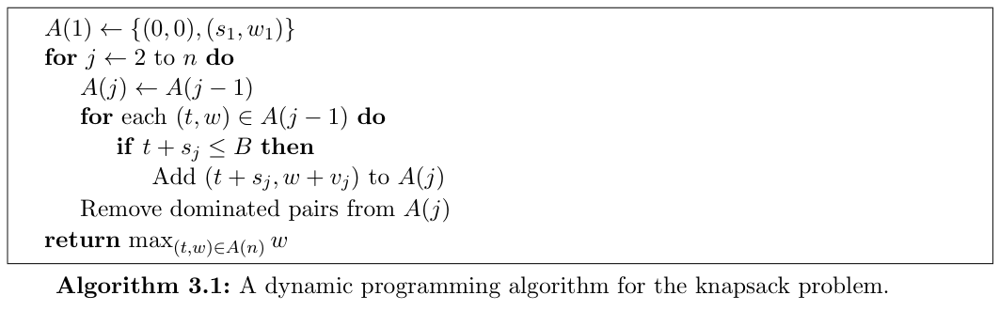
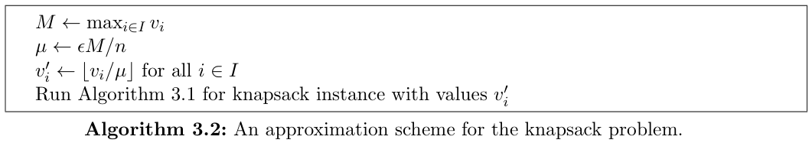
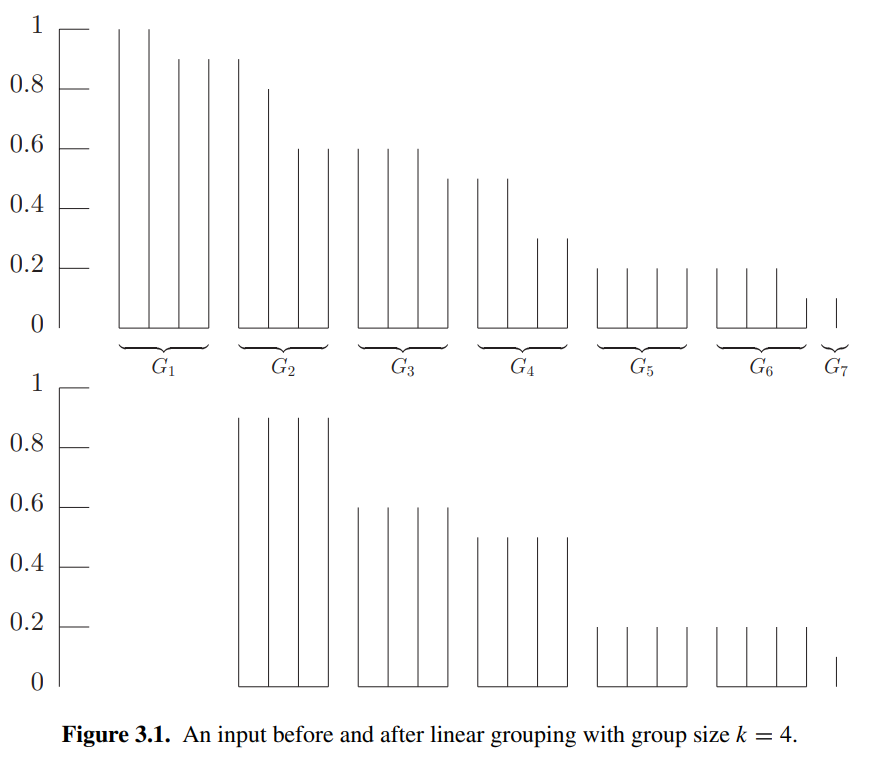

有些 NP-hard problem 在 input data 以 unaray 的形式表达时，可以使用 dynamic programming 在以 input size 为自变量的 polynomial time 解决，此时的 algorithm 被称为是 *pseudopolynomial*[^1] 的。通过 rounding input value 可以得到一个 polynomial in the input size 的 approximation algorithm.

[^1]: Wikipedia 上的解释: [Pseudo-polynomial time](http://en.wikipedia.org/wiki/Pseudo-polynomial_time).

对于其他 problem, 则通常将 input instance 分为 "large" 和 "small" 两个部分，对 large input 进行 rounding, 然后使用 DP 在 polynomial-time 单独求解得到一个存在 error parameter 的 solution, 再通过一些方式结合 small input 得到最终的 solution.

## The knapsack problem

> 给定 item 的集合 $I = \{1, \dots, n\}$, 每个 item 有 value $v_{i}$ 与 size $s_{i}$, 所有 value 与 size 都是正整数。knapsack 的容量为 $B$, 也是一个正整数。要求出 item 的子集 $S \subseteq I$, 满足 $\sum_{i \in S}s_{i} \leq B$, 使得 $\sum_{i \in S}v_{i}$ 最大。

经典的 DP 算法如下：

:::note[Theorem 3.1]
Algorithm 3.1 correctly computes the optimal value of the knapsack problem.
:::

Algorithm 3.1 的时间复杂度为 $O(n \min(B, V))$, 其中 $V =\sum_{i \in I}v_{i}$. 若所有 input 都用 binary 编码，此时 input $B$ 的 size 为 $\log_{2} B$, $O(nB)=O\left(n 2^{\log_{2}B}\right)$ 为 input number $B$ 的 exponential, 因此并不是 polynomial in input size.

:::note[Definition 3.2]
An algorithm for a problem $\Pi$ is said to be pseudopolynomial if its running time is polynomial in the size of of the input when the numneric part of the input is encoded in unary.
:::

若 $V$ 是 $n$ 的 polynomial, 那么 $O(n \min(B, V))$ 就会是 $n$ 的 polynomial. 我们可以通过将 $v_{i}$ round 到 $n$ 的 polynomial 来得到一个真正的 polynomial-time (但是 approximation) algorithm, 合适的 rounding 技巧可以使结果的误差较小。

:::note[Definition 3.3]
A polynomial-time approximation scheme (PTAS) is a family of algorithms $\{A_{\epsilon}\}$, where there is an algorithm for each $\epsilon > 0$, such that $A_{\epsilon}$ is a $(1 + \epsilon)$-approximation algorithm (for minimization problems) or a $(1 - \epsilon)$-approximation algorithm (for maximization problems).
:::

$A_{\epsilon}$ 的 running time 会取决于 $1 / \epsilon$, 一般考虑在 $1 / \epsilon$ 上有较好的 bound 的 algorithm:

:::note[Definition 3.4]
A fully polynomial-time approximation scheme (FPAS, FPTAS) is an approximation scheme such that the running time of $A_{\epsilon}$ is bounded by a polynomial in $1 / \epsilon$.
:::

下面给出一个 knapsack problem 的 FPAS. 考虑用一个与 $n$ 有关 (polynomial in $n$) 的数 $\mu$ 来估计 $v_{i}$, 将 $v_{i}$ round 到 $v_{i}'=\lfloor v_{i} / \mu \rfloor$, 然后跑 Algorithm 3.1 得到 item 集合 $S'$, 最终算法得到的解即为 $\sum_{i \in S'}v_{i}$. 

记最优解得到的 item 集合为 $S$, 则 $\mu\sum_{i \in S}v_{i}' \geq \mathrm{OPT}-n\mu$, 由于 $S'$ 为此时的最优解，因此有 $\mu \sum_{i \in S'}v_{i}' \geq \mu \sum_{i \in S}v_{i}' \geq \mathrm{OPT} - n \mu$, 又 $\mu \cdot \sum_{i \in S'}v_{i}' \leq \sum_{i \in S'}v_{i}$, 因此得到的解与 $\mathrm{OPT}$ 的差不超过 $n \mu$. 由于算法（需要）是 $(1-\epsilon)$-approximation, 因此解与 $\mathrm{OPT}$ 的差不应超过 $\epsilon \mathrm{OPT}$. 记 $M = \max_{i \in I}v_{i}$, 则显然有 $\mathrm{OPT} \geq M$, 不妨令 $n \mu = \epsilon M$ 控制误差恒不超过 $\epsilon M$, 得到 $\mu = \epsilon M / n$, 于是 $v_{i}' = \lfloor \frac{v_{i}}{\epsilon M / n} \rfloor$.

此时有 $V'=\sum_{i=1}^n v_{i}' = \sum_{i=1}^n \lfloor \frac{v_{i}}{\epsilon M / n} \rfloor = O(n^2 / \epsilon)$, 算法的时间复杂度为 $O(n \min(B, V')) = O(n^{3} / \epsilon)$, 满足 bounded by a polynomial in $1 / \epsilon$.

:::note[Theorem 3.5]
Algorithm 3.2 is a fully polynomial-time approximation scheme for the knapsack problem.
:::

$\textit{Proof}.$ 只需证明算法是 $(1-\epsilon)$-approximation 即可。通过下列不等式可以证明：

$$
\begin{aligned}
\sum_{i \in S'}v_{i} &\geq \mu\sum_{i \in S'}v_{i}'\\
&\geq \mu \sum_{i \in S}v_{i}'\\
&\geq \sum_{i \in S}v_{i} - n\mu \\
&= \mathrm{OPT} - \epsilon M\\
&\geq \mathrm{OPT} - \epsilon \mathrm{OPT}\\
&= (1-\epsilon)\mathrm{OPT}
\end{aligned}
$$

## Scheduling jobs on identical parallel machines

不难想到将 job 分为 short job 和 long job, 然后对数量被限制到常数级别的 long job 求出 optimal schedule, 再将 short job 按照 list scheduling 加入当前 schedule 中。

具体来说，将 $p_{i} \geq \frac{1}{km} \sum_{i=1}^{n} p_{i}$[^2] 的 job 视为 long job, 则 long job 至多有 $km$ 个，其中 $k$ 为常数，若假定 $m$ 也是常数，那么 long job 的数量也是常数级别，此时可以直接暴力求出 optimal schedule for long jobs, 总的状态数为 $O(m^{km})$ 为常数，然后对 short jobs 从大到小排序后按照 list scheduling 加入 schedule 得到最终的 schedule, 最后的时间复杂度为 $O(n\log n + m^{km})=O(n\log n)$, 瓶颈在于排序，显然属于 polynomial-time algorithm. 记此类算法为 $\{ A_{k} \}$.

在上一章中 list scheduling 算法有结论

$$C_{\max} \leq p_{\ell} + \sum_{j \neq \ell}p_{j} / m,$$

其中 $\ell$ 为最晚完成的 job. 对于 $A_{k}$ 得到的 schedule, 若最晚完成的 job 是 long job, 那么此时的 $C_{\max}=C_{\max}^{\ast}$; 若最晚完成的 job 是 short job, 根据结论有

$$
\begin{aligned}
C_{\max} &\leq p_{\ell} + \sum_{j \neq \ell}p_{j} / m \\
&\leq \frac{1}{k}\sum_{i=1}^{n}p_{i} / m + \sum_{j \neq \ell} p_{j} / m \\
&\leq \left( 1 + \frac{1}{k} \right)\sum_{i=1}^{n}p_{i} / m \\
&\leq \left( 1 + \frac{1}{k} \right) C_{\max}^{\ast}
\end{aligned}
$$

令 $\epsilon=\frac{1}{k}$, 则 $A_{k}$ 是 $(1+\epsilon)$-approximation polynomial-time algorithm.

:::note[Theorem 3.6]
The family of algorithms $\{ A_{k} \}$ is a polynomial-time approximation scheme for the problem of minimizing the makespan on any constant number of identical parallel machines.
:::

如果只在最晚完成的 job 是 long job 时才对 long job 计算 optimal schedule, 否则沿用 knapsack 的 DP 方法计算一个非最优的 schedule, 这样可以移除 $m$ 是常数的限制。

由于 $C_{\max}^{\ast}$ 未知，不妨设 target length 为 $T$, 令 $p_{j} \geq T / k$ 的 job 为 long job, 若设置的 $T \geq C_{\max}^{\ast}$, 此时 long job 的数量相对少，可以利用 DP 在 poly-time 得到一个关于 $T$ 的近似解，然后便可调小 $T$ 值；若设置的 $T < C_{\max}^{\ast}$, 此时 long job 的数量较多，poly-time 内难以找到与 $T$ 相关的近似解，因此可以 return false 并调大 $T$ 值，最终会得到一个 $\leq C_{\max}^{\ast}$ 的 $T$ 值并由此计算出一个近似解，最后再利用 list scheduling 加入 short job 即可。

记上述算法为 $\{ B_{k} \}$, 具体过程如下：将 long job 的 length round 到最近的 $T / k^{2}$ 的倍数 $i \cdot T / k^{2}$, 之后只需要关心 $i$ 而不是 $p_{j}$. 在 target length 为 $T$ 的设定下，每个 machine 会被分配的 job 至多 $T / \frac{T}{k} = k$ 个，并且最大的 job 满足 $p_{j} \leq T$ (否则必然有 $T < C_{\max}^{\ast}$), 因此按照 $i$ 分类的话 long job 至多可以分为 $T / \frac{T}{k^{2}} = k^{2}$ 类，于是每个 machine 的状态可以用一个 $k^{2}$ 维的 vector $(s_{1}, s_{2}, \dots, s_{k^{2}})$ 表示，当满足下列不等式时称它为 *machine configuration*:

$$
\sum_{i=1}^{k^{2}}s_{i} \cdot i T / k^{2} \leq T.
$$

记所有 machine conofiguration 构成的集合为 $\mathcal{C}$, 则 $\lvert \mathcal{C} \rvert \leq (k+1)^{k^{2}}$, 为常数级别。

然后 DP (类似分组背包) 的状态方程为

$$
\mathrm{OPT}(n_{1}, \dots, n_{k^{2}}) = 1 + \min_{(s_{1}, \dots, s_{k^{2}}) \in \mathcal{C}} \mathrm{OPT}(n_{1} - s_{1}, \dots, n_{k^{2}} - s_{k^{2}}).
$$

可以在 $O(m \cdot \lvert \mathcal{C} \rvert)$ 时间内求出 round 后的最优解。由于限定了单个 machine 的 load $\leq T$, 设该解在任意 machine 上分配的 job 集合为 $S$, 有 $\lvert S \rvert \leq k$, 且单个 job 满足 $p_{j} - p_{j}' \leq T / k^{2}$, 所以有

$$
\sum_{j \in S}p_{j} \leq T + k\cdot T / k^{2} = \left( 1 + \frac{1}{k} \right) T.
$$

于是 DP 的近似解满足 $C_{\max}' \leq \left( 1 + \frac{1}{k} \right)T$, 且如果 $T < C_{\max}^{\ast}$ 就无法找到合法的解，最后加上 short job 不难证明在最后完成的 job 是 short job 时，由于 $\sum_{j=1}^{n}p_{j} / m \leq T$, 于是

$$
\begin{aligned}
C_{\max} &\leq p_{\ell} + \sum_{j \neq \ell}p_{j} / m \\
&\leq T / k + T \\
&= \left( 1 + \frac{1}{k} \right) T.
\end{aligned}
$$

因此，$\{ B_{k} \}$ 会在 poly-time 内要么返回 $T$ 无解要么返回 $C_{\max} \leq \left( 1 + \frac{1}{k} \right)T$ 的解。

设

$$
L_{0} = \max \left\{ \left\lceil  \sum_{j=1}^{n} p_{j} / m  \right\rceil, \max_{j=1, \dots, n} p_{j}   \right\}, R_{0} = \left\lceil  \sum_{j=1}^{n} p_{j} / m  \right\rceil + \max_{j=1, \dots, n} p_{j},
$$

作为 $T$ 的上下界然后二分即可，最后得到的 $T \leq C_{\max}^{\ast}$, 因此 $\{ B_{k} \}$ 可以给出 $C_{\max} \leq \left( 1 + \frac{1}{k} \right)C_{\max}^{\ast}$ 的解，再令 $\epsilon = \frac{1}{k}$, 于是 $\{ B_{k} \}$ 为 $(1 + \epsilon)$-approximation poly-time algorithm.

:::note[Theorem 3.7]
There is a polynomial-time approximation scheme for the problem of minimizing the makespan on an input number of identical parallel machines.
:::

由于 DP 的状态数为 $O\left((k+1)^{k^{2}}\right)$, 即 exponential in $O\left(1 / \epsilon^{2}\right)$, 因此 $\{ B_{k} \}$ 并不是 FPAS.

事实上，这个 scheduling problem 是 strongly NP-complete 的：即使将每个 job 的 processing time 限制为 $q(n)$, 在这个特殊情况下也依旧是 NP-complete 的。若存在解决该 scheduling problem 的 FPTAS, 那么就可以令 $k=\lceil 2nq(n) \rceil \geq 2nP$,  其中 $P = \max_{j=1, \dots, n}p_{j}$, 于是算法的解满足 $C_{\max} \leq \left( 1 + \frac{1}{k} \right)C_{\max}^{\ast} \leq C_{\max}^{\ast} + \frac{1}{2}$, 由于 $C_{\max}, C_{\max}^{\ast}$ 为整数，因此 $C_{\max} = C_{\max}^{\ast}$, 从而存在算法在 poly-time 解决 processing time 被限制为 $q(n)$ 的 scheduling problem, 从而可以推出 $\mathrm{P=NP}$.

一个更 general 的结论是：对于任意优化问题，若该问题是 strongly NP-complete 的，那么它不存在 FPAS.

## The bin-packing problem

*bin-packing problem* 指的是下列问题：

> 给定 $n$ 个大小分别为 $a_{1}, a_{2}, \dots, a_{n}$ 的 pieces (或 items), 满足
> 
> $$1 > a_{1} \geq a_{2} \geq \cdots \geq a_{n} > 0;$$
> 
> 我们希望将这些 pieces 装进尽可能少的 bins, 其中每个 bin 的容量为 1.

bin-packing problem 的特殊情形下可以转化为 *partition problem*: 给定 $n$ 个正整数 $b_{1}, \dots, b_{n}$ 满足 $B=\sum_{i=1}^n b_{i}$ 为偶数，问能否将下标集合 $\{ 1,\dots,n \}$ 划分为集合 $S$ 和 $T$ 使得 $\sum_{i \in S}b_{i} = \sum_{i \in T}b_{i}$.

只需令 $a_{i}=2b_{i} / B$ 并检查能否装进 2 个 bin 即可将 bin-packing problem 转化为 partition problem. 由于 partition problem 是 NP-complete 的，于是有下列 theorem.

:::note[Theorem 3.8]
Unless $\mathrm{P=NP}$, there cannot exist a $\rho$-approximation algorithm for the bin-packing problem for any $\rho < 3 / 2$.
:::

记 $\mathrm{FFD}(I)$ 为 First-Fit-Descreasing 算法运行在 instance $I$ 时得到的需要的 bin 的数量，$\mathrm{OPT}(I)$ 表示 $I$ 最少需要的 bin 数量，有证明表示，对于任意 instance $I$ 都有 $\mathrm{FFD}(I) \leq (11 / 9) \mathrm{OPT}(I) + 4$.

事实上，如果允许存在 small additive terms, 我们可以找到算法使得它得到的 packing 不会使用超过 $\mathrm{OPT}(I)+1$ 个 bin.

尽管有 Theorem 3.8 的结论，bin-packing problem 在允许 small additive terms 时却可以做到优化乘法系数是因为它没有 *rescaling property*, 即对于任意 input $I$ 和任意值 $\mathcal{K}$, 可以构造一个等价的 instance $I'$ 使得 objective function value of  any feasible solution is rescaled by $\mathcal{K}$.

前面讨论的所有 weighted problem 都拥有 rescaling property, $\rho \mathrm{OPT}+c$ 的 solution 都可以等价转化得到一个 $\rho$-approximation 算法，例如 Section 3.2 中的 scheduling problem 若将所有 $p_{j}$ 乘上系数 $\mathcal{K}$ 就能利用结果是整数的特性摆脱 additive terms. 因此只需考虑 no additive terms 的情形即可。

下面设计一系列 poly-time approx algorithms parameterized by $\epsilon > 0$, 其中每个算法都在任意 input $I$ 下保证得到的 packing 所需 bin 数量不超过 $(1+\epsilon)\mathrm{OPT}(I) + 1$. 这样的算法不满足 PTAS 的定义，这启发了下列定义。

:::note[Definition 3.9]
An asymptotic polynomial-time approximation scheme (APTAS) is a family of algorithms $A_{\epsilon}$ along with a constant $c$ where there is an algorithm $A\epsilon$ for each $\epsilon > 0$ such that $A\epsilon$ returns a solution of value at most $(1+\epsilon)\mathrm{OPT}+c$ for minimization problems.
:::

bin-packing problem 与前面 scheduling problem 中关于 $T$ 的 decision problem 部分十分相似，不难想到用相同的 DP 来解决 bin-packing problem. 这要求：

- 将 $p_{j}$ 除以 $T$ 得到 input for bin-packing problem
- 不同的 piece size 数量需要是常数
	- 利用 *linear grouping scheme*
- 每个 bin 能放入的 piece 数量是常数
	- 仅对 size 较大的 piece 进行 DP

具体而言，设定 threshold $\gamma$, 仅对 $a_{i} \geq \gamma$ 的 piece 进行 DP, 令 $\mathrm{SIZE}(I)=\sum_{i=1}^n a_{i}$, 则需要 DP 的 piece 不超过 $\mathrm{SIZE}(I) / \gamma$ 个，lemma 3.10 表明加入 small pieces 后结果的上界：

:::note[Lemma 3.10]
Any packing of all pieces of size greater than $\gamma$ into $\ell$ bins can be extended to a packing for the entire input with at most $\max\left\{  \ell, \frac{1}{1-\gamma}\mathrm{SIZE}(I) + 1  \right\}$ bins.
:::

Lemma 3.10 的证明依赖于 First-Fit algorithm，记 First-Fit 算法的结果为 $\mathrm{FF}(I)$, 这里不妨先证明 $\mathrm{FF}(I) \leq 2\mathrm{OPT}(I)+1$. 假设已经使用了 $\ell$ 个 bin, 当前 piece 被放入第 $\ell+1$ 个 bin 当且仅当前 $\ell$ 个 bin 都放不下该 piece, **对于单个 bin 的情况不方便分析，但是两个 bin 结合起来就可以发现它们满足一些有用的 property**：将 bin 1 和 bin 2 结合，bin 3 和 bin 4 结合，如此下去，当且仅当前 $2k-1$ 个 bin 无法放入当前 piece 时会开启第 $2k$ 个 bin, 因此这之后第 $2k-1$ 个 bin 与第 $2k$ 个 bin 所使用的容量之和必然 $> 1$, 从而若一共使用了 $\ell$ 个 bin, 那么有 $\mathrm{SIZE}(I) \geq \lfloor \ell / 2 \rfloor$, 于是 $\mathrm{FF}(I) \leq 2\mathrm{OPT}(I)+1$.

$\textit{Proof of Lemma 3.10}.$ 考虑 small pieces 按照 First-Fit 放入。若所有 small pieces 都被放入了原有的 $\ell$ bins 中，那么答案显然是 $\ell$. 若当前的 small piece 被放入了一个新的 bin, 不妨设为第 $k+1$ 个 bin, 那么前 $k$ 个 bin 的剩余容量都 $\leq 1 - \gamma$, 这样的 bin 至多有 $\frac{1}{1-\gamma}\mathrm{SIZE}(I)$ 个，于是答案至多为 $\frac{1}{1-\gamma}\mathrm{SIZE}(I)+1$, 得证。

若我们希望设计的算法的 performance guarantee 为 $1+\epsilon$ with $0 < \epsilon < 1$, 可以令 $\gamma=\epsilon / 2$, 于是 $1 / (1 - \epsilon / 2) \leq 1 + \epsilon$, 又有 $\mathrm{SIZE}(I) \leq \mathrm{OPT}(I)$, 从而最终的 composite algorithm 可以得到至多包含 $\max\{ \ell, (1+\epsilon)\mathrm{OPT}(I) + 1 \}$ 个 bin 的 packing.

然后将这部分需要 DP 的 piece 按照 size 从大到小每个 $k$ 个分为一组, 最后一组的 piece 数量记为 $h \leq k$ 个，再按照 Section 3.2 中的方式进行 DP, linear grouping 后的最优解与 grouping 前的最优解的大小关系如下：

:::note[Lemma 3.11]
Let $I'$ be the input obtained from an input $I$ by applying linear grouping with group size $k$. Then

$$\mathrm{OPT}(I') \leq \mathrm{OPT}(I) \leq \mathrm{OPT}(I') + k,$$

and furthermore, any packing of $I'$ can be used to generate a packing of $I$ with at most $k$ additional bins.
:::

$\textit{Proof idea.}$ 从下图看很显然

最后分析算法性能来设定 $k$. $I'$ 包含不同 size 的数量至多为 $n / k$, 其中 $n$ 是 $I$ 中 piece 的数量，而 $I$ 中去除了 small pieces, 从而 $\mathrm{SIZE}(I) \geq \epsilon n / 2$. 令 $k=\lfloor \epsilon \mathrm{SIZE}(I) \rfloor$, 于是 $n / k \leq 2n / (\epsilon \mathrm{SIZE}(I)) \leq 4 / \epsilon^{2}$, 当 $\epsilon \mathrm{SIZE}(I) < 1$ 时 large pieces 足够少可以直接 DP, 因此这里假定了 $\epsilon \mathrm{SIZE}(I) \geq 1$. 再结合 Lemma 3.10, 最终的 bin 数量不会超过 $(1+\epsilon)\mathrm{OPT}(I) + 1$.

:::note[Theorem 3.12]
For any $\epsilon > 0$, there is a polynomial-time algorithm for the bin-packing problem that computes a solution with at most $(1+\epsilon)\mathrm{OPT}(I)+1$ bins; that is, there is an APTAS for the bin-packing problem.
:::

[^2]: 符号设定沿用 [Chapter 2](../tdaa-chap2/#scheduling-jobs-on-identical-parallel-machines).
