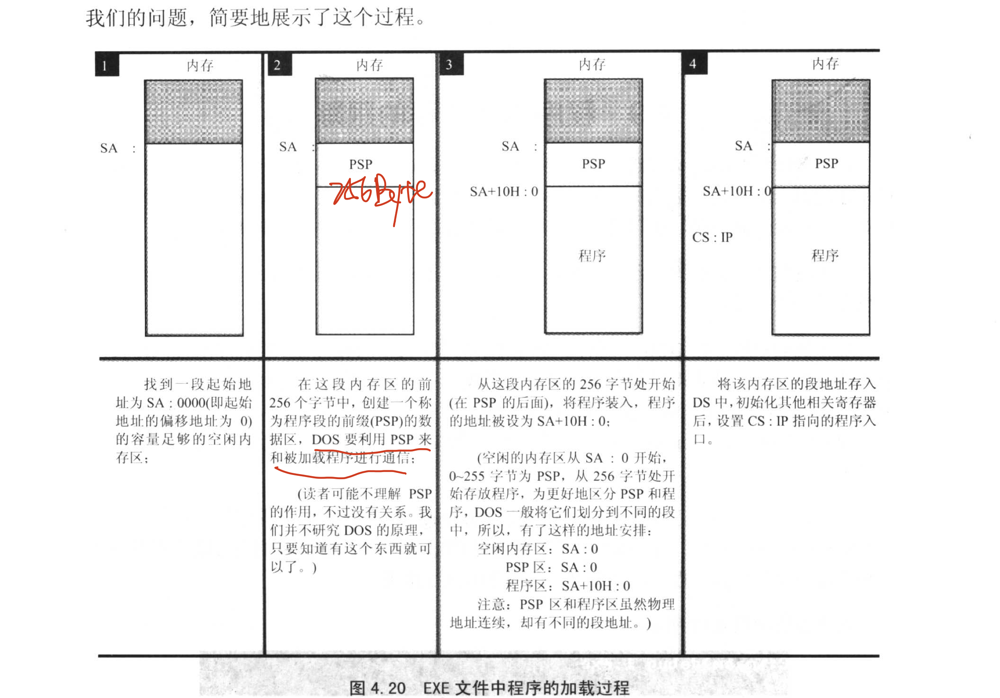

## 伪指令

`end` ：标记整个程序的结束

`assume` : 将有特定用途的段和相关的段寄存器关联起来

## 编译、连接

`masm filename;` : 简易编译指令，生成 `.obj` 文件

`link filename;` : 简易连接指令，生成 `.exe` 可执行文件

## exe 文件中程序的加载过程



## Lab 4: [bx] 和 loop 的使用

### 任务一

```asm
assume cs:code

code segment

    mov ax, 0H
    mov ds, ax
    mov bx, 200H

    mov cx, 64
s:  mov ds:[bx], al
    inc bx
    inc ax
    loop s

    mov ax, 4c00H
    int 21H

code ends
end
```

### 任务二

```asm
assume cs:code

code segment

    mov ax, 0H
    mov ds, ax
    mov bx, 200H

    mov cx, 64
s:  mov ds:[bx], bl
    inc bx
    loop s

    mov ax, 4c00H
    int 21H

code ends
end
```

### 任务三

```asm
assume cs:code

code segment

    mov ax, cs
    mov ds, ax
    mov ax, 0020h
    mov es, ax
    mov bx, 0
    mov cx, 10h

s:  mov al, [bx]
    mov es:[bx], al
    inc bx
    loop s

    mov ax, 4c00h
    int 21h

code ends
end
```