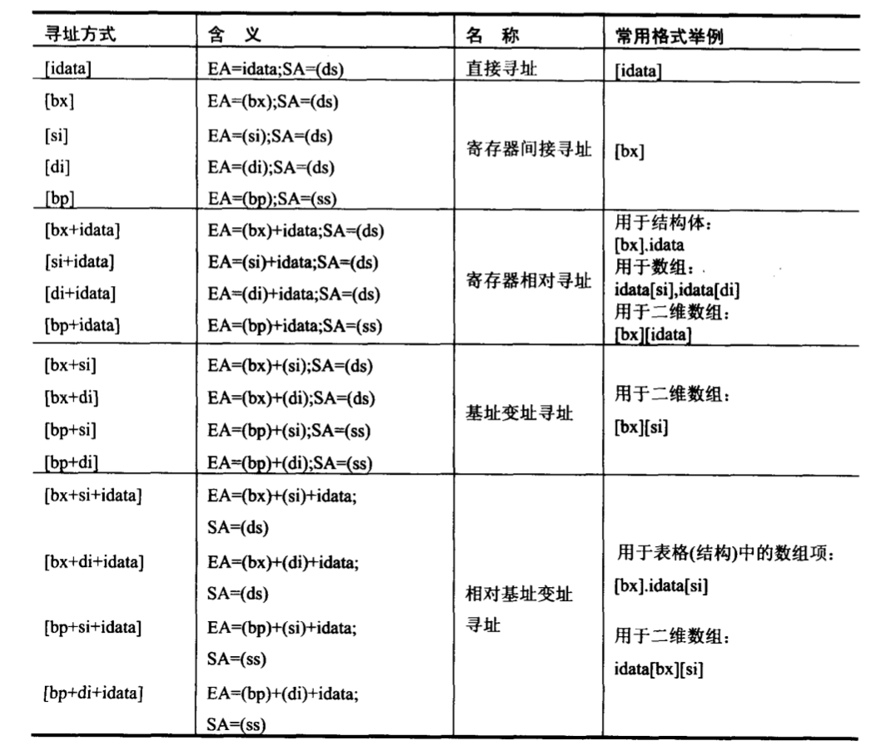

## 数据处理的两个基本问题

### bx、si、di、bp

- 只有这 4 个寄存器可以在 `[...]` 中进行内存单元的寻址
- 它们只能单个出现或者以 bx 和 si、bx 和 di、bp 和 si、bp 和 di 的组合出现
- bp 的段地址默认在 ss 中

### 机器指令处理的数据所在位置

- 指令在执行前，所要处理的数据可以在：CPU 内部、内存、端口

### 汇编语言中数据位置的表达

1. 立即数（idata）：执行前在 CPU 指令缓冲器中
2. SA 和 EA：指令要处理的数据在内存中

### 寻址方式



记一下名字即可

### 指令要处理的数据有多长？

`push` 指令只进行字操作

### 寻址方式的综合应用

用 bx 定位整个结构体，用 idata 定位结构体中的某一个数据项，用 si 定位数组项中的每个元素

### div 指令

- 除数：8 位和 16 位两种
- 被除数：位数是除数的两倍，存放在 ax 、dx 寄存器
  - dx 存放高 16 位，ax 存放低 16 位
- 结果
  - 除数为 8 位：al 存商，ah 存余数
  - 除数为 16 位：ax 存商，dx 存余数

### 伪指令 dd

dd：dword (double word)

### dup

使用格式：`db 重复次数 dup (重复的字节型数据)`

## Lab 7

```asm
assume cs:code

data segment
	db '1975','1976','1977','1978','1979','1980','1981','1982','1983'
	db '1984','1985','1986','1987','1988','1989','1990','1991','1992'
	db '1993','1994','1995'
	;以上是表示21年的21个字符串

	dd 16,22,382,1356,2390,8000,16000,24486,50065,97479,140417,197514
	dd 345980,590827,803530,1183000,1843000,2759000,3753000,4649000,5937000
	;以上是表示21年公司总收入的21个dword型数据

	dw 3,7,9,13,28,38,130,220,476,778,1001,1442,2258,2793,4037,5635,8226
	dw 11542,14430,15257,17800
	;以上是表示21年公司雇员人数的21个word型数据
data ends

table segment
	db 21 dup('year summ ne ?? ')
table ends

code segment
start:	mov ax, table
		mov ds, ax
		mov ax, data
		mov es, ax

		mov bx, 0
		mov di, 0
		mov cx, 21
	s0:	mov si, 0
		push di
		mov ax, di
		add di, ax
		mov ax, es:[di+0]
		mov [bx].0[si], ax
		add si, 2
		add di, 2
		mov ax, es:[di+0]
		mov [bx].0[si], ax
		pop di
		; year
		mov si, 0
		push di
		mov ax, di
		add di, ax
		mov ax, es:[di+84]
		mov [bx].5[si], ax
		add si, 2
		add di, 2
		mov ax, es:[di+84]
		mov [bx].5[si], ax
		pop di
		; summ
		mov si, 0
		mov ax, es:[di+168]
		mov [bx].10[si], ax
		; ne
		add bx, 16
		add di, 2
		loop s0

		mov ax, 4c00h
		int 21h
code ends
end start
```

## 转移指令的原理

### 依据位移进行转移的 jmp 指令

- 段内短转移：`jmp short 标号`
  - IP 修改范围：-128 ~ 127
  - (IP) = (IP) + 8 位位移
  - 对应机器码中不包含转移的目的地址，包含的是下一条指令到标号地址到位移差
  - 位移用补码表示
- 段内近转移：`jmp near ptr 标号`
  - IP 修改范围：-32768 ~ 32767
  - (IP) = (IP) + 16 位位移

### 转移到目的地址在指令中的 jmp 指令

- 段间转移：`jmp far ptr 标号`

### 转移地址在 16 位寄存器中的 jmp 指令

- `jmp 16位寄存器`

### 转移地址在内存中的 jmp 指令

- `jmp word ptr 内存单元地址`（段内转移）
- `jmp dword ptr 内存单元地址`（段间转移）

### jcxz 指令

- `jcxz 标号`
- 若 cx = 0，(IP) = (IP) + 8 位位移

### loop 指令

所有循环指令都是短指令

## Lab 8

```asm
assume cs:codesg

codesg segment
    mov ax, 4c00h
    int 21h
start: mov ax, 0
s:  nop
    nop

    mov di, offset s
    mov si, offset s2
    mov ax, cs:[si]
    mov cs:[di], ax

s1: mov ax, 0
    int 21h
    mov ax, 0

s2: jmp short s1
    nop
codesg ends
end start
```

运行前：不能正确返回

使用 debug 加载程序，一步步执行指令发现

```asm
mov di, offset s
mov si, offset s2
mov ax, cs:[si]
mov cs:[di], ax
```

将 s 处的指令修改为了 s2 处的指令，即

```asm
s:  nop
    nop
```

变成了 `jmp short s1` ，但是由于机器码记录的是位移差，因此执行 `jmp short s` 之后再次执行 s 处的 `jmp short s1` 会跳转到奇怪的指令处，从而不能正确返回

## Lab 9

```asm
assume cs:code

; 绿色 00000010B
; 绿底红色 00100100B
; 白底蓝色 01110001B

; starts from B87A0H

code segment
    mov ax, 0B87AH
    mov ds, ax
    mov bx, 0

    mov ah, 'w'
    mov al, 00000010B
    mov word ptr [bx], ax
    add bx, 2

    mov ah, 'e'
    mov al, 00000010B
    mov word ptr [bx], ax
    add bx, 2

    mov ah, 'l'
    mov al, 00000010B
    mov word ptr [bx], ax
    add bx, 2

    mov ah, 'c'
    mov al, 00000010B
    mov word ptr [bx], ax
    add bx, 2

    mov ah, 'o'
    mov al, 00000010B
    mov word ptr [bx], ax
    add bx, 2

    mov ah, 'm'
    mov al, 00000010B
    mov word ptr [bx], ax
    add bx, 2

    mov ah, 'e'
    mov al, 00000010B
    mov word ptr [bx], ax
    add bx, 2

    mov ah, ' '
    mov al, 00000010B
    mov word ptr [bx], ax
    add bx, 2

    mov ah, 't'
    mov al, 00000010B
    mov word ptr [bx], ax
    add bx, 2

    mov ah, 'o'
    mov al, 00000010B
    mov word ptr [bx], ax
    add bx, 2

    mov ah, ' '
    mov al, 00000010B
    mov word ptr [bx], ax
    add bx, 2

    mov ah, 'm'
    mov al, 00000010B
    mov word ptr [bx], ax
    add bx, 2

    mov ah, 'a'
    mov al, 00000010B
    mov word ptr [bx], ax
    add bx, 2

    mov ah, 's'
    mov al, 00000010B
    mov word ptr [bx], ax
    add bx, 2

    mov ah, 'm'
    mov al, 00000010B
    mov word ptr [bx], ax
    add bx, 2

    mov ah, '!'
    mov al, 00000010B
    mov word ptr [bx], ax

    mov ax, 4c00h
    int 21h
code ends
end
```