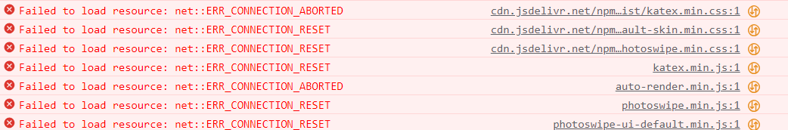
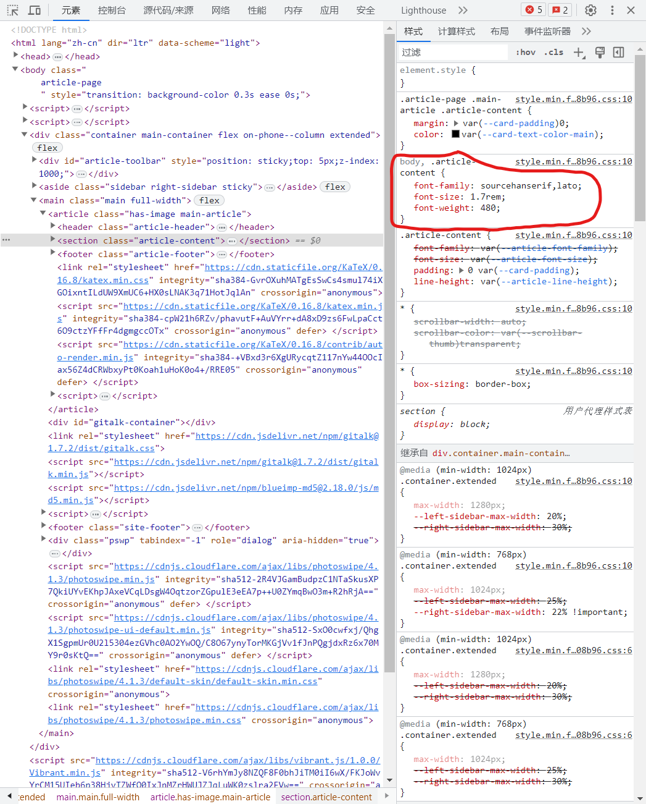
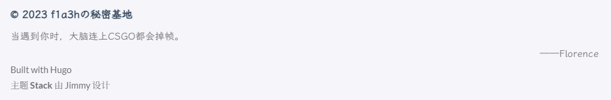
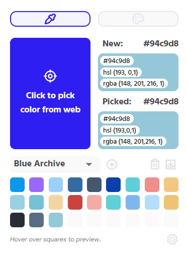
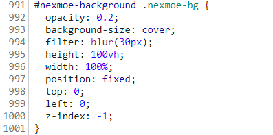
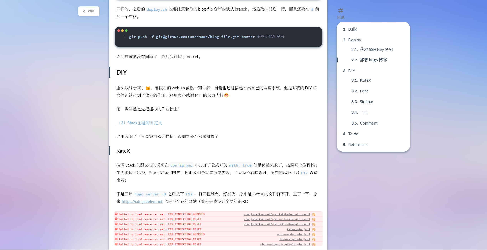
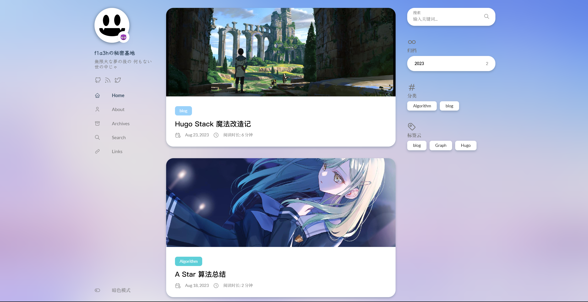

本来之前的服务器到期了准备放弃 Typecho ，暑假自学 web 然后写一个自己的博客，然而，事实是到了现在都还没新建文件夹 ╮(╯-╰)╭

但是博客肯定还是要写的。继续用以前的 hexo ？看了一眼 Github ，纯 JavaScript！算了算了，感觉没意思。用回 Typecho 吗？虽然部署方便，但是一堆 PHP 文件更不会了啊，这下几乎不能 DIY 了。

上网一顿乱搜，最终将目标锁定（其实只是一时心血来潮）在了以前使用过几天（指对着文档一顿乱搞）的 Hugo 上，费了点工夫终于折腾出个样子了。

## Build

直接抄作业！

[（1）带着Stack主题入坑Hugo](https://blog.linsnow.cn/p/join-hugo-and-stack/)

这一步貌似没有遇到什么问题，下一步吧。

## Deploy

还是抄作业😋

[（2）部署你的Hugo博客](https://blog.linsnow.cn/p/deploy-hugo/)

上面这位大佬在这里有一些问题，一些没写清楚容易混淆，一些写错了 XD ，让我在这一步耗了不少时间👿

### 获取 SSH Key 密钥

在 1.3 步骤「获取 SSH Key 密钥」中，正确的 Shell 指令如下：

```sh
ssh-keygen -t rsa -b 4096 -C "$(git config user.email)" -f gh-pages -N ""
```

如果你的电脑之前生成过对应 git 账号的 ssh-key ，那么按照他的指令会生成一个和原来一样的 ssh-key ，也就相当于没有变化，而使用上面的命令会生成名为 gh-pages 的 ssh-key ，再分别填入对应的地方，这样在之后的 Github Action 上才能成功 deploy 到 blog 仓库。

还要注意一点，`ACTIONS_DEPLOY_KEY` 的值是没有 `.pub` 后缀的私钥的值。

### 部署 hugo 博客

在 1.4 步骤「部署 hugo 博客」中，`deploy.xml` 文件的后缀应该是 `.yml` ，不然在 VSCode 中打开连高亮都没，还一堆红线。

然后 `deploy.yml` 文件中要注意看你仓库的默认 branch 是 main 还是 master ，如果是 master 就要把文件中的 branch 名改为 master 。

```yml
on:
    push:
        branches:
            - master # 原来是 main
```

同样的，之后的 `deploy.sh` 也要注意看你的 blog-file 仓库的默认 branch ，然后改掉最后一行，而且还要在 `#` 前加一个空格。

```sh
git push -f git@github.com:username/blog-file.git master #向存储库推送
```

之后应该就没有问题了，然后我跳过了 Vercel 。

## DIY

重头戏终于来了😼，暑假看的 weblab 虽然一知半解，自觉也还是搭建不出自己的博客系统，但是对我的 DIY 和文件纠错起到了救星的作用，这里衷心感谢 MIT 的大力支持😁

第一步当然是先把能抄的作业抄上！

[（3）Stack主题的自定义](https://blog.linsnow.cn/p/modify-hugo/)

这里我除了「首页添加欢迎横幅」没加之外全都照着搞了。

### KateX

按照 Stack 主题文档的说明在 `config.yml` 中打开了公式开关 `math: true` 但是仍然失败了，按照网上教程搞了半天也搞不出来，Stack 实际也内置了 KateX 但是就是渲染失败，半天摸不着脑袋时，突然想起来可以 `F12` 查错来着！

于是开启 `hugo server -D` 之后按下 `F12` ，打开控制台，好家伙，原来是 KateX 的文件打不开，查了一下，原来 [https://cdn.jsdelivr.net](https://cdn.jsdelivr.net) 也是不存在的网站（看来是我没开全局的锅 XD



东翻西找之后在主题文件夹里找到了引用 KateX 的文件。

新建 `blog\data\external.yaml` 文件，把 `blog\themes\hugo-theme-stack\data\external.yaml` 里的内容粘贴进来，然后把所有 https://cdn.jsdelivr.net 修改为可以访问的镜像网站地址，如下

```yaml
Vibrant:
    - src: https://cdnjs.cloudflare.com/ajax/libs/vibrant.js/1.0.0/Vibrant.min.js
      integrity: sha512-V6rhYmJy8NZQF8F0bhJiTM0iI6wX/FKJoWvYrCM15UIeb6p38HjvTZWfO0IxJnMZrHWUJZJqLuWK0zslra2FVw==
      type: script

PhotoSwipe:
    - src: https://cdnjs.cloudflare.com/ajax/libs/photoswipe/4.1.3/photoswipe.min.js
      integrity: sha512-2R4VJGamBudpzC1NTaSkusXP7QkiUYvEKhpJAxeVCqLDsgW4OqtzorZGpulE3eEA7p++U0ZYmqBwO3m+R2hRjA==
      type: script
      defer: true

    - src: https://cdnjs.cloudflare.com/ajax/libs/photoswipe/4.1.3/photoswipe-ui-default.min.js
      integrity: sha512-SxO0cwfxj/QhgX1SgpmUr0U2l5304ezGVhc0AO2YwOQ/C8O67ynyTorMKGjVv1fJnPQgjdxRz6x70MY9r0sKtQ==
      type: script
      defer: true

    - src: https://cdnjs.cloudflare.com/ajax/libs/photoswipe/4.1.3/default-skin/default-skin.min.css
      type: style

    - src: https://cdnjs.cloudflare.com/ajax/libs/photoswipe/4.1.3/photoswipe.min.css
      type: style

KaTeX:
    - src: https://cdn.staticfile.org/KaTeX/0.16.8/katex.min.css
      integrity: sha384-GvrOXuhMATgEsSwCs4smul74iXGOixntILdUW9XmUC6+HX0sLNAK3q71HotJqlAn
      type: style

    - src: https://cdn.staticfile.org/KaTeX/0.16.8/katex.min.js
      integrity: sha384-cpW21h6RZv/phavutF+AuVYrr+dA8xD9zs6FwLpaCct6O9ctzYFfFr4dgmgccOTx
      type: script
      defer: true

    - src: https://cdn.staticfile.org/KaTeX/0.16.8/contrib/auto-render.min.js
      integrity: sha384-+VBxd3r6XgURycqtZ117nYw44OOcIax56Z4dCRWbxyPt0Koah1uHoK0o4+/RRE05
      type: script
      defer: true
```

再次查看 blog ，公式渲染成功！

### Font

审美参考 ouuan 大佬的 blog ，正文的中文字体使用 [思源宋体](https://github.com/adobe-fonts/source-han-serif) ，英文使用主题自带的 Lato ，标题则使用自带的 苹方 ，引用块内使用 <a href="https://github.com/lxgw/LxgwWenKai" style="font-family:LXGWWenKai-Regular;color:#89b4d4;">霞鹜文楷</a> 。

首先建立 `blog\layouts\custom-font.html` 文件，写入以下内容覆写原有字体

```html
<!-- <script>
    (function () {
        const customFont = document.createElement('link');
        customFont.href = "https://fonts.googleapis.com/css2?family=Lato:wght@300;400;700&display=swap";

        customFont.type = "text/css";
        customFont.rel = "stylesheet";

        document.head.appendChild(customFont);
    }());
</script> -->

<link rel="preconnect" href="https://fonts.googleapis.com">
<link rel="preconnect" href="https://fonts.gstatic.com" crossorigin>
<link
    href="https://fonts.googleapis.com/css2?family=Fira+Code&family=JetBrains+Mono&family=Noto+Sans+SC:wght@500&family=Noto+Serif+HK:wght@500&family=Noto+Serif+SC:wght@500&family=Ubuntu+Mono&display=swap"
    rel="stylesheet">
```

这里我在 [Google Font](https://fonts.google.com/) 中引入部分字体，虽然最后没有使用。。。

然后下载好思源宋体和霞鹜文楷的 `.ttf` 文件，放在 `blog\static\fonts` 目录下，接着在 `blog\assets\scss\custom.scss` 中引入字体文件，这里使用 unicode-range 方法将思源宋体的作用域限制在中文。

```scss
@font-face {
    font-family: "LXGWWenKai-Regular";
    src: url("/fonts/LXGWWenKai-Regular.ttf") format("truetype");
}

@font-face {
    font-family: "SourceHanSerif";
    src: url("/fonts/SourceHanSerifSC-VF.ttf") format("truetype");
    unicode-range: U+1000-fffff
}
```

之后如果想要修改某一部分的字体，直接 `F12` 选中相应的部分，查看对应的 css 类名称，如图



然后在 `blog\assets\scss\custom.scss` 中加入

```scss
body,
.article-content {
    // font-family: 'Fira Code', monospace;
    // font-family: 'JetBrains Mono', monospace;
    // font-family: 'Noto Sans SC', sans-serif;
    // font-family: 'Noto Serif HK', serif;
    // font-family: 'Noto Serif SC', serif;
    // font-family: 'Ubuntu Mono', monospace;
    font-family: "SourceHanSerif", "Lato";
    font-size: 1.7rem;
    font-weight: 480;
}
```

### Sidebar

主题原有侧边栏的主页和关于页面的是中文，而其余三个都是英文，看着难受，于是在 `blog\content\page` 目录下找到 `/about` 目录将两个 `.md` 文件的 `title` 都改为英文的 About ，主页则是将在 `blog\content` 目录下的两个 `.md` 文件的 `title` 改为英文的 Home.

### 一言

在页面 footer 部分加入「一言」



主要参考一言 [官方文档](https://developer.hitokoto.cn/)，新建文件 `blog\assets\scss\partials\footer.scss` ，先将主题文件下的 `footer.scss` 内容蒯进来，然后加入一言的内容，之后文件内容如下

```scss
footer.site-footer {
    padding: 20px 0 var(--section-separation) 0;
    font-size: 1.4rem;
    line-height: 1.75;

    &:before {
        content: "";
        display: block;
        height: 3px;
        width: 50px;
        background: var(--body-text-color);
        margin-bottom: 20px;
    }

    .copyright {
        color: var(--accent-color);
        font-weight: bold;
        margin-bottom: 5px;
    }

    .hitokoto {
        color: var(--body-text-color);
        font-weight: normal;
        font-size: 1.3rem;
        font-family: "LXGWWenKai-Regular";

        p {
            margin: 0%;
        }
    
        a {
            color: var(--body-text-color);
        }
    }

    .powerby {
        color: var(--body-text-color);
        font-weight: normal;
        font-size: 1.2rem;

        a {
            color: var(--body-text-color);
        }
    }
}
```

接着建立文件 `blog\layouts\partials\footer\footer.html` ，同样将主题文件夹内同一文件的内容蒯过来，再加入一言的内容，如下

```html
{{- $ThemeVersion := "3.18.0" -}}
<footer class="site-footer">
    <section class="copyright">
        &copy;
        {{ if and (.Site.Params.footer.since) (ne .Site.Params.footer.since (int (now.Format "2006"))) }}
        {{ .Site.Params.footer.since }} -
        {{ end }}
        {{ now.Format "2006" }} {{ default .Site.Title .Site.Copyright }}
    </section>

    <section class="hitokoto">
        <p id="hitokoto">
            <a href="#" id="hitokoto_text">:D 获取中...</a>
        </p>
        <p id="hitofrom" align="right">
            <a href="#" id="hitokoto_text">:D 获取中...</a>
        </p>
        <script>
              fetch('https://v1.hitokoto.cn')
                    .then(function (res) {
                        return res.json();
                    })
                    .then(function (data) {
                        var hitokoto = document.getElementById('hitokoto');
                        hitokoto.innerText = data.hitokoto;
                        var hitofrom = document.getElementById('hitofrom');
                        hitofrom.innerText = "——" + data.from + '\xa0';
                    })
                    .catch(function (err) {
                        console.error(err);
                    })
        </script>
    </section>

    <section class="powerby">
        {{ with .Site.Params.footer.customText }}
        {{ . | safeHTML }} <br />
        {{ end }}

        {{- $Generator := `<a href="https://gohugo.io/" target="_blank" rel="noopener">Hugo</a>` -}}
        {{- $Theme := printf `<b><a href="https://github.com/CaiJimmy/hugo-theme-stack" target="_blank" rel="noopener"
                data-version="%s">Stack</a></b>` $ThemeVersion -}}
        {{- $DesignedBy := `<a href="https://jimmycai.com" target="_blank" rel="noopener">Jimmy</a>` -}}

        {{ T "footer.builtWith" (dict "Generator" $Generator) | safeHTML }} <br />
        {{ T "footer.designedBy" (dict "Theme" $Theme "DesignedBy" $DesignedBy) | safeHTML }}
    </section>
</footer>
```

### Comment

使用 Waline 评论系统，直接照着 [官方文档](https://waline.js.org/guide/get-started/) 搞就行了，就是这个 Vercel 只支持 gmail 邮箱就离谱，害得我还特地注册了个 gmail 邮箱😠

### Color Style

纯色背景感觉太平淡，想搞个 Blue Archive 风格的界面，但是又没那设计 UI 的能力，只能瞎 jb 改改背景还有一点颜色细节了。

先说说颜色吧，主要是从 [Blue Archive](https://bluearchive.nexon.com/home) 官网上用浏览器插件吸取的一些颜色，然后再从中选取一部分整合到 blog 上。



之后就和前面修改字体一样，在修改颜色的地方 F12 然后选中，查找到对应 CSS 类名再在 `blog\assets\scss\custom.scss` 中修改即可。

这里我修改了选中文本后的颜色还有代码的颜色。

```scss
::selection {
    background: #99d1fa;
}

.article-content code {
    color: #81b6f0;
}
```

之后还修改了 tags 标签的背景颜色，同样是创建文件 `blog\assets\scss\variables.scss` 然后把主题文件夹下对应文件内容复制过来，再修改顶部内容。

```scss
$defaultTagBackgrounds: #99d1fa, #5ecfd8, #f08f89, #f1c782, #9969ff;
$defaultTagColors: #fff, #fff, #fff, #fff, #fff;
```

最后就是最折腾我的背景图片了。首先当然还是 `F12` 找 CSS 样式名，然后添加 Background 相关属性，这里我还 `F12` 了 [吕楪](https://irithys.com) 大佬的博客，因为他是放了背景图片的。

然后我使用了 Blue Archive 最终章的图片，放上去和前面白色的文章块有点突兀，想搞一个模糊效果，于是想到之前很喜欢的 hexo 主题 [nexmoe](https://github.com/theme-nexmoe/hexo-theme-nexmoe) ，于是找到使用 nexmoe 主题的 [折影清梦](https://nexmoe.com/) ，再次使用 `F12` 神器，查找背景相关的 CSS 代码，如下



于是在 `custom.scss` 中加入以下代码

```scss
body {
    background-image: url("/img/WhereAllMiraclesBegin.png");
    background-position: fixed;
    background-size: cover;
    backdrop-filter: blur(75px);
    background-color: transparent;
}
```

这时模糊效果是实现了，但是点开较长的文章会发现图片被拉长到与网页一样长度了，之后上 [MDN](https://developer.mozilla.org/zh-CN/docs/Web/CSS/background) 查找 background 相关属性，添加了 `background-attachment: fixed;` 之后终于实现了想要的效果。



~~因为图片是后截的，所以忽略我的阴影效果~~

但是这时候又会发现，文章的白色贴片像是直接放上去的一样，又会很有违和感，继续观察 [折影清梦](https://nexmoe.com/) ，发现他的网站有明显的阴影效果，配合 blur 的效果观感会很好， Google 一顿发现这种效果叫 `box-shadow` ，于是接着 `F12` ，瞎 jb 乱搞之后决定仅仅修改 `variables.scss` 中的 `--shadow-l1` 为 `--shadow-l1: 0px 4px 8px rgba(89, 110, 131, 0.4);` ，同时在 `custom.scss` 中加入以下代码修改头像的阴影

```scss
.sidebar header .site-avatar .site-logo {
    box-shadow: 0px 2px 12px rgba(89, 110, 131, 1);
}
```

这下应该差不多了。


## To-do

- more things...

## References

- [action-gh-pages](https://github.com/peaceiris/actions-gh-pages)
- [（1）带着Stack主题入坑Hugo](https://blog.linsnow.cn/p/join-hugo-and-stack/)
- [（2）部署你的Hugo博客](https://blog.linsnow.cn/p/deploy-hugo/)
- [时隔半年，博客又有了那些新变化？！](https://irithys.com/p/%E6%97%B6%E9%9A%94%E5%8D%8A%E5%B9%B4%E5%8D%9A%E5%AE%A2%E5%8F%88%E6%9C%89%E4%BA%86%E9%82%A3%E4%BA%9B%E6%96%B0%E5%8F%98%E5%8C%96/)
- [Hugo Stack主题更新小记](https://xrg.fj.cn/p/hugo-stack%E4%B8%BB%E9%A2%98%E6%9B%B4%E6%96%B0%E5%B0%8F%E8%AE%B0/)
- [Hugo博客自定义字体](https://cloud.tencent.com/developer/article/2209934?areaSource=104001.1&traceId=7g0V6-1w3yKZfwO30ObET)
- [ouuan's blog](https://ouuan.moe)
- [用 CSS3 指定网页的中英文分别使用不同字体](https://myfairland.net/css-font-face-unicode-range/)
- [一言](https://developer.hitokoto.cn/)
- [Waline](https://waline.js.org/)
- [nexmoe](https://github.com/theme-nexmoe/hexo-theme-nexmoe)
- [折影清梦](https://nexmoe.com/)
- [MDN-background](https://developer.mozilla.org/zh-CN/docs/Web/CSS/background)