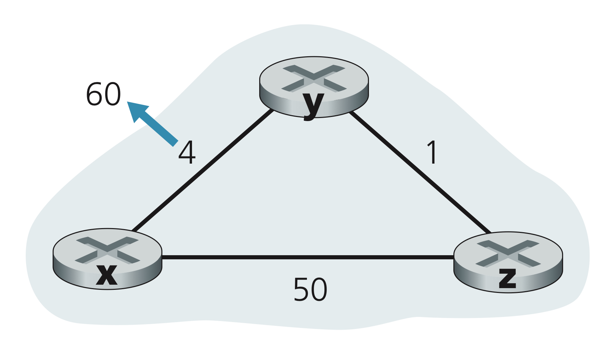
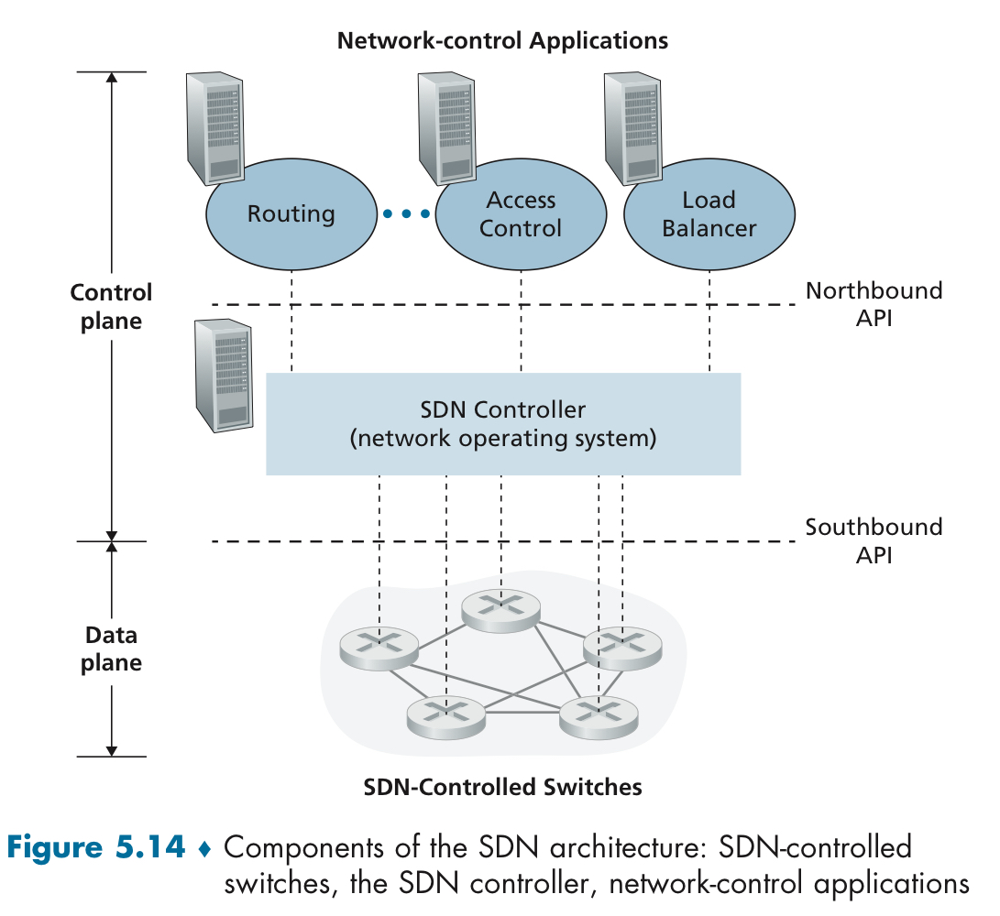

## Introduction

control plane 计算 forwarding 和 flow tables 有两种方式：

- per-router control: router 之间进行交流，分别计算自己的 forwarding table
- logically centralized control: 由一个 remote controller 收集信息，计算并分发结果

## Routing Algorithms

在 routing algorithms 中，network 被抽象为一张图，综合考虑 physical length、link speed、monetary cost 等作为边权。

routing algorithm 可以分为以下几类：

- centralized / decentralized: 计算过程中是否知道整张图的信息
- static / dynamic: 是否对网络负载、拓扑结构等的变化作出响应
- load-sensitive / load-insensitive: 是否考虑 congestion 的状况

### The Link-State (LS) Routing Algorithm

LS 是 centralized routing algorithm，需要每个结点将 attached links 的信息进行广播 (link-state broadcast) 让所有结点拥有整张图的信息，再用 Dijkstra 等算法计算最短路。

对于 load-sensitive routing algorithm，traffic load 的改变可能会导致出现 oscillations，解决办法就是改成 load-insensitive 的或者保证不是所有结点都在同时运行 LS。

### The Distance-Vector (DV) Routing Algorithm

DV 是 distributed、 iterative、decentralized 的 routing algorithm。

每个结点维护自己到其他每个结点的 distance vector，当自己的 distance vector 更新了就将自己的 distance vector 发送给 neighbor，并且也会由 neighbor 的 distance vector 更新自己的，当 link state 发生改变时，DV 会经过多轮迭代并进行传播最终收敛。

当 link-cost 减小时，收敛较快。但是当 link-cost 增大时，由于不在这个 link 上的那个结点的消息滞后性，可能会导致 $y$ 用 $z$ 来更新 $D_y(x)$，然后 $z$ 用 $y$ 来更新 $D_z(x)$，两者互相更新最终需要边权值域大小次的迭代（称为 *count to infinity problem*），并在过程中产生 routing loop，如下图所示：

使用 *poisoned reverse* 可以避免出现二元环：如果 $u$ 通过 $v$ 走了 $(u, w)$ 这条路径，则在 $u$ 通知 $v$ 的时候将 $D_u(w)$ 改成 $\infty$。

当出现大于 2 个结点的 loop 时，poisoned reverse 会失效。

### A Comparison of LS and DV Routing Algorithms

- message complexity: LS 需要每个结点获得全局的信息，而且需要结点将信息送到很远的地方；DV 仅仅需要结点知道 neighbor 的信息。
- speed of convergence: LS 时间复杂度较低（Dijkstra 可以使用优先队列优化到 $\mathcal{O}(n\log n)$ ）； DV 则较慢，过程中可能出现 routing loop，还有 count-to-infonity problem。
- robustness: 在 LS 中每个结点可以发送错误的 link state 给其他结点，但是由于每个结点只计算自己的 forwarding table，不依赖于其他结点的，所以影响较小；DV 中每个结点的计算结果都是其他结点的结果的一部分，影响较大。

实际上 Internet 同时采用了这两种算法。

## Intra-AS Routing in the Internet: OSPF

如果统一管理所有的 routers，会规模过大性能无法接受，也不能满足自治的需求。因此，routers 被划分成了很多个 *autonomous system (AS)*，每个 AS 有一个 ICANN 赋予的编号，每个 ISP 可能管理一个或多个 AS。

每个 AS 内部都会使用一种 intra-AS routing protocol，例如 OSPF (Open Shortest Path First)。

OSPF 使用 LS routing algorithm，边权由管理员设定，router 向整个 AS 内部 broadcast link state（当 link state 发送改变时/周期性地）。

OSPF 有以下一些 advances:

- security: routers 之间的信息可以利用 MD5 进行 authentication
- multiple same-cost paths: 当有多条路径的 cost 相同时可以同时使用这些路径
- 有 MOSPF 拓展来支持 unicast 和 multicast
- hierarchy within a single AS: 可以将 AS 划分成多个 area 来形成 AS 内部的 hierarchy，每个 area 内部走最段路，不同 area 之间通过走 area 的 border router 来走 backbone area

## Routing Among the ISPs: BGP

BGP (Border Gateway Protocol) 是一个 decentralized、asynchronous 的 inter-AS routing protocol。

### The Role of BGP

在 BGP 中，destination 的不是确定的 IP 地址，而是 CIDR prefix。

BGP 使得一个 AS 可以向其他 AS advertise prefix，并计算出到达各个 prefix 的 route。

### Advertise BGP Route Information

不同的 router 之间会建立称为 BGP connection 的 TCP connection，负责连接两个 AS 的 gateway router 之间会建立 external BGP (eBGP) connection，AS 内部的 router 两两之间会建立 internal BGP (iBGP)。

假设要向所有 router advertise 前往 prefix $x$ 的路径：
- $x$ 所在的 AS 的 gateway router 会向周围 AS 的 gateway router 发送 eBGP message，类似于 `AS3 x`
- 其他 AS 的 gateway router 收到后会向 AS 内部广播 iBGP message: `AS3 x`
- 之后其他的 gateway router 会继续向相邻的 AS 的 gateway router 发送 eBGP message，并在 advertisement 中加入自己所在的 AS，类似于 `AS2 AS3 x`。

### Determining the Best Routes

一条 BGP advertisement 包含 AS-PATH 和 NEXT-HOP 等信息（称为 *BGP attributes*，加上 prefix 就称为一个 *route*）：

- AS-PATH 表示到达目的地需要经过的 AS，一个 AS 收到来自其他 AS 的 route 后可以在其中加上自己，然后继续发送给 neighbor
- NEXT-HOP 表示离开当前 AS 去往目的地需要走到的下一个 AS 的第一个 router 的 IP 地址

从一个 AS 出发到达某个 prefix 有很多种路径，在实践中，BGP 采用的是 *route- selection algorithm*，router 按照顺序使用以下几条规则来选择 best route：

- 由管理员设置或者从其他 AS 获得的 local preference（作为一个 attribute）
-  shortest AS-PATH（经过最少的 AS），当这条 rule 成为唯一的 rule 时采用 DV 算法，边权设置为 AS hops 的数量。
-  *hot patato routing*: 在 AS 内走最短路（通过 intra-AS protocol 以及 NEXT-HOP 得到）到达 gateway router
-  根据 BGP identifier 选

### IP-anycast

BGP 可以为前往某个 prefix 寻找 best route，如果给多个 host 设置相同的 IP 地址，即可实现 IP-anycast，例如 CDN 为客户寻找最合适的 server，这一过程是在 router 的挑选中实现的。

IP-anycast 如果用于 TCP 可能会导致同一个 TCP connection 中的 message 发送给不同的 host，所以 CDN 一般不采用 IP-anycast，而 DNS root server 则采用（使用 UDP）。

### Routing Policy

local preference 的存在为管理员决定如何选择 route 以及实现某些 policy 提供了可能。

## The SDN Control Plane

:::note[INFO]
因为时间很紧 + 考试不考，所以这部分写的比较简略，而且~~基本全靠抄 ouuan dalao 的笔记~~，要有更好的理解还是去看书或者看 [ouuan dalao](https://ouuan.moe/post/2023/07/cnatda-5) 的笔记。
:::

SDN 分为 SDN controller、network management applications（例如 routing、access control、load balancing） 和 controlled devices 三个部分。

SDN 使用 generalized forwarding，通过 network-control application 提供 network control functions，实现了 programmable network。

SDN 将 network functionality 进行了 unbundle，使得 packet switches、SDN controller、network management applications 可以来自不同供应商。

- communication layer (northbound API): controlled devices 和 SDN controller 进行通信。
- network-wide state-management layer: SDN controller 维护的一些信息。
- interface to the network-control application layer (southbound API): 让 network-control applications 能够读写 network state 和 flow tables 等信息，通过 RESTful API 等方式进行通信。

在 OpenFlow 中，SDN controller 可以向 controlled device 发送：

- configuration
- modify/read-state
- send packet

 controlled device 可以向 SDN controller 发送：

 - flow-removed
 - port-status
 - packet-in

## ICMP: The Internet Control Message Protocol

ICMP 被用来进行 router 和 host 之间的通信，作为 IP payload 进行传输。

ICMP 的 message 有很多种，例如：

- ping 使用的 echo request 和 echo reply
- destination network/host/protocol/port unreachable
- destination network/host unknown
- router advertisement/discovery
- TTL expired
- IP header bad

traceroute 使用 ICMP 通过发送 TTL 递增的 UDP segment with an unlikely port number 给 host，通过 TTL expired 得知每一个 router 的信息，通过 port unreachable 得到终点的信息。

## Network Management and SNMP, NETCONF/YANG

network management 包括 managing server（包括 network managers）、managed device、data（每个 device 有 configuration data、operational data、device statistics，而 managing server 会维护每个 device 和整个 network 的 data）、network management agent、network management protocol。

进行 network management 有以下几种方式：

- CLI: error-prone，不能 scale to larger-sized network。
- SNMP/MIB: 每个 device 有 management information base (MIB) objects，可以使用 simple network management protocol (SNMP) 来获取/设置 MIB objects 的 data，device 可以发送 trap message 向 managing server 通知状态变化。由于 SNMP/MIB 针对的是单个的 device，也难以 scale。
- NETCONF/YANG: NETCONF 比 SNMP 更注重配置管理，可以一次性操控多个 device，设置 constraint 来检查配置的正确性，使用 YANG 作为 data modeling language，以 XML 格式通过 TLS 进行通信。