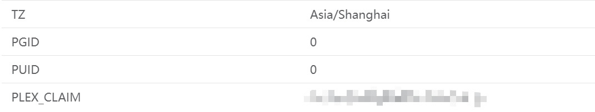

是 NAS，好耶！😆

## 前情提要

前一段时间租了个丐版 VPS 跑了 Alist、Nginx Proxy Manager、WeWeRSS 等服务，但是内存太小、CPU 核心太少，而随着跑的服务越来越多，flash 的野心也逐渐膨胀😈，加上之前在 Win 本本地跑了个 Jellyfin Server 看番但是不便在别的电脑上用感觉还是不够爽，于是趁着这几天没课回家整了台 NAS.

明确需求后，经过一番对比选择了极空间 Z4Pro，原因如下：
- 也许会跑 [immich](https://immich.app/), 带得动的群晖价格太高接受不了
- 给家里人用的话，国产 NAS 貌似挺合适
- 不想花太多时间折腾，所以最便宜的自组方案也不行
- 绿联的系统风评不行，懒得弄绿群晖，所以 reject

由于不清楚硬盘声究竟有多吵，所以没有买矿盘 HC550，暂时先只买了一块希捷酷狼 4T 将就着用。

Z4Pro.jpg（~~假装拍了图~~）

回家装好 Z4Pro 后发现客厅的网速极慢，完全无法正常使用，而客厅用的路由器是一个很老的 TP Link 路由器，我房间的路由器是一台刷了老毛子固件的小米 AC2100 与客厅的路由器接的是同一个光猫但是网速却好得多，猜测是路由器导致网速过慢，于是出门买了个小米 AX3000 回来装上，弄好后网速果然快多了。

## 高能预警

在花了一整天的时间折腾各种东西之后因为手动按电源键重启了一次 Z4Pro，之后就再也检测不到硬盘了，4 个盘位都检测不能，当然首先怀疑的是 PDD 上买的硬盘踩雷了，于是拿去电脑城随便找了个维修店检测一下，结果老板不仅不认识 NAS 还二话不说把硬盘重置了。。。。仕方ない😮‍💨，里面还没有装什么很重要的数据，只能算了，至少硬盘是没有问题的，因此只能是 Z4Pro 的问题了。

硬件这块 flash 真是小白，只能求助客服，咨询了半天拍了各种照片以及 N 次重启后，客服让等工程师来解决。本以为是硬件出了问题，结果第二天工程师发了一个约 10G 的镜像让我手动升级（实际是降级）系统，升级完了确实能用了，只是很可惜硬盘数据没了一切都得重来。

可以看出极空间的系统并不是很稳定，网上冲浪时也发现不止我一个人遇到了无法识别硬盘的问题，所以要求稳的话还是上白群吧，总之后悔买极空间了。


:::warning

寒假回家后给 NAS 上了块固态，再次启动 Z4Pro 后又出现了无法识别硬盘的问题，和客服沟通并由极空间的工程师远程 SSH 后还是和上次一样只能手动刷旧系统，但是总不能每次关机后都让我重新安装一遍系统吧，而且安装完后硬盘无法识别为旧盘只能格式化回到最初的起点，于是询问客服能否换机，客服永远不正面回答这个问题，并且告诉我工程师反馈我有开启过 SSH ......

无奈之下只能认命，果然还是应该直接白群或者买个小主机自己折腾的......

不过想到刚刷完系统后一会儿关机再开机并不会出现不认盘的问题，猜测可能真是因为 SSH 导致的。我在上一次刷完系统后使用 SSH 并没有用过 docker-compose 这一类工具，仅仅只是用 `apt` 安装使用了 `screen` 这个软件 + 命令行运行 `mihomo` + `touch` 创建过几个文件 + `chmod` 修改过一个 docker 容器用的文件夹权限，在这一次刷系统后我改成了在极空间自带的 docker 界面使用 `mihomo` 的 docker 容器而不是在终端安装运行，也就是避开了前两个行为，这一次过了几天后断电重启并没有出现不认盘的问题。

不认盘应该是驱动出了问题，而导致这个问题的可能性最大的原因应该是为了安装 `screen` 而使用过 `sudo apt update` 与 `sudo apt upgrade`, 会因为这个掉驱动我也是头一回见......

极空间使用的是 ZOS 系统，带情绪的评价只能说是拿 Ubuntu 乱改的一坨屎。国产 NAS 系统还是看看远方的 fn-OS 吧！

:::note
更新于 2025/03/19: ZOS 应该是基于 Debian 的。


:::
:::

## 开搞！

上来当然是先弄 docker 了，搜了几个 image 都搜索不到，自行 pull 连不上 `docker.io`，于是先解决上网问题。

### 科学上网

参考：
- [手把手教你如何在飞牛 OS 中使用网络代理 - windowBR](https://windowbr.top/2024/09/17/fnos-mihomo/).

第一件事当然是获取 SSH 权限了，在获取之后用终端连接，Z4Pro 的硬盘位于 `/data_s00x`, 其中 `x` 是硬盘所在盘位，用户在硬盘中的文件夹路径为 `/data_s00x/data/udata/real/username/`.

本机先在 [mihomo - release](https://github.com/MetaCubeX/mihomo/releases) 下参照 [我应该下载哪个文件? / Which file should I download?](https://github.com/MetaCubeX/mihomo/wiki/FAQ) 下载好对应的包，Z4Pro 是 x86 架构则下载 `mihomo-linux-amd64-alpha-89dfabe.deb`, 然后通过极空间 APP 上传到用户目录下，接着终端 `cd` 进去，使用下列命令进行安装：

```sh
sudo dpkg -i mihomo-linux-amd64-alpha-89dfabe.deb
```

然后 docker 安装 metacubexd 作为 mihomo 的 web 管理界面：

```sh
sudo docker run -d --restart always -p 9097:80 --name metacubexd ghcr.io/metacubex/metacubexd
```

如果下载不动的话可以用国内的 ghcr.io 镜像源，例如南大的镜像源，对应的镜像地址为 `ghcr.nju.edu.cn/metacubex/metacubexd`.

如果在命令行直接使用 `docker run` 或是 `docker compose` 的话，在极空间的 docker 应用中是无法查看对应 container 的详情的，因此方便起见，在极空间的 docker 应用中 `自定义拉取` 部分输入 `ghcr.nju.edu.cn/metacubex/metacubexd`, 拉取完成后双击运行，修改名称为 `metacubexd`, 端口号中将容器端口 80 对应的本地端口改为 9097（对应上方的命令），其余保持默认即可。

接着在随便找一个你喜欢的地方建立 `mihomo` 文件夹用于存放 mihomo 的配置，将本机的科学上网软件里你所使用的配置文件 `config.yaml` 上传至 `mihomo` 文件夹，命令行 `cd` 进去使用 `sudo mihomo -d .` 即可运行 mihomo 并将 `config.yaml` 作为代理的配置文件。

如果遇到类似下列的报错：

```raw
can't initial geoip: can't download mmdb: get "https://github.com/metacubex/meta-rules-dat/releases/download/latest/geoip.metadb"
```

说明 NAS 网络下不动 Github 上的这个文件 `geoip.metadb` ，直接本机去 [mata-rules-dat](https://github.com/MetaCubeX/meta-rules-dat) 下载好相应的文件上传至 `mihomo` 文件夹下即可。

接着安装 `screen` 软件便于后台运行 mihomo，否则退出 SSH 后 mihomo 进程也会退出：

```sh
sudo apt update
sudo apt upgrade
sudo apt install screen
```

然后创建名为 `mihomo` 的窗口：

```sh
screen -R mihomo
```

进入窗口后可能需要重新 `cd` 进 `mihomo` 文件夹，接着运行 mihomo:

```sh
sudo mihomo -d .
```

再使用 `Ctrl+A+D` 退出窗口，最后便可安全退出 SSH 了。

### 公网访问

第一次弄的时候是用的 Cloudflare tunnel 进行免费内网穿透，但是看番这种流量大的场景 Cloudflare 的速度实在没法用，又不想找运营商要公网 IPv4，于是一番搜索之后锁定了 IPv6 + DDNS 的方案。

因为在家里的时候没有成功用外网访问 IPv6 地址，所以没有给光猫和路由器的设置界面截图，DDNS 的设置用的是极空间自带的 DDNS + 阿里云，这个纯傻瓜式操作就懒得截图放上来了，当时着急要回学校了不方便折腾家里的网络所以直接上了个 [Sakura frp](https://www.natfrp.com/), 极空间的设置可以结合官方文档中的 [飞牛 OS](https://doc.natfrp.com/app/fnos.html) 和 [群晖](https://doc.natfrp.com/app/synology.html) 的教程看，官方文档也很详细了所以 flash 不再记录。

后面回到学校时突然发现 NAS 的 IPv6 能用了于是终于开启公网看番的大时代，不过用的还是 域名+端口号 访问的方案，如果你觉得这样不够酷也可以用 [Nginx Proxy Manager](https://nginxproxymanager.com/) 设置一下反代，但是近期 DDL 以及考试密集（我有考试密集恐惧症.jpg）所以就先不折腾了。

如果你想折腾 Cloudflare tunnel，可以参考下列文章：
- [黑群晖服务使用 Cloudflare tunnel 进行内网穿透教程 - hack-fang](https://hackfang.me/nas-cloudflare-tunnel)
- [极空间无公网IP搭建Cloudflared免费隧道内网穿透，部署docker教程 - 没事随便写写](https://post.smzdm.com/p/ao9vdw8n/)

对于 IPv6 + DDNS，因为在家里的时候不成功所以参考了一大堆相关文章，也不太好评价最终哪些文章起到了作用，所以就不放上来了。

### NetBar

这部分就是实现自动化看番 + Jellyfin/Plex Server 的配置了，起这个标题是因为给它们的 docker 网络起名叫 netbar 😎。

这部分主要参考的是 mikusa 的文章：
- [ANI-RSS：自动追番新姿势！- 初之音](https://www.himiku.com/archives/ani-rss.html)

首先为创建名为 `netbar` 的 docker 网络，然后开始实现自动化看番，先拉取 `superng6/qbittorrentee:latest` 容器，配置时修改如下部分（使用 `|` 作为分隔符）：
- 基本设置：
	- 容器名称：qb
	- 取消启用性能限制
- 文件夹路径：
	- 
- 网络：
	- 更换为前面添加的 `netbar`
- 端口：
	- 添加 `8989` | `8989` | `TCP` 作为 web UI 的访问端口
- 环境：
	- 修改 `WEBUIPORT` 的值为 `8989`
	- 添加 `PUID` | `0` 和 `PGID` | `0`, 这里使用 root 的 PUID 和 PGID 是因为 flash 使用用户的 PUID 和 PGID 时会在日志里报错

然后直接应用并访问 web UI 就可以了，qb 设置直接抄 mikusa 的作业。

ani-rss 的容器配置则做以下修改：
- 基本设置：
	- 容器名称：ani-rss
	- 取消启用性能限制
- 文件夹路径：
	- `你的番剧下载路径` | `/bangumi`
	- `/SATA存储11/docker/ani-rss` | `/config`
- 网络：
	- `netbar`
- 端口：
	- `7789` | `7789` | `TCP`
- 环境：
	- 

同样进入 web UI 然后抄 mikusa 的作业。

再是 Plex Server, 使用的镜像是 `linuxserver/plex:latest`, 配置修改如下：
- 基本设置：
	- 容器名称：plex
	- 取消启用性能限制
	- 开启特权模式
	- 开启调用核心显卡
- 文件夹路径：
	- 
- 网络：
	- `netbar`
- 端口：
	- 将容器端口为 `32400` 对应的本地端口修改为 `32400` 方便访问，其余空着等自动分配即可
- 环境：
	- 

其中 `PLEX_CLAIM` 的内容需要在 [Plex | Claim](https://www.plex.tv/claim/) 获取，第一次进入 Plex 网页时需要在路径中加上 `/web`, 例如 `http://ip:32400/web`, 进去之后的设置可以参考：
- [【群晖 Synology】使用 Docker 搭建 Plex Media Server - 哔哩哔哩](https://www.bilibili.com/opus/854238758610927685)

如果你希望在公网其他服务中（例如 Infuse 添加 Plex 服务器）添加 Plex Server 使用你公网访问用的域名，就在你的 Plex 网页端 `Settings - Remote Access` 中 disable remote access，如果你有公网 IPv4 的话就可以不用 disable，然后在 `Settings - Network` 中的 `Custom server access URLs` 填入你的域名（+端口号）。

本来是打算润到 Plex 的（Plex 的刮削是真强），但是碍于用了 Anime4K 就回不去了，而 [plex-mpv-shim](https://github.com/iwalton3/plex-mpv-shim) 连不上我的 Plex Server，遂用回 Jellyfin. 

配置参考 mikusa：
- [利用 Jellyfin + Bangumi 打造更舒适的动画媒体库 - 初之音](https://www.himiku.com/archives/deploy-a-more-comfortable-animation-library-with-jellyfin-and-bangumi.html)

容器配置修改为：
- 基本设置：
	- 容器名称：jellyfin
	- 取消启用性能限制
	- 开启特权模式
	- 开启调用核心显卡
- 文件夹路径：
	- 
- 网络：
	- `netbar`
- 端口：
	- `8096` | `8096` | `TCP`
- 环境：
	- 添加 `PUID` | `0` 和 `PGID` | `0`
	- 你也可以参照 mikusa 的文章在此处添加代理

然后可以调用 [jellyfin-mpv-shim](https://github.com/jellyfin/jellyfin-mpv-shim) 配合 [Anime4K](https://github.com/bloc97/Anime4K) 爽看番了。

当然，这时又会遇到一个问题：观看 BD 资源的番时，NAS 没有安装外挂字幕需要的字体怎么办？这里依然抄的 mikusa 的作业，使用 AssFont 在 Window 笔记本上子集化字体嵌入 ASS 文件再上传至 NAS，详细的参考：
- [我的动画字幕字体解决方案 - 初之音](https://www.himiku.com/archives/my-solution-for-perfect-anime-subtitle-fonts.html)

不过当我子集化 [Hello World](https://bgm.tv/subject/269090) 的字体时发现 `方正悠宋 GBK 509R` 字体无法被子集化，但是好像[暂时没有比较好的解决方案](https://github.com/wyzdwdz/assfonts/issues/6)。