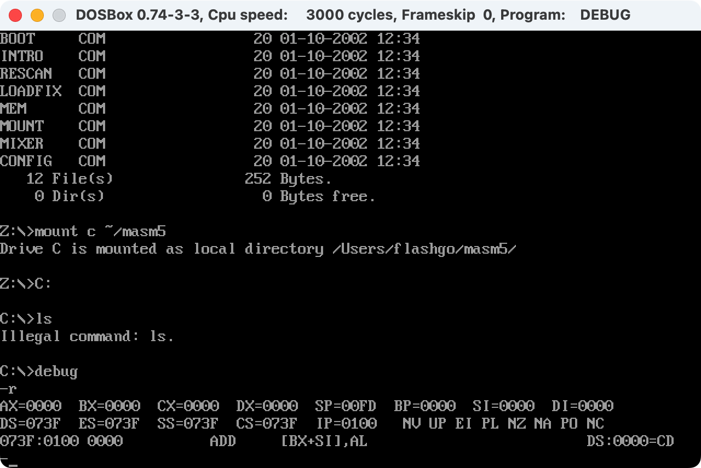

在学汇编的时候遇到一个问题——王爽的「汇编语言」的 Lab 是在 Windows 环境下的 x86 汇编，而我只有一台 M2 的 Mac ，这显然不行啊（悲）

于是开始查找 Mac 下学习 x86 汇编的方法，其实还挺简单的。

主要用到两个工具：

1. [DOSBox](https://sourceforge.net/projects/dosbox/files/dosbox/0.74-3/DOSBox-0.74-3-3.dmg/download)
2. [masm](https://link.jianshu.com/?t=http://cdn.suiyuanjian.com/masm5.zip)

其中 DOSBox 用来模拟 x86 的环境，masm 是一个汇编的工具包。

下载好之后，将 masm 解压到一个方便管理、路径简单的地方，我就直接放到了 `username/masm5` 路径下，下载的 DOSBox 是一个 dmg 文件，打开后将里面的 DOSBox 直接拖到 Application 文件夹下即可完成安装。

然后打开 DOSBox 软件，可以输入 `dir` 命令查看一些基本信息，接着使用 `mount` 命令挂载 masm 工具，比如我的命令就是 `mount c ~/masm5` ，当它显示挂载成功之后就可以输入 `debug` 进行汇编了。

~~忽略我输入的错误命令 ls~~