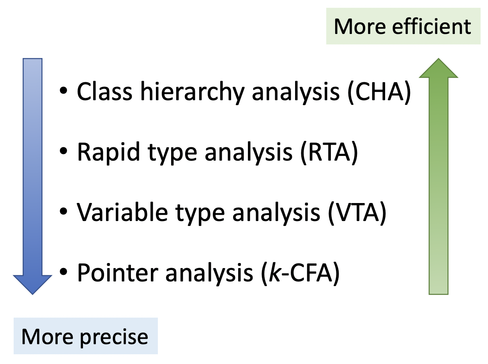
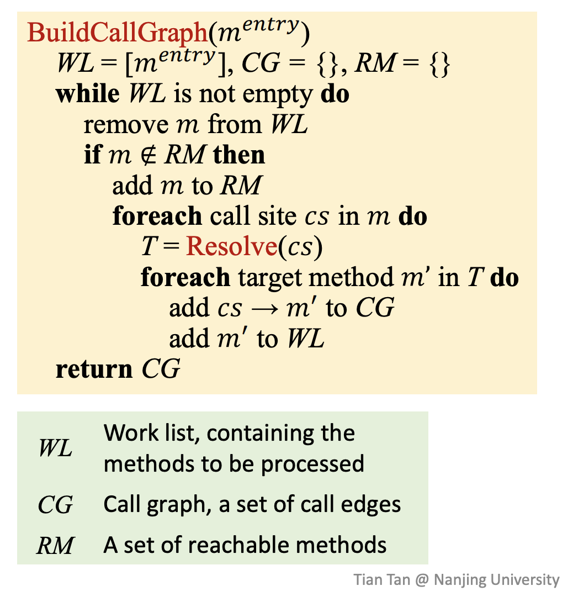
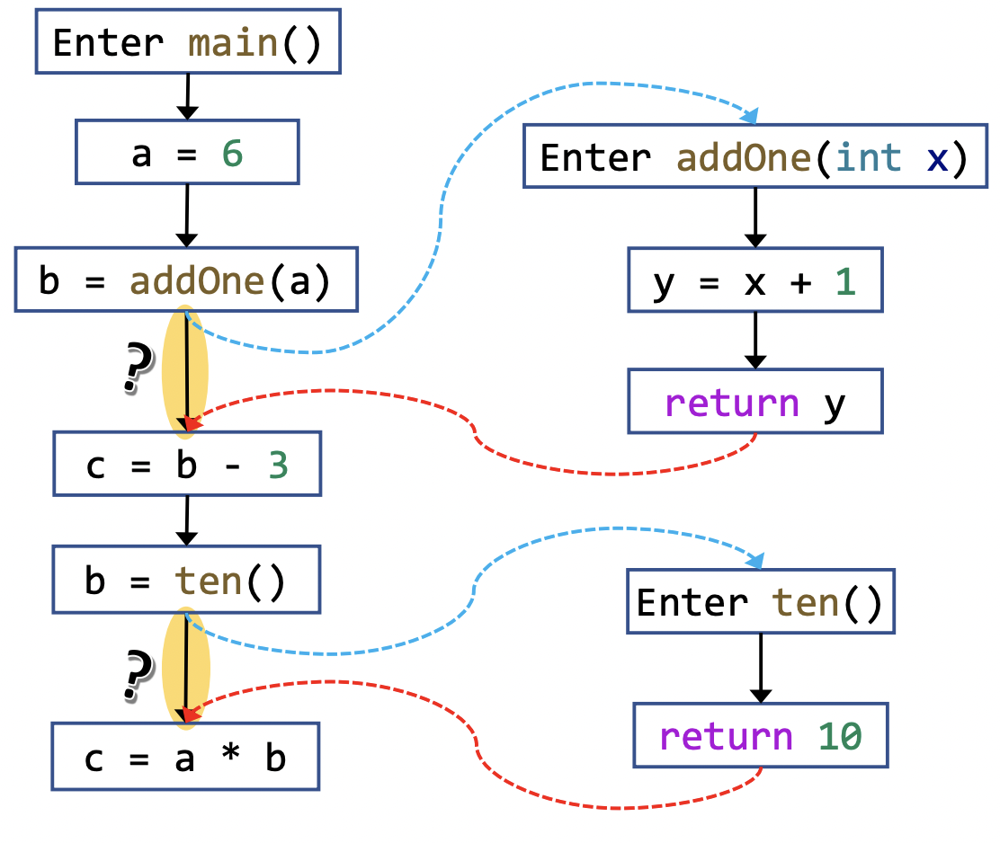
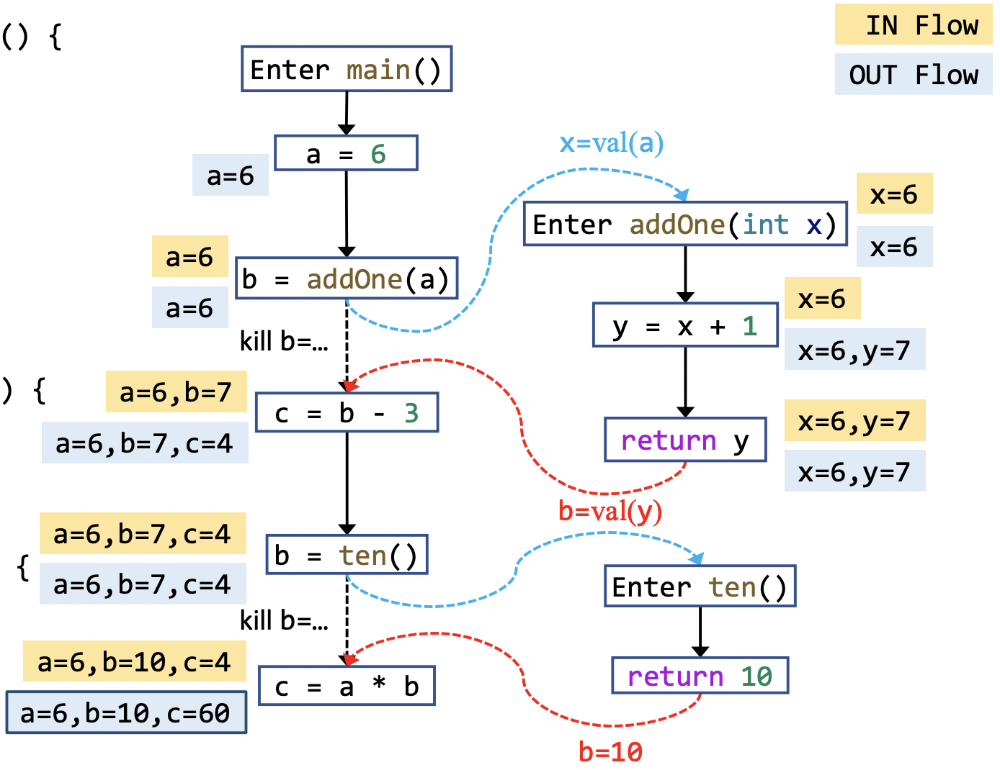
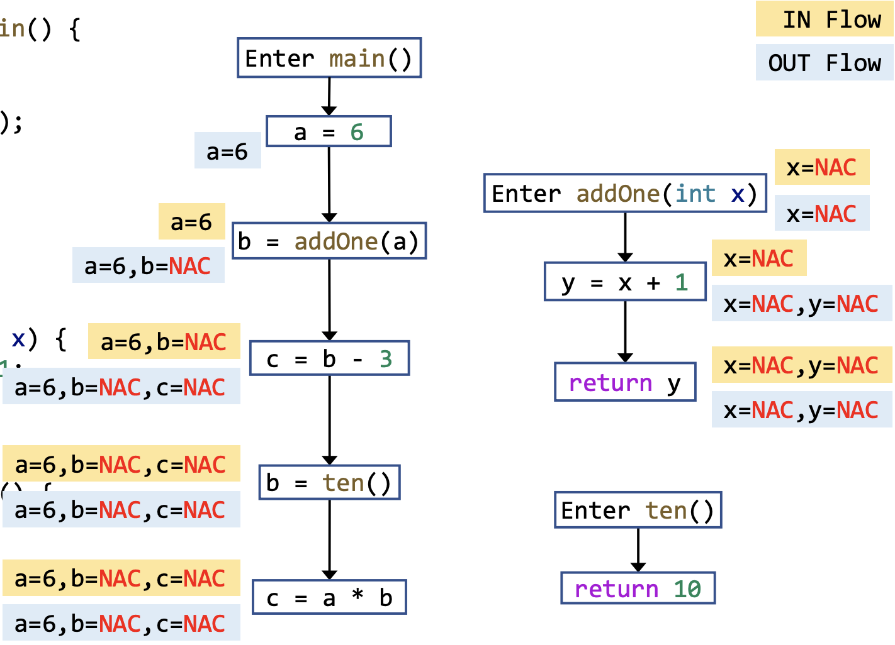

:::note[INFO]
南京大学「[软件分析](https://tai-e.pascal-lab.net/lectures.html)」课程 Interprocedural Analysis 部分的学习笔记。
:::

## Motivation

为了处理 method calls，我们可以做最 conservative assumptions 来直接不管这个 method 的具体形态，但是这样会产生很大的 imprecision，于是，针对 method calls 这种特殊形态，我们需要一个 Interprocedural Analysis。

## Call Graph Construction (CHA)

call graph: a representation of calling relationships in the program.

对于 OOPLs，call graph construction 主要有以下几种方法：

### Method Call

在 Java 中，有 3 中 method calls，如下图所示

其中 virtual call 是最大的难点也是 call graph construction 的重点。

在 run-time，virtual call 基于以下两点决定调用哪个方法：

- type of the receiver object $\to c$
- method signature(identifier of a method) at the call site: `<C: T foo(P, Q, R)>` $\to m$
  - signature = class type(C) + method name(foo) + descriptor(T, P, Q, R)
  - descriptor: return type + parameter types

我们使用 $Dispatch(c, m)$ 函数来描述 run-time 时 virtual call 的 dispatch 过程，实际就是递归向 parent 寻找对应的 method call 的过程。

### Class Hierarchy Analysis

class hierarchy analysis (CHA) 是一种用来解决 method call 的方法，它需要整个程序的 class hierarchy information，并基于 *declared type of receiver variable ($a$)* of call site 和 $a$ 可能指向任意子类或父类的假设来解决 virtual call。

CHA 只考虑 declared type of receiver variable
at the call-site 和它的 inheritance hierarchy，完全忽略 data- he control-flow 的信息，因此它具有 fast 的优势也有 imprecision 的劣势，它的一个运用场景就是 IDEA。

### Call Graph Construction

## Interprocedural Control-Flow Graph

CFG 展示的只是一个 individual method 的 structure，而 ICFG 则是在 CFG 的基础上加入了 *call edges, return edges* 来展示整个程序的 structure。

可以看到图中黄色部分的边连接了 call edge 和 return edge 的起点与终点，它的作用是让当前 CFG 中的 data-flow 信息可以直接流向下一个 BB 而不是从 call edge 然后经过一大段冗余的路径才到达下一个 BB。

## Interprocedural Data-Flow Analysis

interprocedural data-flow analysis 就是基于 ICFG 对整个程序进行分析。相比于 intraprocedural 的 CFG，ICFG 加入了 call 和 return edges，相应的 transfer function 也要从 node transfer 加上 edge transfer。

- call edge transfer: transfer data flow from call site to the entry node of callee
- return edge: transfer: transfer data flow from the exit node of the callee to the return site

对于 intraprocedural 的 constant propagation，interprocedural 的 node transfer function 只在 call nodes 上有所不同：相比于直接将 LHS variable 设置为 NAC，我们先将这个 variable kill 掉，然后将其 flow 到 edge transfer，最后经由 return edge transfer 进行合并。

in summary:

- node transfer
  - call nodes: identity
  - other nodes: same as intraprocedural
- edge transfer
  - normal edges: identity
  - call-to-return edges: kill the LHS variable, then propagate others
  - call edges: pass argument values
  - return edges: pass return values

以下是一个 interprocedural data-flow analysis 的 example:

再与 intraprocedural data-flow analysis 进行，对比，很显然 interprocedural 的结果是更 precise 的。

