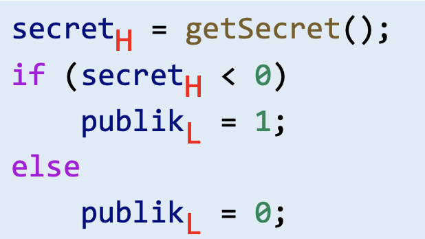
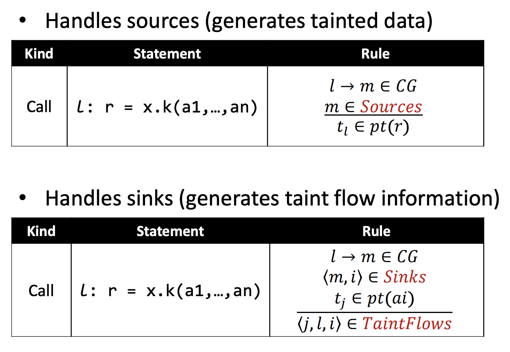

:::note[INFO]
南京大学「[软件分析](https://tai-e.pascal-lab.net/lectures.html)」课程 Static Analysis for Security 部分的学习笔记。
:::

security 指的是在存在 adversaries 的情况下能够成功达到一些 goals。

computer security 中非常重要的一个 topic 就是 information flow。

## Information Flow Security

information flow security 的目的就是阻止通过阻止 unwanted information flow 来保护 information security。

保护 sensitive data 的方式主要有 access control 和 information flow security 两种。

- access control: a standard way
  - 检查程序是否有权利 access 某些 information
  - *how information is accessed*
  - 不关心程序是如何使用这些 information 的
- information flow security: end-to-end
  - 跟踪 information flow
  - *how information is propagated*

> \"A practical system needs both *access* and *flow control* to satisfy all security requirements\"
> 
— D.Denning, 1976

information flow[^1] 指的是如果有 information 从 variable $x$ 流入 variable $y$，就说存在信息流 $x\to y$。

[^1]: Dorothy E. Denning and Peter J. Denning, *\"Certification of Programs for Secure Information Flow\"*. CACM 1977.

而 information flow security 则通过将 variables 分为不同的 security levels、指定这些 levels 之间哪些 information flow 是允许的来达到 safe 的目的。

### Security Levels (Classes)

不同 levels 的 classification 可以被划分成一个 topo 图的结构，更准确的说，可以被 modeled as lattice[^2].

[^2]: Dorothy E. Denning, *\"A Lattice Model of Secure Information Flow\"*. CACM 1976.

### Information Flow Policy

information flow security 用来限制在不同的 security levels 之间的 information flow。

一个经典的 policy 是 noninterference policy[^3]，它要求通过 low variables 不能推断出任何 high information，具体来说就是禁止从 high variable 到 low variable 的 inforrmation flow，换句话说就是保证 information 只会在 lattice 上向上走。但是它允许了 low variable 到 high variable 的 information flow，这使得它仍然不能到达它的目的。

[^3]: J. A. Goguen and J. Meseguer, *\"Security policies and security models\"*. S&P 1982.

## Confidentiality and Integrity

confidentiality 指的是阻止 secret information 泄漏，也就是上面的 noninterference policy 做到的。

而 integrity 指的是阻止 untrusted information 破坏 critical information[^4]，有关的最广泛的 vulnerabilities 的造成原因就是 injection errors[^5] (SQL injection etc.)。

[^4]: Ken Biba, *\"Integrity Considerations for Secure Computer Systems\"*. Technical Report, ESD-TR-76-372, USAF Electronic Systems Division, Bed-ford, MA, 1977.

[^5]: National Vulnerability Database, [https://nvd.nist.gov/](https://nvd.nist.gov/)

integrity 的广泛的定义是指以下三点：

- correctness: E.g. critical data 不应该被 untrusted data 破坏
- completeness (broader than consistency): E.g. 一个 DBS 应该完整保存整个 data
- consistency: E.g. 一个文件传输系统一个保证 sender 和 receiver 之间传输的文件内容是一致的

## Explicit Flows and Covert Channels

通过直接 copy 进行的 information flow 称为 explicit flow。相应地，由 secret information 影响的 control flow 造成的 information flow 称为 implicit flow，implicit flow 同样可以产生 information leak。

上面这个程序存在一个从 `secret` 到 `publik` 的一个 implicit flow 并且会造成 leakage，但是并没有从 `secret` 到 `publik` 的 data flow，可以看出 information flow 和 data flow 的区别所在。

通过一个 computing system 来 signal information 的 mechanisms 被称为 channels。而目的不是 information transfer 的 channels 被称为 covert channels[^6]。

[^6]: Butler W. Lampson, *\"A Note on the Confinement Problem\"*. CACM 1973.

常见的几种 covert channels 包括 implicit flows、termination channels、timing channels、exceptions。

由于 explicit flows 通常会比 covert channels 传递更多的 critical information，所以主要考虑 explicit flows。

## Taint Analysis

taint analysis 是最常用的 information flow analysis。它将 data 分为两类：

- tainted data: 与 critical information 有关的 data，在 taint analysis 中将其打上一个 label
- untainted data

tainted data 的 sources 就被称为 *sources*，实践中它们往往是某些 methods (E.g. `getPassword()`) 的返回值。

taint analysis 的原理就是跟踪 tainted data，并观察它们是否有可能 flow 到某些 sensitive methods（可能造成 unsafe 的 methods，被称为 *sinks*）。

taint analysis 既能应用于 confidentiality 也能应用于 integrity 的检测：

- confidentiality
  - source: source of secret data
  - sink: leakage
  - validation: information leaks
- integrity
  - source: source of untrusted data
  - sink: critical computation
  - validation: injection errors

将 tainted data 看作 objects，sources 看作 allocation sites，可以看出来 taint analysis 要做的事就是 pointer analysis 的工作，因此我们可以沿用 pointer analysis 的方法来完成 taint analysis[^7]。

[^7]: Neville Grech and Yannis Smaragdakis, *\"P Taint: Unified Points-to and Taint Analysis\"*. OOPSLA 2017.

在 domain and notations 中，我们只需额外增加一栏 tainted data，其余的保持不变：

对于 inputs & outputs，taint analysis 需要我们输入 sources 和 sinks，然后会输出一系列由 source 和 sink calls 组成的 tuples 的 taintflows。

为了标记 tainted data 并输出 taintflows，taint analysis 对于 call 的 rules 也有所不同：

