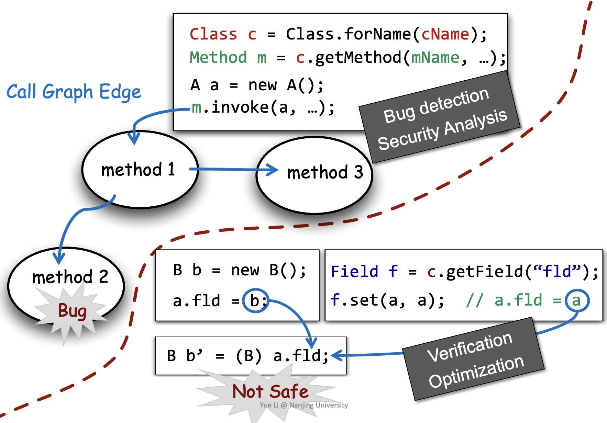
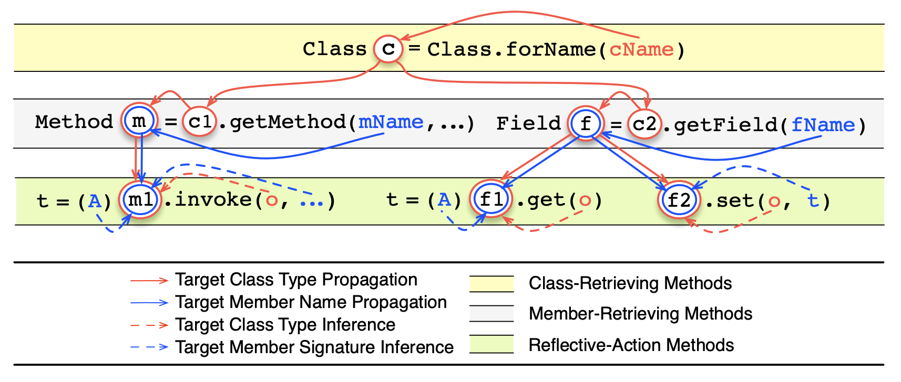

:::note[INFO]
南京大学「[软件分析](https://tai-e.pascal-lab.net/lectures.html)」课程 Soundness and Soundiness 部分的学习笔记。
:::

## Soundness and Soundiness

前面提到 static program analysis 追求的 goal 是 soundness，但是无论是在学术界还是在工业界，由于一些语言的 hard language features 的存在，对现实世界的大型 program 想要实现完全的 soundness 是（目前）做不到的。

> Hard-to-analyze features: an aggressively conservative treatment to these features will likely make the analysis too imprecise to scale, rendering the analysis useless.

于是，为了避免 papers 中写 soundness 会误导读者，所以引入了 soundy 的概念：a soundy analysis typically means that the analysis is mostly sound, with well-identified unsound treatments to hard/specific language features.

## Hard Language Feature: Java Reflection

java reflection 会在 run-time 将 class、method、field 等转换为 metaobject，并且用一个 string 作为它们的 identifier，如图所示。

在 run-time 对代码作出一些改变会产生一些 static analysis 无法预测的行为，这也是 static analysis 的硬伤。

- string `mName` 无法分析，那么 `m.invoke` 具体调用了哪个方法也就无法得知，于是对某些可能的 method 的忽略优化很有可能会导致我们少检测到一些 bug
- 在进行 verification optimization 时，我们可能会忽略 reflection 产生的作用等同于 `a.fld = a` 的语句 `f.set(a, a)`，那么在分析 `B b = (B) a.fld` 就会得到 false negative

考虑到 reflection 产生的很多不确定行为都是由于 string 具体值的未知而导致的，因此我们可以用 string constant analysis + pointer analysis[^1] 来完成对 reflection 的分析。

[^1]: Benjamin Livshits, John Whaley, Monica S. Lam. Stanford University, *\"Reflection Analysis for Java\"*. APLAS, 2005.

但是实际上的很多 string 都是 statically unknown，所以这种方法仍然具有很大的局限性。

除了直接对 string 进行分析，我们还在 usage points 对可能的 reflective targets 进行推断，概括来说就是 type inference + string analysis + pointer analysis，实践上，这种方法的准确度也很高。[^2]

[^2]: Yue Li, Tian Tan, Yulei Sui, Jingling Xue. UNSW Sydney, *\"Self-Inferencing Reflection Resolution for Java\"*. ECOOP, 2014.

不仅仅是根据 usage point 时的 parameters 对 method 进行推断，对其他的 metaobject 也是有效的[^3]。

[^3]: Yue Li, Tian Tan, Jingling Xue, *\"Understanding and Analyzing Java Reflection\"*. TOSEM, 2019.

另外，我们也可以根据 run-time 的特性利用 dynamic analysis 辅助 static analysis[^4]。具体一点说就是利用一部分程序进行 dynamic analysis 分析得到的数据进行 static analysis，但是有限的程序量很难 cover 所有可能的 data。

[^4]: Eric Bodden, Andreas Sewe, Jan Sinschek, Hela Oueslati, Mira Mezini. Technische Universität Darmstadt, *\"Taming reflection: Aiding static analysis in the presence of reflection and custom class loaders\"*. ICSE, 2011.

## Hard Language Feature: Native Code

在 java 中如果想要 print，就需要与 OS 进行交互，于是就不得不调用一些底层的 C/C++ 代码，这些代码被称为 native code。

由于 java 是运行在 jvm 上的，所以 jvm 需要一个 function module 作为 interface 便于它 (jvm) 与 native code 调用的 native libraries 进行交互，也可以与 OS 进行交互、复用已有的 C/C++ 代码，这个 interface 就是 JNI。

由于我们的 analyzer 针对的是 java 代码，而 native code 用的是 C/C++ 代码，所以我们无法进行分析。

目前对于这个问题使用最广泛的方法是 manually models critical native code，比如调用 `arraycopy` 方法就将其改写为 java 语言的循环赋值语句然后再进行分析。

最近的研究工作有使用 binary scanning 在 native code 中识别 java calls 的[^5]。

[^5]: George Fourtounis, Leonidas Triantafyllou, Yannis Smaragdakis, University of Athens, *\"Identifying Java Calls in Native Code via Binary Scanning\"*. ISSTA, 2020.

最后，想要了解更多 soundiness，可以访问 [soundiness.org](http://soundiness.org/).