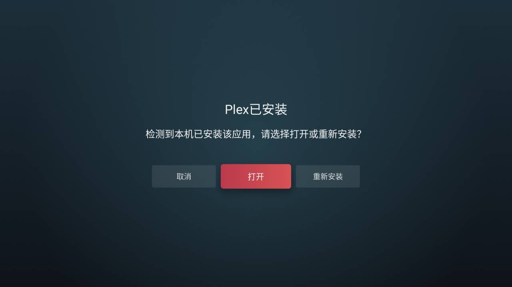

在 NAS 上安装好 Plex Server 后，当然可以访问网页端 / 电脑端 APP / 手机端 APP，亦或是 Infuse 这样的服务使用 Plex Server, 但是可惜家里的电视并不是 Apple TV, 更不是 Google TV 等，而是一台国内常见品牌──海信电视。这样，在电视上播放 Plex 媒体库中的内容就成了一个问题。

此时，你有两个方案：

- 在 PS5 上下载 Plex
- 在海信电视上下载 Plex

也许还有更多选项有待发现，不过上面两种姿势已经足以优雅地使用 Plex 媒体库了。

## PS5 安装 Plex

这个就很简单了，直接在 PlayStation Store 里找到 Plex 安装就好了，不过在港服的 PlayStation Store 貌似没有找到 Plex 😿, 所以还是走 Plan B......

## 安卓电视安装 Plex

国内的智能电视大多是安卓系统，那么就有办法手动安装 APK 包。

不同的安卓电视上传 APK 包的方式各不相同，其中较为通用的一个办法是使用过 USB 上传，其余方式可以自行 Google, 这里以我家的海信电视 98E3N Pro 为例。

首先，手机上安装『海信爱家 APP』用于上传 APK 文件。

如果在 Plex 官网的下载页面上找是找不到国内普通安卓电视可以使用的 APK 文件的，而其余的安卓安装方式都依赖在 Google Play 或 Amazon Appstore 等“不存在”的平台，所幸 Plex 官方有在 Plex Forum 上上传安卓的安装包文件供下载[^1]，因此只需在 [Plex for Android - Announcements - Plex Forum](https://forums.plex.tv/t/plex-for-android/29115/523) 上下载最新的 APK 文件即可。

当然，这上面针对不同的处理器架构有不同的 APK 文件版本，我家的电视可以安装的版本是 [Google Play (arm64v8a)](https://downloads.plex.tv/Kepler/kepler-arm64-v8a-googlePlay-10.24.1.2313-4acce576.apk), 国内大多数安卓电视应该也是这个版本（flash 也不怎么了解电视机这方面 qaq），如果不确定的话也可以都下载安装试试，毕竟海信爱家 APP 投屏的话也挺方便的。

[^1]: 发现于 [.apk direct download links? :r/Plex](https://www.reddit.com/r/PleX/comments/1c2opt7/apk_direct_download_links/).

在手机上下载好相应的 APK 安装包后，打开海信爱家 APP, 添加设备处将电视添加进去，然后点击刚添加的『客厅电视』，投屏处选择『文件』，在实际投屏之前先在电视机中打开投屏并选择『海信爱家 App』，然后在手机上将之前下载的 APK 文件传过去，等待传输完成后电视会自动安装应用，安装完成后就能使用了。

