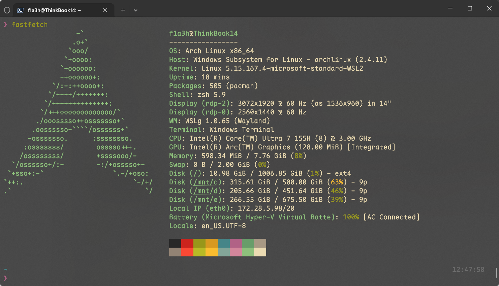
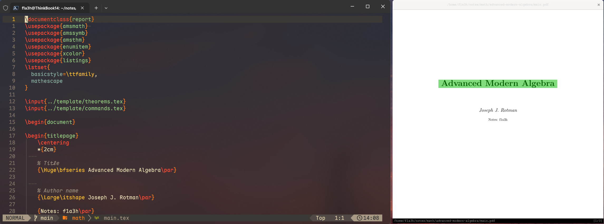

这段时间为了愉快地推 gal 用 Windows 比较多，由于 LaTeX 在 Linux 下编译速度更快，于是选择用 WSL2 写 LaTeX. 一开始用 VSCode 连接 WSL 进行编辑，但是习惯了 Obsidian 插件 [LaTeX Suite](https://github.com/artisticat1/obsidian-latex-suite), VSCode 下没有找到很接近的 Snippets, 我又懒得搓一份，考虑到 [LaTeX Suite](https://github.com/artisticat1/obsidian-latex-suite) 的写法很大程度参考的是 [Gilles Castel](https://castel.dev/post/lecture-notes-1/#other-snippets) 的，Gilles Castel 使用的则是 Vim, 顺着这条线索很快找到了写法接近的 Neovim Snippets 插件 [iurimateus/luasnip-latex-snippets.nvim](https://github.com/iurimateus/luasnip-latex-snippets.nvim), 于是开始配置 WSL 中的 Neovim, ~~由于中途解决了一大堆头疼的 WM 的问题所以还能顺便水一篇博客~~。

这里 WSL2 的发行版是 archlinux, 既然说到 arch 了那必得 `fastfetch` 秀一波（逃）



## 安装 TeX Live

这里以清华 TUNA 镜像站为例，参考相应[文档](https://mirrors.tuna.tsinghua.edu.cn/help/CTAN/)页面进行安装。

使用 `wget` 安装 install-tl.zip 脚本包，解压缩后 `cd` 进入相应路径：

```bash
wget https://mirrors.tuna.tsinghua.edu.cn/CTAN/systems/texlive/tlnet/install-tl.zip
unzip install-tl.zip
```

下列命令使用 TUNA 镜像源进入交互式安装界面：

```bash
perl install-tl --repository https://mirrors.tuna.tsinghua.edu.cn/CTAN/systems/texlive/tlnet
```

首先输入 `C` 并回车精简需要安装的组件，根据自身情况选择不安装的包列表如下^[1]：

```
deghijkstuvwxyznoABCEHIKLMNS
```

[^1]: 这部分内容参考 [TeX Live 2025 安装教程（Windows/WSL/Linux）](https://www.cnblogs.com/eslzzyl/p/17358405.html).

输入后回车，确认无误后输入 `R` 并回车回到主界面，最后输入 `I` 并回车进行安装。

安装过程中可能会提示 Permission denied, 这里不推荐使用 `sudo` 提权安装。Tex Live 的安装位置在 `/usr/local/texlive` 下，使用下列命令修改文件夹的 owner 即可：

```bash
sudo chown -R $(whoami) /usr/local/texlive
```

等待安装完成后根据界面上的提示更新环境变量，在 `~/.zshrc` 中加入如下内容：

```bash
export PATH=/usr/local/texlive/2025/bin/x86_64-linux:$PATH
export MANPATH=/usr/local/texlive/2025/texmf-dist/doc/man:$MANPATH
export INFOPATH=/usr/local/texlive/2025/texmf-dist/doc/info:$INFOPATH
```

之后 `source ~/.zshrc` 重载 Zsh 配置，然后执行

```bash
tex -v
```

即可查看是否安装成功。

最后刷新字体缓存：

```bash
sudo cp /usr/local/texlive/2025/texmf-var/fonts/conf/texlive-fontconfig.conf /etc/fonts/conf.d/09-texlive.conf
sudo fc-cache -fsv
```

至此，TeX Live 便安装完成了。

TeX Live 使用的包管理器是 `tlmgr` , 使用下列命令永久切换镜像源到 TUNA:

```bash
tlmgr option repository https://mirrors.tuna.tsinghua.edu.cn/CTAN/systems/texlive/tlnet
```

或临时切换：

```bash
tlmgr update --all --repository https://mirrors.tuna.tsinghua.edu.cn/CTAN/systems/texlive/tlnet
```

最后执行 `tlmgr update` 更新即可使用 `tlmgr` 安装所需的包了。

## 安装配置 Neovim

用 paru 安装 Neovim:

```bash
paru -S neovim
```

然后使用 LazyVim 来配置 Neovim, LazyVim 的具体安装要求参考[官网](http://www.lazyvim.org/):

```bash
# Make a backup of your current Neovim files
# required
mv ~/.config/nvim{,.bak}

# optional but recommended
mv ~/.local/share/nvim{,.bak}
mv ~/.local/state/nvim{,.bak}
mv ~/.cache/nvim{,.bak}

# Clone the starter
git clone https://github.com/LazyVim/starter ~/.config/nvim

# Remove the `.git` folder, so you can add it to your own repo later
rm -rf ~/.config/nvim/.git

# Start Neovim!
nvim
```

然后安装 [VimTex](https://github.com/lervag/vimtex):

```bash
# 创建 LaTeX 相关的插件配置文件
touch ~/.config/nvim/lua/plugins/latex.lua
```

编辑 `~/.config/nvim/lua/plugins/latex.lua` 并加入如下内容：

```lua
return {
  {
    "lervag/vimtex",
    lazy = false, -- we don't want to lazy load VimTeX
    -- tag = "v2.15", -- uncomment to pin to a specific release
    init = function()
      -- VimTeX configuration goes here, e.g.
      vim.g["vimtex_view_method"] = "zathura"
      vim.g["vimtex_quickfix_open_on_warning"] = 0
      vim.g["vimtex_compiler_latexmk_engines"] = {
        _ = "-xelatex",
        pdfdvi = "-pdfdvi",
        pdfps = "-pdfps",
        pdflatex = "-pdf",
        luatex = "-lualatex",
        lualatex = "-lualatex",
        xelatex = "-xelatex",
      }
    end,
  },
}
```

这里使用的 PDF Viewer 为 Zathura, 并配置默认的 latexmk engine 为 `xelatex`.

编辑完成后再次打开 Neovim 会自动安装 VimTeX 插件。

接着安装 Zathura 及其 PDF 组件：

```bash
paru -S zathura zathura-pdf-mupdf
```

创建 Zathura 配置文件:

```bash
mkdir -p ~/.config/zathura
touch ~/.config/zathura/zathurarc
```

在 `~/.config/zathura/zathurarc` 中加入如下内容开启 `syctex`:

```bash
# ~/.config/zathura/zathurarc
set synctex true
set synctex-editor-command "nvr --remote-silent %f -c %l"
```

Neovim 与 Zathura 之间需安装 neovim-remote 进行通信：

```bash
pip install neovim-remote
```

首先测试 WSL 下 Zathura 能否正常查看 PDF 文件：

```bash
zathura test.pdf
```

若你的 `/etc/wsl.conf` 中设置了 `systemd=true`, 那么你很有可能会遇到报错：

```
Can't open display :0
```

若参考 [Cannot open graphical applications in WSL2 on Arch, but works on Ubuntu](https://superuser.com/a/1834383) 关闭了 systemd 那么在之后 VimTeX 中就无法成功使用 Zathura 的 synctex 功能，因为关闭 systemd 后不会自动启动 dbus 服务，而 Zathura 的 synctex 依赖 dbus 进行通信。

因此我们保持 systemd 开启，查看 `XDG_RUNTIME_DIR` 环境变量，得到如下输出：

```bash
❯ echo $XDG_RUNTIME_DIR
/run/user/1000/
```

查看 `/run/user/1000/` 中的内容：

```bash
❯ ll /run/user/1000
total 0
drwx------ 2 f1a3h f1a3h 160 May 31 12:29 gnupg
drwxr-xr-x 6 f1a3h f1a3h 160 May 31 12:29 systemd
srw-rw-rw- 1 f1a3h f1a3h   0 May 31 12:29 bus
```

WSL 的 WM 为 WSLg, 而 `XDG_RUNTIME_DIR` 下没有相应的配置文件，于是我们软链接 `/run/user/1000/wayland-0` 到 WSLg 的 runtime-dir 下的配置文件 `/mnt/wslg/runtime-dir/wayland-0` 即可：

```bash
sudo ln -s /mnt/wslg/runtime-dir/wayland-0* /run/user/1000/
```

此后无论单独 `zathura test.pdf` 还是在 Neovim 中通过 VimTeX 与 Zathura 进行通信查看 PDF 都可以成功打开 PDF, 并且 synctex 功能正常：



但是这种手动创建 symlink 的方式在重启 WSL 之后，`XDG_RUNTIME_DIR` 下依旧会缺失 symlink, 此事在 ArchWiki 中亦有[记载](https://wiki.archlinux.org/title/Install_Arch_Linux_on_WSL#Run_graphical_applications_with_WSLg)，根据 ArchWiki 中的描述，symlinks 的问题在 **WSL pre-release version 2.5.7.0** 被 fix 了，而我的 WSL 版本为 2.4.11.0, 遂 `wsl --update` 到了 2.5.7.0 版本，并在 `%USERPROFILE%\.wslconfig` 中加入如下内容：

```toml
[wsl2]
guiApplications = true
```

此时重启 WSL 可以发现启动时已经自动把 symlink 创建好了：

```bash
❯ ll $XDG_RUNTIME_DIR
total 0
drwxr-xr-x 3 f1a3h f1a3h  60 May 31 14:26 dbus-1
drwx------ 2 f1a3h f1a3h 160 May 31 14:26 gnupg
drwxr-xr-x 2 f1a3h f1a3h  80 May 31 14:26 pulse
drwxr-xr-x 6 f1a3h f1a3h 160 May 31 14:26 systemd
srw-rw-rw- 1 f1a3h f1a3h   0 May 31 14:26 bus
lrwxrwxrwx 1 root  root   31 May 31 14:26 wayland-0 -> /mnt/wslg/runtime-dir/wayland-0
lrwxrwxrwx 1 root  root   36 May 31 14:26 wayland-0.lock -> /mnt/wslg/runtime-dir/wayland-0.lock
```

## 使用 LuaSnip 插件

这里对 LuaSnip 插件的配置直接蒯大佬的配置 [iChunyu/nvim](https://github.com/iChunyu/nvim) 下的 `coding.lua` 文件，也顺便配置了 mason 和 cmp 相关插件，另外还需参照 `REAME.md` 安装好相应的依赖。

安装 [iurimateus/luasnip-latex-snippets.nvim](https://github.com/iurimateus/luasnip-latex-snippets.nvim) 插件则在 `~/.config/nvim/lua/plugins/latex.lua` 中 `return {}` 里加入如下内容：

```lua
{
    "iurimateus/luasnip-latex-snippets.nvim",
    -- vimtex isn't required if using treesitter
    requires = { "L3MON4D3/LuaSnip", "lervag/vimtex" },
    config = function()
      require("luasnip-latex-snippets").setup()
      -- or setup({ use_treesitter = true })
      require("luasnip").config.setup({ enable_autosnippets = true })
    end,
}
```

接着启动 `nvim` 等待安装完成，这之后再使用 `:LazyExtras` 命令按照需求 enable 相应的语言插件和 cmp 插件，最后再安装好这些 extras 插件即可享受 WSL 下的 Neovim 了。